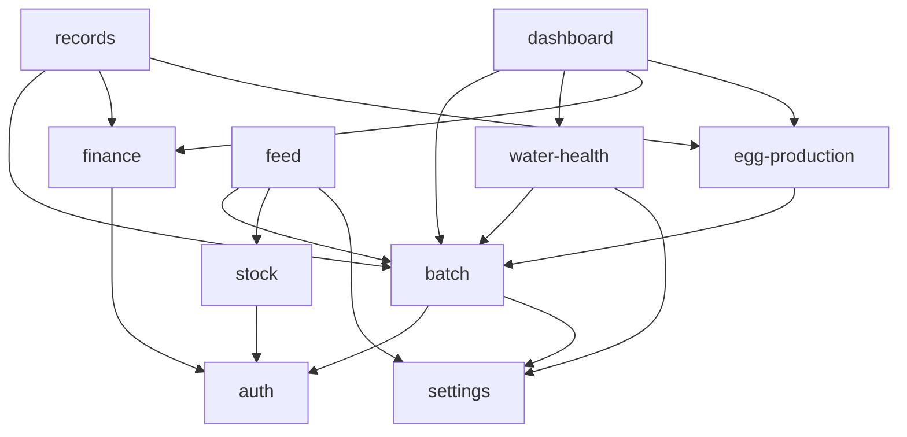
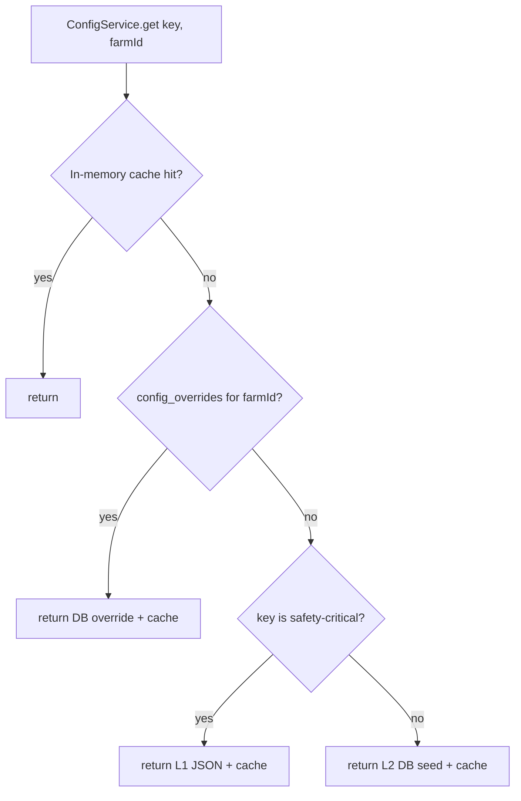

# Master Architecture

**Status:** Spec v2 (rewritten 2026-05-03)
**Module path:** `artifacts/api-server/src/` (root)
**Owner:** TBD

This document is the foundational architectural reference for LampFarms. Per-module detail lives in the numbered specs in this directory; this doc only states what is shared, what is canonical, and what is out of scope. Where a value or rule is fixed in `00_CONVENTIONS.md`, that document wins.

---

## 1. Purpose & Scope

### 1.1 Purpose

LampFarms is an offline-first poultry farm management platform for West African smallholders. It manages four species (broiler, layer, duck, turkey) across intensive and semi-intensive production systems, with container-based medication dosing, GHS/NGN currency, and species-specific lifecycle, feed, and health protocols.

### 1.2 In scope (this spec)

- The system landscape: modules, dependencies, deployment topology.
- The canonical data model overview (per-module schemas live in their own specs).
- The global event catalog (every event type, payload schema, publishers, consumers).
- Cross-cutting concerns (auth model, sync, idempotency, error handling, observability).
- The 3-tier configuration system (safety JSON → DB seed → runtime overrides).
- The unified medication conflict matrix C1–C8.
- The canonical species reference table.
- Background jobs and their schedules.
- The Phase 1–4 development roadmap (broiler-first).
- The platform-wide out-of-scope list.

### 1.3 Out of scope

See §13. Hardware integrations, SMS/WhatsApp notifications, multi-currency reporting beyond per-farm currency, vet portal, marketplace.

### 1.4 Non-goals

- This document does **not** redefine any rule already fixed in `00_CONVENTIONS.md`. It cites those rules.
- This document does **not** include per-module Drizzle schemas, full route handlers, or per-module FSMs. Those live in `02_BATCH_MANAGEMENT.md` … `11_RECORDS.md`.

---

## 2. System Landscape

### 2.1 Topology

Single-process modular monolith deployed as one Node.js service plus PostgreSQL.

```
                 ┌─────────────────────────┐
                 │ React 19 PWA            │
                 │  - Vite                 │
                 │  - TanStack Query       │
                 │  - Dexie.js v4 (offline)│
                 │  - Workbox (injectMfst) │
                 │  - highs-js (offline LP)│
                 └──────────┬──────────────┘
                            │ HTTPS /api/*
                 ┌──────────▼──────────────┐
                 │ Express 5 (Node 20+)    │
                 │  - modules/{batch,...}  │
                 │  - events/ (in-mem bus) │
                 │  - jobs/ (pg-boss)      │
                 │  - outbox relay (pg-boss)│
                 └──────────┬──────────────┘
                            │
                   ┌────────▼────────┐
                   │  Postgres 16    │
                   │  (Drizzle +     │
                   │   pg-boss)      │
                   └─────────────────┘
```

### 2.2 Module map

Source layout per `00_CONVENTIONS.md` §1. Each module is a bounded context with its own routes, services, repositories, schema slice, Zod schemas, and event handlers.

| # | Module | Path | Spec |
|---|---|---|---|
| 1 | Auth & Farm Setup | `modules/auth` | `09_AUTH.md` |
| 2 | Batch Management | `modules/batch` | `02_BATCH_MANAGEMENT.md` |
| 3 | Water-Health | `modules/water-health` | `03_WATER_HEALTH.md` |
| 4 | Feed Calculator | `modules/feed` | `04_FEED_CALCULATOR.md` |
| 5 | Egg Production | `modules/egg-production` | `05_EGG_PRODUCTION.md` |
| 6 | Stock Management | `modules/stock` | `06_STOCK_MANAGEMENT.md` |
| 7 | Finance | `modules/finance` | `07_FINANCE.md` |
| 8 | Records & Analytics | `modules/records` | `08_RECORDS.md` |
| 9 | Settings | `modules/settings` | `10_SETTINGS.md` |
| 10 | Dashboard (read-model) | `modules/dashboard` | `11_DASHBOARD.md` |
| — | Cross-cutting | `events/`, `jobs/`, `shared/`, `db/` | this spec |

Species protocols (broiler, layer, duck, turkey, other) live as data + simpler protocol specs (`20_BROILER.md` … `24_OTHER_SPECIES.md`).

### 2.3 Module dependency graph

A module may import from a module above it (one-way). Cycles are forbidden and enforced via lint rule (`eslint-plugin-boundaries` or equivalent).



Dovetail Synergy (feed → expense + stock allocation; health task completion → expense; egg sale → revenue) crosses these boundaries via **events only** (§4), never direct service-to-service calls.

### 2.4 Deployment

| Concern | Choice |
|---|---|
| Runtime | Node.js 20+ ESM |
| Process model | 1 web process + 1 worker process (pg-boss) — may be co-located on small deploys |
| Containerization | Single Docker image; entrypoint switches mode by env (`SERVICE=web\|worker`) |
| DB | PostgreSQL 16, single primary |
| Reverse proxy | Platform-managed (no custom Nginx) |
| TLS | Platform-managed |
| Logs | stdout JSON (pino) → platform log sink |
| Metrics | `/metrics` Prometheus endpoint on web + worker |

---

## 3. Canonical Data Model Overview

The detailed Drizzle schema for each entity lives in its module spec. This section names the tables, owns the entity glossary, and pins the cross-module relations.

### 3.1 Entity inventory

| Table | Module spec | Notes |
|---|---|---|
| `users` | `09_AUTH.md` §3 | UUIDv7 id, email unique |
| `farms` | `09_AUTH.md` §3 | `currency`, `timezone` columns |
| `farm_memberships` | `09_AUTH.md` §3 | user↔farm with role |
| `houses` | `02_BATCH_MANAGEMENT.md` §3 | one batch active at a time |
| `batches` | `02_BATCH_MANAGEMENT.md` §3 | central aggregate |
| `batch_mortalities` | `02_BATCH_MANAGEMENT.md` §3 | append-only |
| `health_tasks` | `03_WATER_HEALTH.md` §3 | scheduled or ad-hoc |
| `medication_administrations` | `03_WATER_HEALTH.md` §3 | immutable audit |
| `medications` | `03_WATER_HEALTH.md` §3 | seeded; runtime read-only |
| `medication_conflicts` | `03_WATER_HEALTH.md` §3 | the C1–C8 matrix (§7) |
| `containers` | `03_WATER_HEALTH.md` §3 | the 9 canonical types (CONVENTIONS §2.3) |
| `vaccination_protocols` | `03_WATER_HEALTH.md` §3 | per species |
| `feed_formulations` | `04_FEED_CALCULATOR.md` §3 | LP results |
| `formulation_ingredients` | `04_FEED_CALCULATOR.md` §3 | line items |
| `ingredients` | `04_FEED_CALCULATOR.md` §3 | seeded library |
| `nutritional_requirements` | `04_FEED_CALCULATOR.md` §3 | seeded per species/phase |
| `egg_productions` | `05_EGG_PRODUCTION.md` §3 | daily entries |
| `egg_inventory` | `05_EGG_PRODUCTION.md` §3 | by size & quality |
| `egg_sales` | `05_EGG_PRODUCTION.md` §3 | revenue source |
| `inventory_items` | `06_STOCK_MANAGEMENT.md` §3 | stock master |
| `stock_lots` | `06_STOCK_MANAGEMENT.md` §3 | FIFO + quality (CONVENTIONS §2.15) |
| `stock_allocations` | `06_STOCK_MANAGEMENT.md` §3 | batch consumption |
| `stock_transfers` | `06_STOCK_MANAGEMENT.md` §3 | audit trail |
| `suppliers` | `06_STOCK_MANAGEMENT.md` §3 | |
| `expenses` | `07_FINANCE.md` §3 | 9 categories; `source_event_id` unique |
| `revenues` | `07_FINANCE.md` §3 | 5 types; `source_event_id` unique |
| `market_prices` | `10_SETTINGS.md` §3 | runtime editable |
| `user_preferences` | `10_SETTINGS.md` §3 | per (user, farm) |
| `config_overrides` | this spec §6 | farm-level JSONB overrides |
| `outbox_messages` | this spec §4 | event durability |
| `processed_events` | this spec §4 | dedup `(event_id, handler_name)` |
| `idempotency_keys` | this spec §5.3 | request-level dedup |
| `species_protocols` | `20_BROILER.md` … `24_OTHER_SPECIES.md` | seeded |

### 3.2 Cross-module foreign keys

- Every non-tenant table carries `farm_id text not null` (CONVENTIONS §4.9).
- Every batch-scoped table carries `batch_id text not null references batches(id)`.
- IDs are UUIDv7 stored as `text`, generated client-side (CONVENTIONS §4.1).
- All `*_at` columns are `timestamptz` UTC (CONVENTIONS §4.4).
- Money columns end in `_pesewas`, `bigint` (CONVENTIONS §4.2).

### 3.3 Conflict-resolution policy

Per-entity-class policy used by the offline sync engine:

| Class | Policy |
|---|---|
| Ledger (`expenses`, `revenues`, `medication_administrations`, `stock_transfers`) | Append-only via idempotent create; no overwrite UI |
| Counters (`batches.current_quantity`, `stock_lots.quantity_available`) | Server recompute + deterministic merge from event history |
| Editable docs (`user_preferences`, free-text notes) | Manual UI choice (Keep Mine / Use Server) |
| Safety config (medications, conflicts, withdrawal periods) | Server-authoritative; client never wins |

---

## 4. Event Catalog (Global)

### 4.1 Bus design

Two channels, different responsibilities:

1. **Authoritative (transactional outbox)** — every persistent side effect is delivered through `pg-boss`. Producers write to `outbox_messages` in the same DB transaction as the business write. The outbox relay reads pending rows and dispatches.
2. **Non-authoritative (in-memory)** — fast same-process notifications (dashboard counters, log breadcrumbs). Best-effort, no retries.

Deduplication contract:

- `processed_events(event_id text, handler_name text, processed_at timestamptz)` with unique `(event_id, handler_name)`.
- `expenses.source_event_id`, `revenues.source_event_id`, `stock_allocations.source_event_id` are unique. Handlers upsert by this key.

### 4.2 Outbox schema

```ts
// artifacts/api-server/src/db/schema/events.ts
import { pgTable, text, timestamp, jsonb, integer, index } from 'drizzle-orm/pg-core';

export const outboxMessages = pgTable('outbox_messages', {
  id: text('id').primaryKey(),
  farmId: text('farm_id').notNull(),
  eventType: text('event_type').notNull(),
  aggregateId: text('aggregate_id').notNull(),
  payload: jsonb('payload').notNull(),
  status: text('status', { enum: ['pending', 'processing', 'sent', 'failed', 'dead'] }).notNull().default('pending'),
  attemptCount: integer('attempt_count').notNull().default(0),
  nextAttemptAt: timestamp('next_attempt_at', { withTimezone: true }).notNull().defaultNow(),
  lastError: text('last_error'),
  createdAt: timestamp('created_at', { withTimezone: true }).notNull().defaultNow(),
}, (t) => ({
  byStatus: index('outbox_status_idx').on(t.status, t.nextAttemptAt),
  byAggregate: index('outbox_aggregate_idx').on(t.aggregateId),
}));

export const processedEvents = pgTable('processed_events', {
  eventId: text('event_id').notNull(),
  handlerName: text('handler_name').notNull(),
  processedAt: timestamp('processed_at', { withTimezone: true }).notNull().defaultNow(),
}, (t) => ({
  pk: { name: 'processed_events_pk', columns: [t.eventId, t.handlerName] },
}));
```

### 4.3 Event envelope

```ts
// artifacts/api-server/src/events/envelope.ts
import { z } from 'zod';

export const eventEnvelopeSchema = z.object({
  eventId: z.string().uuid(),          // UUIDv7
  eventType: z.string(),
  occurredAt: z.string().datetime(),
  farmId: z.string().uuid(),
  actorUserId: z.string().uuid().nullable(),
  correlationId: z.string().uuid(),
  aggregateId: z.string().uuid(),
  payload: z.unknown(),
});

export type EventEnvelope<T> = Omit<z.infer<typeof eventEnvelopeSchema>, 'payload'> & { payload: T };
```

### 4.4 Catalog

Every event type used in LampFarms. `Publisher` is the module that writes to the outbox; `Consumers` are the handlers that read it.

| # | Event type | Publisher | Consumers (durable) | Consumers (in-mem) |
|---|---|---|---|---|
| 1 | `BATCH_CREATED` | batch | water-health (seed tasks), feed (seed phase plan) | dashboard |
| 2 | `BATCH_WEEK_ADVANCED` | batch | water-health, feed | dashboard |
| 3 | `BATCH_MORTALITY_RECORDED` | batch | water-health (dose recalc) | dashboard |
| 4 | `BATCH_TERMINATED` | batch | finance (close), stock (release reservations) | dashboard |
| 5 | `FEED_FORMULATION_CONFIRMED` | feed | stock (allocate), finance (expense) | dashboard |
| 6 | `HEALTH_TASK_GENERATED` | water-health | — | dashboard |
| 7 | `HEALTH_TASK_COMPLETED` | water-health | finance (expense), stock (allocate), batch (FSM withdrawal entry) | dashboard |
| 8 | `WITHDRAWAL_ENTERED` | water-health | batch (FSM guard), jobs (schedule clear) | dashboard |
| 9 | `WITHDRAWAL_CLEARED` | jobs | batch (FSM clear) | dashboard |
| 10 | `STOCK_PURCHASED` | stock | finance (expense) | dashboard |
| 11 | `STOCK_ALLOCATED` | stock | — | dashboard |
| 12 | `EGG_PRODUCTION_RECORDED` | egg-production | — | dashboard |
| 13 | `EGG_SALE_RECORDED` | egg-production | finance (revenue) | dashboard |

### 4.5 Payload schemas

```ts
// artifacts/api-server/src/events/payloads.ts
import { z } from 'zod';

export const eventTypes = [
  'BATCH_CREATED',
  'BATCH_WEEK_ADVANCED',
  'BATCH_MORTALITY_RECORDED',
  'BATCH_TERMINATED',
  'FEED_FORMULATION_CONFIRMED',
  'HEALTH_TASK_GENERATED',
  'HEALTH_TASK_COMPLETED',
  'WITHDRAWAL_ENTERED',
  'WITHDRAWAL_CLEARED',
  'STOCK_PURCHASED',
  'STOCK_ALLOCATED',
  'EGG_PRODUCTION_RECORDED',
  'EGG_SALE_RECORDED',
] as const;
export type EventType = typeof eventTypes[number];

export const batchCreatedPayload = z.object({
  batchId: z.string().uuid(),
  species: z.enum(['broiler', 'layer', 'duck', 'turkey', 'other']),
  duckType: z.enum(['meat', 'layer']).nullable(),
  productionSystem: z.enum(['intensive', 'semi_intensive', 'free_range']),
  initialQuantity: z.number().int().positive(),
  startDate: z.string().date(),
  cycleWeeks: z.number().int().positive(), // for configurable species (turkey 12-20, layer 72-78)
});
export type BatchCreatedPayload = z.infer<typeof batchCreatedPayload>;

export const batchWeekAdvancedPayload = z.object({
  batchId: z.string().uuid(),
  fromWeek: z.number().int().nonnegative(),
  toWeek: z.number().int().positive(),
  newPhase: z.enum(['brooding', 'starter', 'grower', 'finisher', 'withdrawal', 'ready_to_sell', 'terminated', 'production']),
});
export type BatchWeekAdvancedPayload = z.infer<typeof batchWeekAdvancedPayload>;

export const batchMortalityRecordedPayload = z.object({
  batchId: z.string().uuid(),
  recordedAt: z.string().datetime(),
  count: z.number().int().positive(),
  cause: z.string().nullable(),
  remainingQuantity: z.number().int().nonnegative(),
});
export type BatchMortalityRecordedPayload = z.infer<typeof batchMortalityRecordedPayload>;

export const batchTerminatedPayload = z.object({
  batchId: z.string().uuid(),
  reason: z.enum(['normal', 'emergency']),
  finalQuantity: z.number().int().nonnegative(),
  terminatedAt: z.string().datetime(),
});
export type BatchTerminatedPayload = z.infer<typeof batchTerminatedPayload>;

export const feedFormulationConfirmedPayload = z.object({
  formulationId: z.string().uuid(),
  batchId: z.string().uuid(),
  method: z.enum(['ready_made', 'custom_lp', 'concentrate_mix']),
  totalKg: z.number().positive(),
  totalCostPesewas: z.number().int().nonnegative(),
  ingredients: z.array(z.object({
    inventoryItemId: z.string().uuid(),
    quantityKg: z.number().positive(),
    unitCostPesewas: z.number().int().nonnegative(),
  })),
});
export type FeedFormulationConfirmedPayload = z.infer<typeof feedFormulationConfirmedPayload>;

export const healthTaskGeneratedPayload = z.object({
  taskId: z.string().uuid(),
  batchId: z.string().uuid(),
  taskType: z.enum(['vaccination', 'medication', 'supplement']),
  medicationId: z.string().uuid().nullable(),
  deliveryMethod: z.enum(['drinking_water', 'injection_subcutaneous', 'injection_wing_web', 'in_feed', 'topical']),
  dueDate: z.string().date(),
});
export type HealthTaskGeneratedPayload = z.infer<typeof healthTaskGeneratedPayload>;

export const healthTaskCompletedPayload = z.object({
  taskId: z.string().uuid(),
  batchId: z.string().uuid(),
  medicationId: z.string().uuid().nullable(),
  deliveryMethod: z.enum(['drinking_water', 'injection_subcutaneous', 'injection_wing_web', 'in_feed', 'topical']),
  doseAmount: z.number().nonnegative(),
  doseUnit: z.enum(['tsp', 'tbsp', 'ml', 'g']),
  waterVolumeL: z.number().nonnegative().nullable(),
  containerId: z.string().nullable(),
  withdrawalDays: z.number().int().nonnegative(),
  costPesewas: z.number().int().nonnegative(),
  completedAt: z.string().datetime(),
});
export type HealthTaskCompletedPayload = z.infer<typeof healthTaskCompletedPayload>;

export const withdrawalEnteredPayload = z.object({
  batchId: z.string().uuid(),
  source: z.enum(['meat', 'eggs']),
  endDate: z.string().date(),
  triggeredByTaskId: z.string().uuid(),
});
export type WithdrawalEnteredPayload = z.infer<typeof withdrawalEnteredPayload>;

export const withdrawalClearedPayload = z.object({
  batchId: z.string().uuid(),
  source: z.enum(['meat', 'eggs']),
  clearedAt: z.string().datetime(),
});
export type WithdrawalClearedPayload = z.infer<typeof withdrawalClearedPayload>;

export const stockPurchasedPayload = z.object({
  lotId: z.string().uuid(),
  inventoryItemId: z.string().uuid(),
  supplierId: z.string().uuid().nullable(),
  quantity: z.number().positive(),
  unit: z.string(),
  totalCostPesewas: z.number().int().nonnegative(),
  receivedAt: z.string().datetime(),
});
export type StockPurchasedPayload = z.infer<typeof stockPurchasedPayload>;

export const stockAllocatedPayload = z.object({
  allocationId: z.string().uuid(),
  batchId: z.string().uuid(),
  lotId: z.string().uuid(),
  inventoryItemId: z.string().uuid(),
  quantity: z.number().positive(),
  reason: z.enum(['feed', 'medication', 'supplement', 'manual']),
});
export type StockAllocatedPayload = z.infer<typeof stockAllocatedPayload>;

export const eggProductionRecordedPayload = z.object({
  recordId: z.string().uuid(),
  batchId: z.string().uuid(),
  date: z.string().date(),
  totalEggs: z.number().int().nonnegative(),
  cracked: z.number().int().nonnegative(),
});
export type EggProductionRecordedPayload = z.infer<typeof eggProductionRecordedPayload>;

export const eggSaleRecordedPayload = z.object({
  saleId: z.string().uuid(),
  batchId: z.string().uuid(),
  trays: z.number().nonnegative(),
  unitPricePesewas: z.number().int().nonnegative(),
  totalPricePesewas: z.number().int().nonnegative(),
  customerId: z.string().uuid().nullable(),
  soldAt: z.string().datetime(),
});
export type EggSaleRecordedPayload = z.infer<typeof eggSaleRecordedPayload>;

export const eventPayloadSchemas = {
  BATCH_CREATED: batchCreatedPayload,
  BATCH_WEEK_ADVANCED: batchWeekAdvancedPayload,
  BATCH_MORTALITY_RECORDED: batchMortalityRecordedPayload,
  BATCH_TERMINATED: batchTerminatedPayload,
  FEED_FORMULATION_CONFIRMED: feedFormulationConfirmedPayload,
  HEALTH_TASK_GENERATED: healthTaskGeneratedPayload,
  HEALTH_TASK_COMPLETED: healthTaskCompletedPayload,
  WITHDRAWAL_ENTERED: withdrawalEnteredPayload,
  WITHDRAWAL_CLEARED: withdrawalClearedPayload,
  STOCK_PURCHASED: stockPurchasedPayload,
  STOCK_ALLOCATED: stockAllocatedPayload,
  EGG_PRODUCTION_RECORDED: eggProductionRecordedPayload,
  EGG_SALE_RECORDED: eggSaleRecordedPayload,
} as const satisfies Record<EventType, z.ZodType>;
```

### 4.6 Publisher contract

Every producer must:

```ts
// pseudo-canonical helper — real implementation lives in events/publish.ts
await db.transaction(async (tx) => {
  await tx.insert(businessTable).values(row);
  await publish(tx, {
    eventType: 'BATCH_CREATED',
    aggregateId: row.id,
    farmId: row.farmId,
    payload: { /* validated against eventPayloadSchemas[type] */ },
  });
});
```

The `publish` helper inserts into `outbox_messages` in the same `tx`. The outbox relay (pg-boss worker) then drains it.

### 4.7 Consumer contract

Every handler must:

1. Be registered with a stable `handlerName`.
2. Be idempotent: read `processed_events` before writing, or use a unique `source_event_id` upsert.
3. Insert `(eventId, handlerName)` into `processed_events` in the same transaction as its side effect.
4. On unhandled throw, return failure to the relay so it retries with exponential backoff (max 5 attempts) before dead-lettering.

---

## 5. Cross-Cutting Concerns

### 5.1 Auth model

Detailed in `09_AUTH.md`. Summary:

1. JWT access token (15 min) + refresh token (7 days), both HttpOnly cookies, `SameSite=Lax`.
2. Roles: `owner`, `worker`. No other roles in v1.
3. Every farm-scoped query includes `farm_id` in its `WHERE`. Enforced by repository helpers.
4. Membership is checked in middleware: `req.farm` is populated only for routes inside `farms/:farmId/...`.
5. Refresh rotation: each refresh issues a new refresh token; the old one is revoked.

### 5.2 Sync (offline-first)

Per `00_CONVENTIONS.md` §4.6.

1. Server is source of truth.
2. Client (Dexie v4) holds: per-entity mirror, `outbox` (pending writes), `sync_meta` (last_synced_at + server_version), `conflicts` (divergence queue).
3. Reads: `GET /sync/delta?entity={type}&since={cursor}` → `{ items, nextCursor, serverTime }`.
4. Writes: per-entity REST endpoints accept `Idempotency-Key` header.
5. Conflict policy is per-entity-class (§3.3).

### 5.3 Idempotency

Per `00_CONVENTIONS.md` §4.5.

```ts
// artifacts/api-server/src/db/schema/idempotency.ts
import { pgTable, text, timestamp, jsonb, integer } from 'drizzle-orm/pg-core';

export const idempotencyKeys = pgTable('idempotency_keys', {
  key: text('key').primaryKey(),                 // client-supplied UUIDv7
  farmId: text('farm_id').notNull(),
  userId: text('user_id').notNull(),
  route: text('route').notNull(),
  requestHash: text('request_hash').notNull(),   // SHA-256 of body
  responseStatus: integer('response_status'),
  responseBody: jsonb('response_body'),
  createdAt: timestamp('created_at', { withTimezone: true }).notNull().defaultNow(),
  expiresAt: timestamp('expires_at', { withTimezone: true }).notNull(),
});
```

Rules:

1. All `POST`, `PATCH`, `DELETE` accept `Idempotency-Key`. The header is **required** for any client write that may originate offline; optional otherwise.
2. On replay with same key + same hash: return cached response.
3. On replay with same key + different hash: 422 `IDEMPOTENCY_KEY_MISMATCH`.
4. Keys expire after 7 days.

### 5.4 Error handling

All errors follow:

```json
{ "error": { "code": "WITHDRAWAL_ACTIVE", "message": "...", "details": {} } }
```

1. Codes are SCREAMING_SNAKE_CASE, stable across versions, documented per module spec.
2. HTTP status mapping: `400` validation, `401` no auth, `403` wrong farm, `404` not found, `409` conflict (optimistic-lock or sync), `422` business-rule violation, `429` rate-limit, `5xx` infra.
3. Validation errors include `details: { issues: [...] }` from Zod's `flatten()`.
4. The Express error middleware logs `error.code`, `error.message`, `request_id`, `farm_id`, `user_id`, `route`, then returns the JSON envelope.

### 5.5 Observability

Per `00_CONVENTIONS.md` §4.8.

1. **Logging**: pino with fields `request_id`, `farm_id`, `user_id`, `route`, `status`, `duration_ms`. Domain handlers add `event_type`, `aggregate_id`, `correlation_id`.
2. **Metrics** (Prometheus, exposed on `/metrics`):
   - `http_requests_total{route,method,status}`
   - `http_request_duration_ms{route,method}` (histogram)
   - `outbox_pending_total`, `outbox_dead_total`
   - `pg_boss_jobs_total{queue,state}`
   - `lp_solve_duration_ms` (histogram)
3. **Tracing**: optional OpenTelemetry; spans named `module.service.method`.
4. **Health**: `GET /healthz` (process), `GET /readyz` (DB ping).

---

## 6. Configuration System (3-Tier)

Per `00_CONVENTIONS.md` §5 glossary; canonical here.

### 6.1 Layers

| Layer | Storage | Mutability | Examples |
|---|---|---|---|
| **L1 — Safety JSON** | `artifacts/api-server/src/config/safety/*.json` (in repo) | Immutable at runtime; changes ship with a release | `medications.json`, `medication_conflicts.json` (the C1–C8 matrix), `withdrawal_periods.json`, `vaccination_protocols.json`, `containers.json` |
| **L2 — DB seed** | DB tables seeded once at install | Editable per-farm via L3 overrides | `species_protocols`, `nutritional_requirements`, `ingredients` |
| **L3 — Runtime overrides** | DB tables editable via Settings UI | User-editable | `market_prices`, `user_preferences`, `farms.timezone`, `farms.currency`, `config_overrides` (JSONB per farm) |

### 6.2 Lookup order



Cache TTL is 5 minutes; cache is invalidated on any write to `config_overrides`, `market_prices`, `user_preferences`.

### 6.3 ConfigOverride table

```ts
// artifacts/api-server/src/db/schema/config.ts
import { pgTable, text, jsonb, timestamp, uniqueIndex } from 'drizzle-orm/pg-core';

export const configOverrides = pgTable('config_overrides', {
  id: text('id').primaryKey(),
  farmId: text('farm_id').notNull(),
  configKey: text('config_key').notNull(),
  configValue: jsonb('config_value').notNull(),
  updatedAt: timestamp('updated_at', { withTimezone: true }).notNull().defaultNow(),
}, (t) => ({
  uniq: uniqueIndex('config_overrides_farm_key_uq').on(t.farmId, t.configKey),
}));
```

### 6.4 Rules

1. Application code never hardcodes a species value, dose, or threshold. It always asks `ConfigService.get(key, farmId)`.
2. L1 (safety) keys are listed in a published whitelist; the lookup throws if a non-whitelisted key is read from L1.
3. L1 files are validated on boot against Zod schemas in `config/safety/schemas.ts`. Boot fails if any file is invalid.
4. L3 overrides for safety keys are **rejected** by the Settings API (returns `422 SAFETY_KEY_NOT_OVERRIDABLE`).

---

## 7. Unified Medication Conflict Matrix (C1–C8)

The canonical matrix from `00_CONVENTIONS.md` §2.2. Source of truth lives in `artifacts/api-server/src/config/safety/medication_conflicts.json`. The detailed enforcement (FSM guards, API errors, UI surface) lives in `03_WATER_HEALTH.md` §4.

| Code | Conflict | Severity | Action | Reason |
|---|---|---|---|---|
| C1 | Coccidiostat (Amprolium) + Sulfa antibiotics | BLOCK | Reject task creation | Nephrotoxicity (kidney damage) |
| C2 | Two systemic antibiotics simultaneously | BLOCK | Reject task creation | Resistance + toxicity |
| C3 | Dewormer + Coccidiostat (same day) | WARN | Allow with warning | Reduced efficacy of both |
| C4 | Live vaccine + Antibiotic within 72 h | BLOCK | Reject task within window | Antibiotic kills vaccine organisms |
| C5 | Enrofloxacin + any other antibiotic | BLOCK | Reject task creation | Fluoroquinolone resistance |
| C6 | Activated charcoal + any oral medication within 4 h | BLOCK | Reject task within window | Charcoal absorbs medication |
| C7 | Calcium supplement + Tetracyclines within 4 h | BLOCK | Reject task within window | Calcium chelates tetracycline |
| C8 | Live vaccine + Chlorinated water source | BLOCK | Reject vaccine task on chlorinated source | Chlorine kills vaccine virus |

The vaccine + antibiotic guard is **72 hours**. Not 48.

```ts
// artifacts/api-server/src/config/safety/conflicts.schema.ts
import { z } from 'zod';

export const conflictRuleSchema = z.object({
  code: z.enum(['C1','C2','C3','C4','C5','C6','C7','C8']),
  description: z.string(),
  severity: z.enum(['BLOCK', 'WARN']),
  windowHours: z.number().int().nonnegative().nullable(),
  classA: z.string(),  // medication class or specific drug
  classB: z.string(),
  reason: z.string(),
});
export type ConflictRule = z.infer<typeof conflictRuleSchema>;

export const conflictMatrixSchema = z.array(conflictRuleSchema).length(8);
```

---

## 8. Species Reference Table

Canonical species/lifecycle reference. Per-species protocol detail (water tables, vaccinations, costs, traditional remedies) lives in `20_BROILER.md` … `24_OTHER_SPECIES.md`. Corrections from `00_CONVENTIONS.md` §2.1, §2.4–§2.7 are applied here.

| Species | Sub-type | Cycle (weeks) | Egg production | First lay (week) | Withdrawal-bearing? |
|---|---|---|---|---|---|
| `broiler` | — | 6–8 (default 8) | No | — | Yes (meat) |
| `layer` | — | **72–78 (default 78)** | Yes | **19** | Yes (meat + eggs) |
| `duck` | `meat` | 8–10 (default 10) | No | — | Yes (meat) |
| `duck` | `layer` | **72+ (default 78)** | Yes | **20** | Yes (meat + eggs) |
| `turkey` | — | **12–20 configurable (default 16)** | No | — | Yes (meat) |
| `other` | — | configurable | configurable | configurable | configurable |

Notes (numbered, normative):

- **S1.** Layer egg production starts Week **19** (CONVENTIONS §2.1). Tracking continues until the batch is terminated, not until a fixed week.
- **S2.** Layer lifecycle is **72–78 weeks**, default termination at **78** (CONVENTIONS §2.4).
- **S3.** Turkey lifecycle is **configurable 12–20 weeks**, default **16** (CONVENTIONS §2.5). FSM phase thresholds scale linearly with `cycleWeeks`.
- **S4.** Duck has two sub-types selected at batch creation: `meat` and `layer` (CONVENTIONS §2.6). The Batch Creation Wizard adds Step 1b for this.
- **S5.** Duck (layer) egg production starts Week **20** (CONVENTIONS §2.7).
- **S6.** Broiler vaccinations are **5 events**, not 2 (CONVENTIONS §2.8). Listed in `20_BROILER.md` §4.
- **S7.** Duck niacin is a **water-health** task, not a feed ingredient (CONVENTIONS §2.9). 1.5 tsp per gallon (3.785 L), daily through Week 4, then weekly. Source: `03_WATER_HEALTH.md` §6.
- **S8.** Turkey blackhead prevention requires **Metronidazole** in the medication database (CONVENTIONS §2.10). Applies every 2 weeks throughout the cycle.

---

## 9. Background Jobs

Per `00_CONVENTIONS.md` §2.11. All jobs are pg-boss scheduled jobs registered at boot. The outbox relay is also a pg-boss worker.

| Job name | Cron | Timezone | Purpose |
|---|---|---|---|
| `generateDailyBatchTasks` | `0 6 * * *` | `farm.timezone` | For every active batch in the farm, generate due health/vaccination tasks for today |
| `advanceBatchWeeks` | `0 0 * * 0` | `farm.timezone` | Sunday 00:00 — increment `current_week` for every active batch (optimistic lock per CONVENTIONS §2.14) |
| `checkWithdrawalPeriods` | `0 */4 * * *` | UTC (data-only) | For every batch in `withdrawal`, if `withdrawal_end_date <= now()`, publish `WITHDRAWAL_CLEARED` |
| `outboxRelay` | continuous | n/a | pg-boss worker draining `outbox_messages` |

Sample worker stub:

```ts
// artifacts/api-server/src/jobs/advance-batch-weeks.ts
import PgBoss from 'pg-boss';
import { logger } from '../shared/logger.js';
import { db } from '../db/client.js';
import { batches } from '../db/schema/batches.js';
import { sql, eq, and } from 'drizzle-orm';

export async function registerAdvanceBatchWeeksJob(boss: PgBoss, farm: { id: string; timezone: string }) {
  await boss.schedule(
    `advance-batch-weeks-${farm.id}`,
    '0 0 * * 0',
    { farmId: farm.id },
    { tz: farm.timezone },
  );
}

export async function advanceBatchWeeksHandler(job: PgBoss.Job<{ farmId: string }>) {
  const { farmId } = job.data;
  const active = await db.select().from(batches).where(
    and(eq(batches.farmId, farmId), eq(batches.batchStatus, 'active'))
  );
  for (const b of active) {
    const result = await db.execute(sql`
      UPDATE batches
      SET current_week = ${b.currentWeek + 1}, updated_at = NOW()
      WHERE id = ${b.id} AND current_week = ${b.currentWeek}
      RETURNING id
    `);
    if (result.rowCount === 0) {
      logger.warn({ batchId: b.id }, 'advance_batch_weeks: optimistic lock conflict');
    }
  }
}
```

Registration uses the per-farm timezone:

```ts
// artifacts/api-server/src/jobs/register.ts
import PgBoss from 'pg-boss';

export async function registerAllJobs(boss: PgBoss, farms: Array<{ id: string; timezone: string }>) {
  for (const farm of farms) {
    await registerAdvanceBatchWeeksJob(boss, farm);
  }
  boss.work('advance-batch-weeks-*', advanceBatchWeeksHandler);
}
```

---

## 10. Phase 1–4 Development Roadmap

Broiler-first. Each phase is a deployable increment.

### Phase 1 — Foundation (Weeks 1–4)

Goal: a single farmer can register, set up a farm, create a broiler batch, and see it on a dashboard. Offline reads work; offline writes queue.

- **Backend**: `auth`, `settings`, `batch` (broiler only, FSM, week-advance scheduler), `events` (outbox), `sync` (delta endpoints), `idempotency` middleware, `config` (L1+L2+L3 read).
- **Frontend**: shell + nav, login/register, farm setup wizard, dashboard skeleton, batch list, 3-step batch wizard, batch detail (Overview tab).
- **Infra**: Postgres provisioned; pg-boss wired for jobs + outbox relay; pino logging; `/healthz`, `/readyz`, `/metrics`.

### Phase 2 — Core Broiler Domain (Weeks 5–8)

Goal: broiler batch end-to-end (create → feed → medicate → sell) with Dovetail Synergy and full safety enforcement.

- **Backend**: `water-health` (52 medications, full C1–C8 matrix, 9 containers, withdrawal FSM guards), `feed` (Ready-Made + Concentrate + LP via highs-js), `stock` (FIFO + quality per CONVENTIONS §2.15), `finance` (9 expense categories, 5 revenue types).
- **Event handlers**: `FEED_FORMULATION_CONFIRMED → expense + stock`; `HEALTH_TASK_COMPLETED → expense + stock + withdrawal entry`.
- **Frontend**: feed page, water-health page (with conflict alerts + delivery method UI per CONVENTIONS §2.12), stock page, finance page, batch detail tabs (Feed, Health, Performance, Expenses).
- **Testing**: 100% coverage of C1–C8, withdrawal guards, dosing per CONVENTIONS §2.13 across all 9 containers.

### Phase 3 — Multi-Species + Egg Production (Weeks 9–12)

Goal: layers, ducks (meat + layer), turkeys, and egg production tracking.

- **Backend**: extend `batch` for layer/duck/turkey FSM phase rules from species config; duck wizard Step 1b; `egg-production` module; duck niacin auto-task (water-health); Metronidazole turkey schedule; alternative feeding (foraging modifier 12–30%).
- **Event handlers**: `EGG_SALE_RECORDED → revenue`.
- **Frontend**: species-specific batch views; egg dashboard (daily entry, inventory by size/quality, sales); semi-intensive feeding page.

### Phase 4 — Records, Settings, Polish (Weeks 13–16)

Goal: historical analytics, full settings UI, mobile/PWA polish.

- **Backend**: `records` (4-tab analytics, batch comparison ≤3, PDF/CSV export), full `settings` (5 tabs: Preferences, Market Prices, Species Config, System, Data).
- **Frontend**: records page, settings page, mobile bottom nav, PWA install banner, accessibility audit (WCAG 2.1 AA).
- **Ops**: rate limiting, CORS hardening, automated daily DB backup, uptime checks.

---

## 11. Business Rules & Invariants

1. **R1.** Every farm-scoped DB query MUST include `farm_id` in `WHERE` (CONVENTIONS §4.9).
2. **R2.** Every persistent side effect MUST be triggered by a relayed outbox event, never by a direct cross-module service call.
3. **R3.** Every event handler MUST be idempotent and write `(eventId, handlerName)` into `processed_events` in the same transaction as its side effect.
4. **R4.** Every write endpoint that may originate offline MUST require `Idempotency-Key`.
5. **R5.** Week advancement MUST use the optimistic-lock SQL in CONVENTIONS §2.14. Zero rows updated → `409 BATCH_WEEK_RACE`.
6. **R6.** No safety-critical config (medications, conflicts, withdrawal periods, vaccination protocols, containers) is editable at runtime. Overrides are rejected with `422 SAFETY_KEY_NOT_OVERRIDABLE`.
7. **R7.** All scheduled jobs use `farm.timezone` except `checkWithdrawalPeriods` (UTC, data-only).
8. **R8.** Money is always integer pesewas. Floats are forbidden.
9. **R9.** IDs are UUIDv7 strings, generated client-side.
10. **R10.** Cycle imports between modules are forbidden; the dependency graph in §2.3 is enforced by lint.
11. **R11.** Stock allocation MUST follow the FIFO + quality algorithm in CONVENTIONS §2.15.
12. **R12.** Dosing MUST use the medication-record `dose_per_gallon` formula in CONVENTIONS §2.13. The legacy `× 1.5` formula is forbidden.

---

## 12. Error Codes (Cross-Cutting)

Module-specific codes live in their module spec. These are the platform-wide ones.

| Code | HTTP | Meaning |
|---|---|---|
| `UNAUTHENTICATED` | 401 | No or invalid auth token |
| `FORBIDDEN` | 403 | User has no membership in the requested farm |
| `NOT_FOUND` | 404 | Entity does not exist (or not in this farm) |
| `VALIDATION_FAILED` | 400 | Zod validation failed; see `details.issues` |
| `IDEMPOTENCY_KEY_MISMATCH` | 422 | Same key, different request body |
| `IDEMPOTENCY_KEY_REQUIRED` | 400 | Write endpoint missing required `Idempotency-Key` |
| `SAFETY_KEY_NOT_OVERRIDABLE` | 422 | Attempt to override a safety-critical config key |
| `BATCH_WEEK_RACE` | 409 | Optimistic-lock conflict on `current_week` |
| `SYNC_VERSION_CONFLICT` | 409 | Client `updated_at` is older than server's |
| `RATE_LIMITED` | 429 | Too many requests |
| `INTERNAL` | 500 | Unhandled server error |

---

## 13. Out of Scope (Platform-Wide)

Inherited from `00_CONVENTIONS.md` §7. Listed here so individual module specs do not have to repeat:

1. Hardware integrations (sensors, IoT, scales).
2. SMS / WhatsApp notifications (separate spec, future).
3. Multi-currency reporting beyond per-farm `farm.currency`.
4. Veterinarian portal or any role beyond `owner` + `worker`.
5. Marketplace / buyer-side features.
6. Multi-tenancy beyond `(user → farm memberships → farms)`.
7. AI/ML predictions (mortality forecasting, price prediction, etc.).
8. Real-time collaborative editing.
9. Mobile-native apps (PWA only in v1).
10. Push notifications (PWA Web Push deferred to a future spec).

---

## 14. Test Plan

This spec is architectural; per-module test plans live in their specs. Cross-cutting tests owned here:

1. **Outbox relay** — at-least-once delivery, exponential backoff, DLQ after 5 attempts, dedup via `processed_events`.
2. **Idempotency middleware** — same key + same hash returns cached response; same key + different hash returns `422`.
3. **Config lookup** — L3 override beats L2 seed beats L1 JSON; cache invalidation on config write; safety keys not overridable.
4. **Auth/farm scoping** — every farm-scoped route returns `403` for cross-farm access; SQL audit shows `farm_id` in every `WHERE`.
5. **Optimistic locking** — concurrent week-advance produces exactly one success and one `409`.
6. **Event payload validation** — every published event MUST validate against `eventPayloadSchemas[type]` or boot test fails.
7. **Conflict matrix** — 100% coverage of C1–C8 (the actual scenarios live in `03_WATER_HEALTH.md` §11).
8. **Job scheduling** — `farm.timezone` is honoured; `Africa/Accra` and `Africa/Lagos` both round-trip correctly.

---

## 15. Open Questions

1. Worker process topology in production: co-located with web (Phase 1–2) vs separate process (Phase 3+)?
2. Should `outbox_messages` be partitioned by `farm_id` once per-tenant volume justifies it?
3. Do we need a per-farm rate limit in addition to the global one?
4. Push notifications via Web Push: target Phase 4 polish or a post-v1 spec?

---

## 16. References

- `00_CONVENTIONS.md` — source of truth for stack, mandatory corrections, glossary.
- `LampFarms_Spec_Validation_Report.md` — validation findings this spec resolves.
- Per-module specs: `02_BATCH_MANAGEMENT.md`, `03_WATER_HEALTH.md`, `04_FEED_CALCULATOR.md`, `05_EGG_PRODUCTION.md`, `06_STOCK_MANAGEMENT.md`, `07_FINANCE.md`, `08_RECORDS.md`, `09_AUTH.md`, `10_SETTINGS.md`, `11_DASHBOARD.md`.
- Per-species protocols: `20_BROILER.md`, `21_LAYER.md`, `22_DUCK.md`, `23_TURKEY.md`, `24_OTHER_SPECIES.md`.
- Original Python-stack source (historical): `attached_assets/LampFarms_—_Master_Architecture_&_System_Plan_1777797779756.md`.
