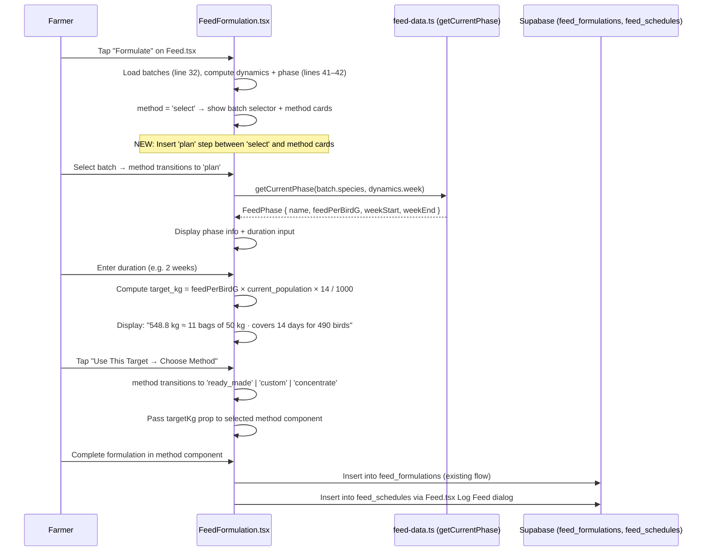
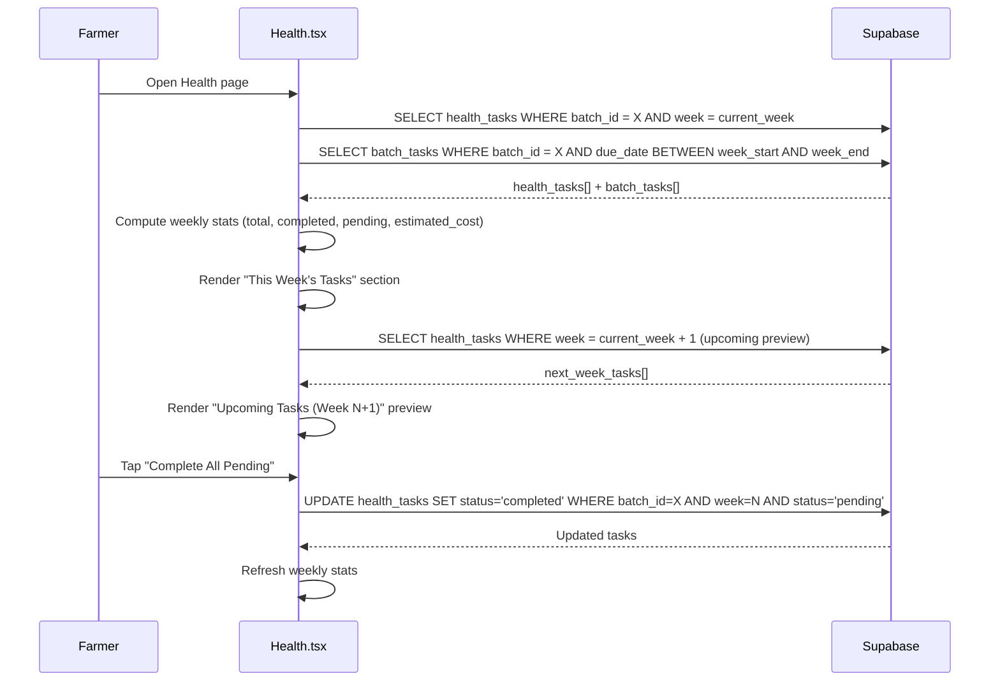
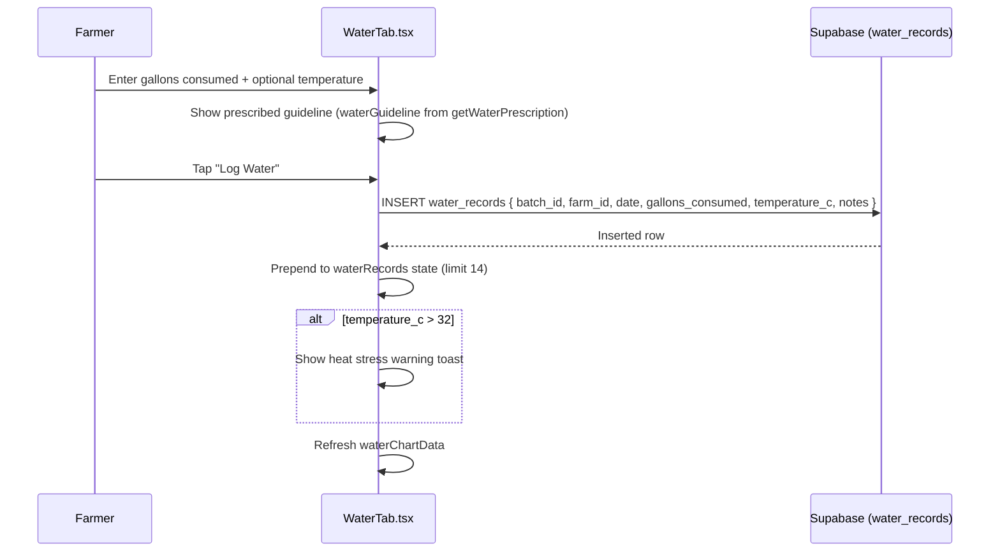
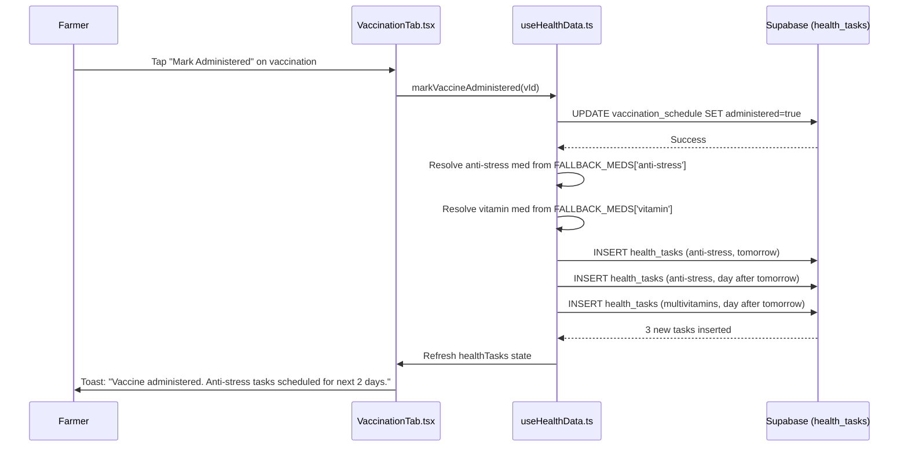

# Core Flows — Feed Planning & Weekly Health Task Allocation

# Core Flows — Feed Planning & Weekly Health Task Allocation

**Status:** New spec — supplements file:exactly-as-seen/specs/10_CORE_FLOWS.md
**Modules:** Feed (`04_FEED_CALCULATOR.md`), Water-Health (`03_WATER_HEALTH.md`), Batch (`02_BATCH_MANAGEMENT.md`)

## 1. Purpose

This spec documents the two new primary user flows added by this epic:

1. **Feed Planning Flow** — how the farmer arrives at `target_kg` before formulating feed
2. **Weekly Health Task Allocation Flow** — how the farmer views, tracks, and completes this week's water-health tasks

It also documents the `batch_tasks` daily operational task system, which was live but unspecced.

## 2. Flow 1 — Feed Planning (Duration-Based)

### 2.1 Entry Points

- Farmer taps **"Formulate"** button on `Feed.tsx` (line 253: `<Link to="/feed/formulate">`) — navigates to `FeedFormulation.tsx`
- Farmer taps **"Plan [Phase] Feed →"** from the feed transition prompt on `Feed.tsx` — navigates to `/feed/formulate` with initial method set to `'plan'`

### 2.2 Flow Diagram



### 2.3 Planning Step UI

The planning step is inserted as **Step 0** in `FeedFormulation.tsx`. The current flow is `'select' → method cards`. The new flow is `'select' → 'plan' → method cards`. The back button at `'plan'` returns to `'select'` (the existing back button logic at line 67 already handles `method === 'select'` → navigate to `/feed`; the new `'plan'` state returns to `'select'`).

```wireframe

<html>
<head>
<style>
body { font-family: system-ui; margin: 0; padding: 16px; background: #f9fafb; }
.card { background: white; border-radius: 12px; padding: 20px; margin-bottom: 16px; border: 1px solid #e5e7eb; }
.phase-badge { background: #f3f4f6; border-radius: 20px; padding: 4px 12px; font-size: 12px; font-weight: 600; display: inline-block; }
.label { font-size: 12px; color: #6b7280; margin-bottom: 4px; }
.value { font-size: 24px; font-weight: 700; color: #111827; }
.sub { font-size: 12px; color: #6b7280; }
.grid { display: grid; grid-template-columns: 1fr 1fr; gap: 12px; margin: 16px 0; }
.stat { background: #f9fafb; border-radius: 8px; padding: 12px; }
.input-row { display: flex; gap: 8px; align-items: center; margin: 16px 0; }
input[type=number] { border: 1px solid #d1d5db; border-radius: 8px; padding: 10px 14px; font-size: 16px; width: 80px; }
select { border: 1px solid #d1d5db; border-radius: 8px; padding: 10px 14px; font-size: 14px; }
.result { background: #eff6ff; border: 1px solid #bfdbfe; border-radius: 8px; padding: 14px; margin: 12px 0; }
.result-main { font-size: 20px; font-weight: 700; color: #1d4ed8; }
.result-sub { font-size: 13px; color: #3b82f6; margin-top: 2px; }
.btn { background: #111827; color: white; border: none; border-radius: 20px; padding: 12px 24px; font-size: 14px; font-weight: 600; cursor: pointer; width: 100%; margin-top: 8px; }
h2 { font-size: 18px; font-weight: 700; margin: 0 0 4px; }
p { font-size: 13px; color: #6b7280; margin: 0 0 16px; }
</style>
</head>
<body>
<div class="card">
  <div style="display:flex;justify-content:space-between;align-items:center;margin-bottom:12px">
    <h2>Plan Your Feed</h2>
    <span class="phase-badge">Grower Phase — Week 4</span>
  </div>
  <p>Set how much feed to prepare. The system will pre-fill your formulation target.</p>

  <div class="grid">
    <div class="stat">
      <div class="label">Per Bird / Day</div>
      <div class="value">80g</div>
      <div class="sub">Grower phase</div>
    </div>
    <div class="stat">
      <div class="label">Current Population</div>
      <div class="value">490</div>
      <div class="sub">birds</div>
    </div>
  </div>

  <div class="input-row">
    <span style="font-size:14px;font-weight:500">Plan for</span>
    <input type="number" value="2" data-element-id="duration-input" />
    <select data-element-id="duration-unit">
      <option>weeks</option>
      <option>days</option>
    </select>
  </div>

  <div class="result">
    <div class="result-main">548.8 kg</div>
    <div class="result-sub">≈ 11 bags of 50 kg &nbsp;·&nbsp; covers 14 days for 490 birds</div>
  </div>

  <button class="btn" data-element-id="confirm-plan">Use This Target → Choose Method</button>
</div>
</body>
</html>
```

### 2.4 Computation Rules

| Input | Formula | Example (80g/bird, 490 birds, 2 weeks) |
| --- | --- | --- |
| `duration_days` | `feedPerBirdG × current_population × duration_days / 1000` | `80 × 490 × 14 / 1000 = 548.8 kg` |
| Bag count | `Math.ceil(target_kg / bag_size_kg)` where `bag_size_kg = 50` | `Math.ceil(548.8 / 50) = 11 bags` |
| Duration label | `"covers X days for Y birds"` | `"covers 14 days for 490 birds"` |

The computation is **client-side only** using `feedPerBirdG` from file:exactly-as-seen/src/lib/feed-data.ts (e.g., broiler Grower = 80g, broiler Finisher = 130g, turkey Finisher = 250g). No new API call is needed. The `current_population` comes from `batch.current_population` (already loaded in `FeedFormulation.tsx` line 40).

### 2.5 Feed Phase Transition Prompt

`Feed.tsx` already loads `feed_schedules` for the selected batch (lines 62–70) and computes `dailyTotalKg = phase.feedPerBirdG × batch.current_population / 1000` (line 77). The phase transition prompt is a **client-side comparison** — no new API call:

```ts
// In Feed.tsx, after schedules load:
const lastSchedule = schedules[0]; // most recent (ordered by day DESC, line 67)
const phaseChanged = lastSchedule && phase &&
  lastSchedule.amount_per_bird_g !== phase.feedPerBirdG;
```

When `phaseChanged` is true, show a dismissible alert card:

```
┌─────────────────────────────────────────────────────┐
│ 🌾 Feed Phase Changed — Grower Phase                 │
│ New consumption rate: 80g / bird / day               │
│ (was 25g / bird / day in Starter)                    │
│                                                      │
│ [Plan Grower Feed →]                                 │
└─────────────────────────────────────────────────────┘
```

The "Plan Grower Feed →" button navigates to `/feed/formulate`. The `advance-batch-weeks` Edge Function (file:exactly-as-seen/supabase/functions/advance-batch-weeks/index.ts) currently returns only `{ success, message }` — **no new fields are needed** because the phase transition detection is client-side.

### 2.6 Business Rules

| Rule | Description |
| --- | --- |
| **R-FP-1** | `target_kg` is always computed as `feedPerBirdG × current_quantity × duration_days / 1000`, rounded to 1 decimal |
| **R-FP-2** | Bag count is `Math.ceil(target_kg / 50)` (50 kg bag is the West African standard) |
| **R-FP-3** | Duration input: minimum 1 day, maximum `cycle_length_weeks × 7` days |
| **R-FP-4** | The planning step is skipped if the farmer navigates directly to a method component (backward compatible) |
| **R-FP-5** | For semi-intensive batches, the UI shows an info note: "For semi-intensive batches, record actual usage manually after feeding" |
| **R-FP-6** | The computed `target_kg` is passed as a prop to `ReadyMadeFeed`, `CustomFormulation`, and `ConcentrateMix` components |

## 3. Flow 2 — Weekly Health Task Allocation

### 3.1 Entry Points

- Farmer opens the **Health** page (`/health`)
- Farmer taps a batch tile on the Dashboard that shows pending tasks

### 3.2 Flow Diagram



### 3.3 Weekly Task Plan UI

```wireframe

<html>
<head>
<style>
body { font-family: system-ui; margin: 0; padding: 16px; background: #f9fafb; }
.card { background: white; border-radius: 12px; padding: 16px; margin-bottom: 12px; border: 1px solid #e5e7eb; }
h2 { font-size: 18px; font-weight: 700; margin: 0 0 4px; }
.week-label { font-size: 13px; color: #6b7280; margin-bottom: 16px; }
.stats { display: grid; grid-template-columns: repeat(4, 1fr); gap: 8px; margin-bottom: 16px; }
.stat { background: #f9fafb; border-radius: 8px; padding: 10px; text-align: center; }
.stat-val { font-size: 20px; font-weight: 700; }
.stat-lbl { font-size: 11px; color: #6b7280; }
.stat-val.green { color: #16a34a; }
.stat-val.amber { color: #d97706; }
.task-card { border: 1px solid #e5e7eb; border-radius: 10px; padding: 14px; margin-bottom: 8px; display: flex; justify-content: space-between; align-items: center; }
.task-left { flex: 1; }
.task-name { font-weight: 600; font-size: 14px; }
.task-meta { font-size: 12px; color: #6b7280; margin-top: 2px; }
.badge { border-radius: 20px; padding: 3px 10px; font-size: 11px; font-weight: 600; }
.badge.pending { background: #fef3c7; color: #92400e; }
.badge.completed { background: #dcfce7; color: #166534; }
.badge.feed { background: #eff6ff; color: #1d4ed8; }
.btn-complete { background: #111827; color: white; border: none; border-radius: 8px; padding: 6px 14px; font-size: 12px; cursor: pointer; }
.btn-bulk { background: #111827; color: white; border: none; border-radius: 20px; padding: 10px 20px; font-size: 13px; font-weight: 600; cursor: pointer; width: 100%; margin-bottom: 16px; }
.section-title { font-size: 14px; font-weight: 600; color: #374151; margin: 16px 0 8px; }
.upcoming-item { display: flex; justify-content: space-between; padding: 8px 0; border-bottom: 1px solid #f3f4f6; font-size: 13px; }
.upcoming-item:last-child { border-bottom: none; }
</style>
</head>
<body>

<div class="card">
  <h2>This Week's Tasks</h2>
  <div class="week-label">Week 4 · Broiler Batch #12 · 490 birds</div>

  <div class="stats">
    <div class="stat"><div class="stat-val">8</div><div class="stat-lbl">Total</div></div>
    <div class="stat"><div class="stat-val green">5</div><div class="stat-lbl">Done</div></div>
    <div class="stat"><div class="stat-val amber">3</div><div class="stat-lbl">Pending</div></div>
    <div class="stat"><div class="stat-val">●●●●</div><div class="stat-lbl">Est. Cost</div></div>
  </div>

  <button class="btn-bulk" data-element-id="complete-all-btn">✓ Complete All Pending Tasks (3)</button>

  <div class="section-title">Pending</div>

  <div class="task-card">
    <div class="task-left">
      <div class="task-name">Multivitamins</div>
      <div class="task-meta">Day 25 · 26.4 tbsp in 100L · Drinking water</div>
    </div>
    <div style="display:flex;gap:8px;align-items:center">
      <span class="badge pending">Pending</span>
      <button class="btn-complete" data-element-id="complete-task-1">Complete</button>
    </div>
  </div>

  <div class="task-card">
    <div class="task-left">
      <div class="task-name">Daily Feed Log</div>
      <div class="task-meta">Day 26 · Record 39.2 kg consumed</div>
    </div>
    <div style="display:flex;gap:8px;align-items:center">
      <span class="badge feed">Feed</span>
      <button class="btn-complete" data-element-id="complete-task-2">Log</button>
    </div>
  </div>

  <div class="task-card">
    <div class="task-left">
      <div class="task-name">Lasota Vaccination</div>
      <div class="task-meta">Day 28 · Drinking water · ½ ration (50L)</div>
    </div>
    <div style="display:flex;gap:8px;align-items:center">
      <span class="badge pending">Pending</span>
      <button class="btn-complete" data-element-id="complete-task-3">Complete</button>
    </div>
  </div>

  <div class="section-title">Completed</div>

  <div class="task-card" style="opacity:0.6">
    <div class="task-left">
      <div class="task-name">Anti-stress + Glucose</div>
      <div class="task-meta">Day 22–24 · Done</div>
    </div>
    <span class="badge completed">Done</span>
  </div>
</div>

<div class="card">
  <div class="section-title" style="margin-top:0">Upcoming — Week 5</div>
  <div class="upcoming-item"><span>Multivitamins (Days 29–30)</span><span style="color:#6b7280">2 tasks</span></div>
  <div class="upcoming-item"><span>Amprolium (Days 31, 33)</span><span style="color:#6b7280">2 tasks</span></div>
  <div class="upcoming-item"><span>Gumboro Plus Vaccination (Day 35)</span><span style="color:#d97706">⚠ Vaccine</span></div>
</div>

</body>
</html>
```

### 3.4 Weekly Summary RPC

**New Postgres function:** `get_weekly_health_summary(p_batch_id UUID, p_week_number INT, p_farm_id UUID)`

Called from `useHealthData.ts` via `supabase.rpc('get_weekly_health_summary', { p_batch_id, p_week_number, p_farm_id })`.

```ts
// Return type (TypeScript)
export interface WeeklySummary {
  batch_id: string;
  week_number: number;
  health_tasks_total: number;
  health_tasks_completed: number;
  health_tasks_pending: number;
  batch_tasks_total: number;
  batch_tasks_completed: number;
  total_health_cost_pesewas: number | null; // null when cost_privacy_enabled
  next_week_tasks: Array<{
    medication_id: string;
    product_name: string;   // from health_tasks.product_name
    task_type: string;
    scheduled_date: string;
    is_vaccination: boolean; // task_type === 'vaccination'
  }>;
}
```

The function computes the week's date range from `batches.start_date + (p_week_number - 1) × 7` days. It counts `health_tasks` by `completed` status within the date range (using `scheduled_date`), counts `batch_tasks` by `completed` within the date range (using `due_date`), sums `cost_pesewas` from completed `health_tasks`, and returns next week's `health_tasks` as a JSONB array.

### 3.5 Bulk Complete RPC

**New Postgres function:** `bulk_complete_health_tasks(p_batch_id UUID, p_week_number INT, p_farm_id UUID, p_completed_at TIMESTAMPTZ)`

Called from `useHealthData.ts` via `supabase.rpc('bulk_complete_health_tasks', { p_batch_id, p_week_number, p_farm_id, p_completed_at })`.

```ts
// Return type (TypeScript)
export interface BulkCompleteResult {
  completed_count: number;
  skipped_count: number; // tasks already completed
  task_ids: string[];    // UUIDs of newly completed tasks
}
```

Behaviour: `UPDATE health_tasks SET completed = true, completed_at = p_completed_at WHERE batch_id = p_batch_id AND completed = false AND scheduled_date BETWEEN week_start AND week_end`. Does **not** touch `batch_tasks` (feed_log, water_log, egg_collection) — those require individual completion with a quantity input. Idempotent — calling twice returns `completed_count = 0, skipped_count = N` on the second call.

### 3.6 Business Rules

| Rule | Description |
| --- | --- |
| **R-WH-15** | Weekly task plan groups `health_tasks` (medication/vaccination) and `batch_tasks` (feed_log, water_log, egg_collection) for the current week |
| **R-WH-16** | "This Week" is defined as the 7-day window starting from `batch.start_date + (current_week - 1) × 7` in farm timezone |
| **R-WH-17** | Upcoming week preview shows the next 7 days' `health_tasks` only (not `batch_tasks`) |
| **R-WH-18** | Bulk complete only applies to `health_tasks` with `status = 'pending'`; `batch_tasks` are excluded |
| **R-WH-19** | `total_health_cost_pesewas` is null when `farm.cost_privacy_enabled = true` and no active unmask grant |
| **R-WH-20** | Bulk complete is idempotent — calling it twice returns the same result |

## 4. `batch_tasks` Daily Operational Task System (Previously Unspecced)

### 4.1 Purpose

`batch_tasks` is a separate task table from `health_tasks`. It holds **daily operational tasks** generated by `cron_generate_daily_tasks()` at 06:00 farm timezone (pg_cron schedule: `'0 * * * *'`, migration line 488):

| `task_type` | Title | Description | Condition |
| --- | --- | --- | --- |
| `feed_log` | Daily Feed | Record daily feed consumption | All active batches |
| `water_log` | Daily Water | Record daily water and health intake | All active batches |
| `egg_collection` | Egg Collection | Record daily egg collection | Layer batches Week 19+, Duck-layer (duck_type='layer') Week 20+ |

### 4.2 Schema (Live — Now Documented)

Confirmed from file:exactly-as-seen/src/integrations/supabase/types.ts lines 79–135:

```ts
// Table: public.batch_tasks
// Unique constraint: (batch_id, due_date, task_type) — migration line 6
{
  id: uuid PK,
  batch_id: uuid FK → batches,
  farm_id: uuid FK → farms,
  title: text NOT NULL,
  description: text | null,
  due_date: date NOT NULL,
  task_type: string DEFAULT 'feed_log',  // 'feed_log' | 'water_log' | 'egg_collection'
  completed: boolean DEFAULT false,
  completed_at: timestamptz | null,
  created_at: timestamptz DEFAULT now(),
  updated_at: timestamptz DEFAULT now(),
}
```

### 4.3 Relationship to `health_tasks`

`batch_tasks` and `health_tasks` are **parallel systems** serving different purposes:

| Dimension | `health_tasks` | `batch_tasks` |
| --- | --- | --- |
| Content | Medication, vaccination, treatment | Feed log, water log, egg collection |
| Generation | On `BATCH_CREATED` + `BATCH_WEEK_ADVANCED` | Daily at 06:00 farm tz |
| Conflict matrix | C1–C8 applied | Not applicable |
| Withdrawal tracking | Yes | No |
| Cost tracking | Yes (`cost_pesewas`) | No |
| Dashboard count | Yes | Yes (both counted in `tasks_today_count`) |

### 4.4 Frontend Integration for `batch_tasks`

`batch_tasks` are currently not surfaced in any frontend page. The weekly task plan view (Flow 2) is the first place they will be visible to the farmer. The "This Week" tab in `Health.tsx` will query `batch_tasks` directly via `supabase.from('batch_tasks')` filtered by `batch_id` and `due_date` within the current week's date range.

`batch_tasks` completion is handled per-task:

- `feed_log` completion: opens the existing Log Feed dialog in `Feed.tsx` (line 316–323)
- `water_log` completion: opens the existing Log Water dialog in `Health.tsx` Water tab
- `egg_collection` completion: opens the existing Egg Collection dialog in `Eggs.tsx`

<user_quoted_section>Important: batch_tasks are not bulk-completable via the weekly health bulk-complete RPC (R-WH-18). Each batch_task requires individual completion because feed_log and egg_collection tasks require the farmer to enter an actual quantity.</user_quoted_section>

## 5. Offline Behaviour

| Flow | Offline Behaviour |
| --- | --- |
| Feed planning step | Fully offline — computation uses `feedPerBirdG` from `feed-data.ts` (client-side constant) |
| Weekly task plan view | Served from Dexie cache; shows `⏳ cached` indicator when stale |
| Bulk complete | Queued in outbox; applied optimistically in Dexie; flushed on reconnect |
| Weekly summary | Served from Dexie cache; `next_week_tasks` may be stale |

## 5. Flow 3 — Water Consumption Tracking (Previously Unspecced)

### 5.1 Purpose

The `water_records` table tracks daily water consumption per batch. It is used to:

- Show the farmer how much water was consumed vs the prescribed guideline
- Detect heat stress (temperature > 32°C triggers an electrolyte warning)
- Drive the water trend chart in `WaterTab.tsx`

### 5.2 `water_records` Schema (Live — Now Documented)

Confirmed from file:exactly-as-seen/src/hooks/useHealthData.ts line 18 and file:exactly-as-seen/src/components/health/WaterTab.tsx:

```ts
// Table: public.water_records
{
  id: uuid PK,
  batch_id: uuid FK → batches,
  farm_id: uuid FK → farms,
  date: date NOT NULL,           // YYYY-MM-DD, farm timezone
  gallons_consumed: numeric NOT NULL,
  temperature_c: numeric | null, // optional ambient temperature
  notes: text | null,
  created_at: timestamptz DEFAULT now(),
}
```

### 5.3 Water Consumption Rates Per Species/Week

Source: deprecated Lampfarms WH spec §Species-Specific Protocols (lines 482–556). Implemented in `dosing-utils.ts` `getWaterPrescription()` but not previously specced.

**Broilers (ml/bird/day):**

| Week | ml/bird/day |
| --- | --- |
| 1 | 50 |
| 2 | 100 |
| 3 | 150 |
| 4 | 200 |
| 5–6 | 250 |

**Layers (ml/bird/day):**

| Week | ml/bird/day |
| --- | --- |
| 1–2 | 50 |
| 3–4 | 100 |
| 5–8 | 150 |
| 9–15 | 200 |
| 16+ | 300 |

**Ducks (ml/bird/day — 1.5–2× chickens):**

| Week | ml/bird/day |
| --- | --- |
| 1–2 | 150 |
| 3–4 | 250 |
| 5–8 | 400 |

**Turkeys (ml/bird/day):**

| Week | ml/bird/day |
| --- | --- |
| 1–2 | 100 |
| 3–6 | 200 |
| 7–10 | 300 |
| 11–14 | 400 |
| 15+ | 500 |

### 5.4 Heat Stress Multipliers

| Temperature | Water Multiplier |
| --- | --- |
| Below 20°C | 1.0× (normal) |
| 20–25°C | 1.2× |
| 25–30°C | 1.5× |
| 30–35°C | 2.0× |
| Above 35°C | 2.5–3.0× |

**Daily water guideline formula:**
`daily_water_gallons = (ml_per_bird × population × heat_multiplier) / 3785`

When no temperature is logged, the system uses a regional ambient temperature estimate from `getRegionalTemperature(farmRegion)` in `dosing-utils.ts`.

**Heat stress alert:** When `temperature_c > 32`, `logWater()` shows a toast: *"⚠️ High temperature detected! Consider adding electrolytes to water and increasing ventilation."*

### 5.5 Water Logging Flow



**Note:** Water logging does NOT create an expense record. Water is a utility cost tracked manually by the farmer in the Finance module under `utilities_and_services`.

## 6. Flow 4 — Vaccination Anti-Stress Auto-Scheduling (Previously Unspecced)

### 6.1 Purpose

When a vaccination is marked as administered, the system should automatically schedule anti-stress and multivitamin tasks for the next 2 days. This is a standard West African poultry protocol to support bird recovery after vaccination stress.

**Source:** Deprecated Lampfarms WH spec §Integration Flows (lines 1942–1959):

<user_quoted_section>"Auto-schedule anti-stress (tomorrow + day after) + multivitamins (day after tomorrow)"</user_quoted_section>

### 6.2 Flow



### 6.3 Business Rules

| Rule | Description |
| --- | --- |
| **R-VAC-1** | Anti-stress tasks are scheduled for `today + 1` and `today + 2` (relative to `administered_at` date) |
| **R-VAC-2** | Multivitamin task is scheduled for `today + 2` |
| **R-VAC-3** | Auto-scheduled tasks use `FALLBACK_MEDS['anti-stress']` and `FALLBACK_MEDS['vitamin']` from `health-auto-tasks.ts` |
| **R-VAC-4** | Auto-scheduling is idempotent — if tasks already exist for those dates (same `medication_id` + `scheduled_date`), the insert is skipped |
| **R-VAC-5** | Auto-scheduled tasks are subject to the conflict matrix (C1–C8) — if a conflict is detected, the task is not inserted and a warning toast is shown |

## 7. Cross-References

- Feed consumption rates: file:exactly-as-seen/src/lib/feed-data.ts — `FEED_PHASES[species][phase].feedPerBirdG` (broiler: 25/80/130g, layer: 30/70/110g, duck: 40/100/150g, turkey: 30/120/250g)
- Feed formulation flow: file:exactly-as-seen/src/pages/FeedFormulation.tsx — `FeedMethod = 'select' | 'ready_made' | 'custom' | 'concentrate'` (line 20)
- Feed page + feed_schedules: file:exactly-as-seen/src/pages/Feed.tsx — reads/writes `feed_schedules`, computes `dailyTotalKg` (line 77)
- Health task generation: file:exactly-as-seen/src/lib/health-auto-tasks.ts — `generateInitialTasks()` for duck niacin + turkey metronidazole
- Daily task cron: file:exactly-as-seen/supabase/functions/generate-daily-tasks/index.ts (Edge Function calls `cron_generate_daily_tasks()` RPC) + file:exactly-as-seen/supabase/migrations/20260414080005_rpc_and_jobs.sql lines 128–172 (pg_cron schedule: `'0 * * * *'`)
- Conflict matrix: file:exactly-as-seen/src/lib/medication-conflicts.ts — C1–C8 rules
- Health hook: file:exactly-as-seen/src/hooks/useHealthData.ts — `markTaskComplete()` (line 308), `addMedication()` (line 214)
- Canonical specs: file:exactly-as-seen/specs/04_FEED_CALCULATOR.md, file:exactly-as-seen/specs/03_WATER_HEALTH.md, file:exactly-as-seen/specs/02_BATCH_MANAGEMENT.md, file:exactly-as-seen/specs/10_CORE_FLOWS.md