# Tech Plan — Feed Planning & Weekly Health Task Allocation

# Tech Plan — Feed Planning & Weekly Health Task Allocation

**Status:** Ready for implementation
**Stack:** TypeScript / React 19 / Supabase (Postgres + Edge Functions) / Dexie.js / shadcn/ui

## 1. Implementation Overview

```mermaid
graph TD
    A[Feed Planning Step] --> B[FeedFormulation.tsx — Step 0 UI]
    A --> C[feed-data.ts — feedPerBirdG lookup]
    A --> D[Pre-fill target_kg in method components]

    E[Feed Phase Transition] --> F[AdvanceWeekResponse — new fields]
    E --> G[Feed.tsx — phase transition prompt]

    H[Weekly Health Task Plan] --> I[Health.tsx — This Week section]
    H --> J[GET /health/batches/:id/weeks/:week/summary]
    H --> K[POST /health/batches/:id/weeks/:week/complete-all]

    L[batch_tasks spec] --> M[10_CORE_FLOWS.md — §4 addition]
    L --> N[Dashboard aggregator — already counts both]

    O[Schema Correctness] --> P[useHealthData.ts — amount_pesewas only]
    O --> Q[useStockData.ts — quality_grade A]
    O --> R[useFinanceData.ts — read amount_pesewas]
    O --> S[Migration — UPDATE quality_grade good→A]
    O --> T[egg_records alignment]
    O --> U[feed_schedules spec]
```



## 2. Feed Planning Step — Frontend Changes

### 2.1 `FeedFormulation.tsx` — Add Planning Step

**File:** file:exactly-as-seen/src/pages/FeedFormulation.tsx

**Current state (confirmed from live code):**

- Line 20: `type FeedMethod = 'select' | 'ready_made' | 'custom' | 'concentrate'`
- Line 27: `const [method, setMethod] = useState<FeedMethod>('select')`
- Lines 67–68: back button returns to `/feed` when `method === 'select'`, else sets `method` to `'select'`
- Lines 87–99: batch selector shown when `method === 'select'`
- Lines 101–137: method cards shown when `method === 'select'`
- Lines 140–148: method components rendered with props `{ batch, phase, week, farmId, onDone }`

**Changes required:**

1. Add `'plan'` to `FeedMethod`: `type FeedMethod = 'select' | 'plan' | 'ready_made' | 'custom' | 'concentrate'`
2. Add `targetKg` state: `const [targetKg, setTargetKg] = useState<number | undefined>(undefined)`
3. After batch selector (line 99), when `method === 'select'` and a batch is selected, show a **"Plan Feed First"** button that sets `method = 'plan'`. The existing method cards remain as a direct shortcut (backward compatible).
4. Add `method === 'plan'` render block: shows the planning step UI (phase info, duration input, computed `target_kg`, bag count, "Use This Target → Choose Method" button)
5. The "Use This Target" button: sets `targetKg` state and transitions to method selection (shows method cards again with `targetKg` pre-set)
6. Update back button: when `method === 'plan'`, back returns to `'select'`
7. Pass `targetKg` to method components

### 2.2 Method Components — Accept `targetKg` Prop

**Files:** file:exactly-as-seen/src/components/feed/ReadyMadeFeed.tsx, file:exactly-as-seen/src/components/feed/CustomFormulation.tsx, file:exactly-as-seen/src/components/feed/ConcentrateMix.tsx

Each component gains an optional `targetKg?: number` prop. When provided:

- Pre-fill the relevant quantity/target input field with `targetKg`
- Show helper text: `"Pre-filled from your plan (X days × Y birds × Zg/bird)"`
- The farmer can still override the pre-filled value

### 2.3 `Feed.tsx` — Phase Transition Prompt

**File:** file:exactly-as-seen/src/pages/Feed.tsx

**Current state (confirmed from live code):**

- Lines 62–70: loads `feed_schedules` ordered by `day DESC`, limit 14
- Line 76: `const todaySchedule = schedules.find(s => s.day === (dynamics?.day ?? 0))`
- Line 77: `const dailyTotalKg = phase && batch ? (phase.feedPerBirdG * batch.current_population) / 1000 : 0`

**Changes required:**

```ts
// After schedules load, add:
const lastSchedule = schedules[0]; // most recent entry (day DESC)
const phaseTransitionDetected = !!(lastSchedule && phase &&
  lastSchedule.amount_per_bird_g !== phase.feedPerBirdG);
const previousFeedPerBirdG = lastSchedule?.amount_per_bird_g ?? null;
```

When `phaseTransitionDetected` is true, render a dismissible `Alert` card above the current phase info card:

```
🌾 Feed Phase Changed — [phase.name] Phase
New consumption rate: [phase.feedPerBirdG]g / bird / day
(was [previousFeedPerBirdG]g in previous phase)
[Plan [phase.name] Feed →]
```

The "Plan [phase.name] Feed →" button navigates to `/feed/formulate`. A `dismissed` boolean state (local, not persisted) hides the alert after the farmer taps the X.

## 3. Phase Transition Detection — Client-Side Only

**No changes to ****`advance-batch-weeks`**** Edge Function or ****`cron_advance_batch_weeks`**** RPC.**

The phase transition prompt is detected entirely client-side in `Feed.tsx` by comparing `phase.feedPerBirdG` (from `feed-data.ts`) against `schedules[0].amount_per_bird_g` (from the last `feed_schedules` row). This is sufficient because:

1. `feed_schedules` rows store `amount_per_bird_g` at the time of logging (line 164 in `Feed.tsx`)
2. When the phase changes, the new `feedPerBirdG` will differ from the last logged value
3. The comparison is instantaneous and requires no additional API call

The `advance-batch-weeks` Edge Function (file:exactly-as-seen/supabase/functions/advance-batch-weeks/index.ts) currently returns `{ success: true, message: 'Advanced batch weeks successfully' }` — this is sufficient; no new fields are needed.

## 4. Weekly Health Task Plan — Frontend Changes

### 4.1 `Health.tsx` — "This Week" Tab

**File:** file:exactly-as-seen/src/pages/Health.tsx

**Current state (confirmed from live code):**

- Line 101: `<Tabs defaultValue="vaccinations" className="w-full">`
- Line 102: `<TabsList className="w-full grid grid-cols-3">`
- Lines 103–118: 3 triggers: `vaccinations`, `medications`, `water`

**Changes required:**

1. Change `grid-cols-3` → `grid-cols-4`
2. Add a new `TabsTrigger value="this_week"` as the **first** trigger (leftmost), with a calendar or checklist icon
3. Add `TabsContent value="this_week"` rendering the weekly task plan UI
4. Change `defaultValue="vaccinations"` → `defaultValue="this_week"` so the farmer lands on the weekly view first

The "This Week" tab content:

1. Calls `supabase.rpc('get_weekly_health_summary', { p_batch_id, p_week_number, p_farm_id })` on mount and when `selectedBatch` changes
2. Renders the weekly stats grid (Total / Done / Pending / Est. Cost — masked when `costPrivacyEnabled`)
3. Renders "Complete All Pending (N)" button — calls `supabase.rpc('bulk_complete_health_tasks', ...)`
4. Renders task cards for pending `health_tasks` (sorted by `scheduled_date`), each showing: `product_name`, computed dose info, status badge, "Complete" button (calls existing `markTaskComplete()`)
5. Renders `batch_tasks` for the week (feed_log, water_log, egg_collection) as separate cards with "Log" button
6. Renders completed tasks (collapsed, expandable)
7. Renders "Upcoming — Week N+1" preview list from `weeklySummary.next_week_tasks`

### 4.2 `useHealthData.ts` — New State and Functions

**File:** file:exactly-as-seen/src/hooks/useHealthData.ts

**Current exports (confirmed from live code lines 444–475):** `batches`, `selectedBatch`, `setSelectedBatch`, `vaccinations`, `healthTasks`, `waterRecords`, `loading`, `generatingVaccines`, `medSubmitting`, `waterSaving`, `batch`, `batchAge`, `pendingVaccines`, `overdueVaccines`, `activeMeds`, `latestTemp`, `healthAlerts`, `activeWithdrawals`, `eggDiscardInfo`, `waterChartData`, `waterGuideline`, `todayWaterLogged`, `generateVaccinationSchedule`, `markVaccineAdministered`, `addMedication`, `markTaskComplete`, `logWater`, `medications`, `containerTypes`, `waterSourceChlorinated`

**New additions:**

```ts
// New state
const [weeklySummary, setWeeklySummary] = useState<WeeklySummary | null>(null);
const [weeklyLoading, setWeeklyLoading] = useState(false);
const [batchTasks, setBatchTasks] = useState<BatchTask[]>([]);

// New functions
const fetchWeeklySummary = async (batchId: string, weekNumber: number) => {
  setWeeklyLoading(true);
  const { data, error } = await supabase.rpc('get_weekly_health_summary', {
    p_batch_id: batchId,
    p_week_number: weekNumber,
    p_farm_id: farmId,
  });
  if (!error) setWeeklySummary(data);
  setWeeklyLoading(false);
};

const bulkCompleteWeekTasks = async (batchId: string, weekNumber: number) => {
  const { data, error } = await supabase.rpc('bulk_complete_health_tasks', {
    p_batch_id: batchId,
    p_week_number: weekNumber,
    p_farm_id: farmId,
    p_completed_at: new Date().toISOString(),
  });
  if (!error && data) {
    // Optimistic update: mark affected tasks as completed in healthTasks state
    setHealthTasks(prev => prev.map(t =>
      data.task_ids.includes(t.id) ? { ...t, completed: true, completed_at: new Date().toISOString() } : t
    ));
    await fetchWeeklySummary(batchId, weekNumber); // refresh summary
  }
};
```

Also load `batch_tasks` for the selected batch in the existing `useEffect` (alongside `health_tasks`, `vaccination_schedule`, `water_records`).

## 5. New Supabase RPC — Weekly Summary

### 5.1 New Migration

A new migration adds `get_weekly_health_summary(p_batch_id, p_week_number, p_farm_id)`:

```sql
-- Returns: health_tasks_total, health_tasks_completed, health_tasks_pending,
--          batch_tasks_total, batch_tasks_completed,
--          total_health_cost_pesewas, next_week_tasks (JSONB array)
```

The function:

1. Computes the week's date range from `batches.start_date + (p_week_number - 1) × 7`
2. Counts `health_tasks` by status within the date range
3. Counts `batch_tasks` by `completed` within the date range
4. Sums `cost_pesewas` from completed `health_tasks`
5. Returns next week's `health_tasks` as a JSONB array of `{ medication_id, medication_name, scheduled_date, is_vaccination }`

### 5.2 Bulk Complete RPC

A new RPC `bulk_complete_health_tasks(p_batch_id, p_week_number, p_farm_id, p_completed_at)`:

```sql
-- Updates health_tasks SET status='completed', completed_at=p_completed_at
-- WHERE batch_id=p_batch_id AND status='pending'
-- AND scheduled_date BETWEEN week_start AND week_end
-- Returns: completed_count, skipped_count, task_ids[]
```

## 6. Schema Correctness Fixes

### 6.1 Finance: Expense Category Strings + Revenue `amount_pesewas`

**Root cause confirmed from live code:**

- `useHealthData.ts` line 458: `category: 'medication'` — non-canonical. Canonical `07_FINANCE.md` §2.1 defines `'health_and_medicine'`.
- `useStockData.ts` lines 144–153: category mapping uses `'feed_purchase'`, `'medications'`, `'chicks_and_birds'`, `'equipment'` — canonical enum is `'feed_and_nutrition'`, `'health_and_medicine'`, `'chicks_and_birds'`, `'equipment_and_tools'`.
- `useFinanceData.ts` line 73: reads `Number(e.amount_pesewas ?? 0) / 100` — **already correct** ✅ (no change needed).
- `useFinanceData.ts` `addRevenue()` line 168: inserts `amount: data.amount` (GHS float) — should be `amount_pesewas: Math.round(Number(data.amount) * 100)`.
- `useFinanceData.ts` `addExpense()` line 142: inserts `amount_pesewas: Math.round(Number(data.amount) * 100)` — **already correct** ✅.

**Files to fix:**

- file:exactly-as-seen/src/hooks/useHealthData.ts line 458: `category: 'medication'` → `category: 'health_and_medicine'`
- file:exactly-as-seen/src/hooks/useStockData.ts lines 144–153: update category mapping:
  - `'feed_ingredients'` / `'feed'` → `'feed_and_nutrition'`
  - `'medications'` / `'medicine'` → `'health_and_medicine'`
  - `'chicks'` / `'birds'` → `'chicks_and_birds'`
  - `'equipment'` → `'equipment_and_tools'`
  - default `'other'` → `'other_expenses'`
- file:exactly-as-seen/src/hooks/useFinanceData.ts `addRevenue()` line 168: `amount: data.amount` → `amount_pesewas: Math.round(Number(data.amount) * 100)` (remove `amount` field)

### 6.2 Stock: `quality_grade` Fix

**Status: CLOSED** — `20260525000000_fourth_sprint.sql` M1+M2 already applied the data fix and CHECK constraint. `useStockData.ts` line 109 already inserts `quality_grade: 'A'` ✅. No further action needed.

### 6.3 `egg_records` → `egg_collections` Alignment

**Status: CLOSED** — `20260525000000_fourth_sprint.sql` M3 already renamed the table and recreated both `get_batch_record_summary` and `get_egg_inventory` Postgres functions ✅. `useEggData.ts` must be updated to use `supabase.from('egg_collections')` (lines 58, 177, 191) and `types.ts` regenerated from DB. Canonical specs (`05_EGG_PRODUCTION.md`, `08_RECORDS.md`) are already correct.

### 6.4 `feed_schedules` Spec + Records CTE Fix

**Root cause confirmed:**

- `Feed.tsx` lines 63–69: reads from `feed_schedules` — confirmed live table name
- `Feed.tsx` lines 159–168: inserts into `feed_schedules` with columns `farm_id`, `batch_id`, `week`, `day`, `amount_per_bird_g`, `total_amount_kg`, `completed`, `completed_at` — confirmed live column names
- `batch-utils.ts` lines 105–108: `cleanupBatchCompletion` updates `feed_schedules` — confirmed
- Migration line 336: `get_batch_record_summary` queries `feed_schedules.total_amount_kg` — **already correct in the live Postgres function**
- `08_RECORDS.md` §5.3 CTE (lines 232–235): uses `FROM feed_consumption` and `consumed_kg` — **wrong in the spec**
- Live `types.ts`: `feed_schedules` table is defined (confirmed from `Feed.tsx` line 21: `type FeedSchedule = Database['public']['Tables']['feed_schedules']['Row']`)

**Files to update:**

1. file:exactly-as-seen/specs/04_FEED_CALCULATOR.md — Add §3.1 documenting `feed_schedules` table with confirmed columns: `id`, `farm_id`, `batch_id`, `week`, `day`, `amount_per_bird_g`, `total_amount_kg`, `completed`, `completed_at`
2. file:exactly-as-seen/specs/08_RECORDS.md §5.3 CTE — Change `FROM feed_consumption` → `FROM feed_schedules` and `consumed_kg` → `total_amount_kg`

**No migration needed** — the live `get_batch_record_summary` Postgres function already uses `feed_schedules.total_amount_kg` correctly (migration line 336). Only the spec CTE needs updating.

## 6.5 New: Vaccination Anti-Stress Auto-Scheduling

**File:** file:exactly-as-seen/src/hooks/useHealthData.ts

**Current state:** `markVaccineAdministered()` (lines 243–260) only updates `vaccination_schedule.administered = true` and logs to `activity_log`. No auto-scheduling.

**Changes required:** After the `vaccination_schedule` update succeeds, insert 3 new `health_tasks` rows:

```ts
// After markVaccineAdministered succeeds:
const tomorrow = format(addDays(new Date(), 1), 'yyyy-MM-dd');
const dayAfter = format(addDays(new Date(), 2), 'yyyy-MM-dd');
const antiStress = FALLBACK_MEDS['anti-stress']; // from health-auto-tasks.ts
const vit = FALLBACK_MEDS['vitamin'];

await supabase.from('health_tasks').upsert([
  { batch_id: selectedBatch, farm_id: farmId, task_type: 'supplement',
    product_name: antiStress.name, medication_id: antiStress.id,
    delivery_method: antiStress.delivery_method, scheduled_date: tomorrow,
    completed: false, duration_days: 1, withdrawal_meat_days: 0, withdrawal_egg_days: 0 },
  { batch_id: selectedBatch, farm_id: farmId, task_type: 'supplement',
    product_name: antiStress.name, medication_id: antiStress.id,
    delivery_method: antiStress.delivery_method, scheduled_date: dayAfter,
    completed: false, duration_days: 1, withdrawal_meat_days: 0, withdrawal_egg_days: 0 },
  { batch_id: selectedBatch, farm_id: farmId, task_type: 'supplement',
    product_name: vit.name, medication_id: vit.id,
    delivery_method: vit.delivery_method, scheduled_date: dayAfter,
    completed: false, duration_days: 1, withdrawal_meat_days: 0, withdrawal_egg_days: 0 },
], { onConflict: 'batch_id,medication_id,scheduled_date', ignoreDuplicates: true });
```

Refresh `healthTasks` state after insertion. Show toast: *"Vaccine administered. Anti-stress tasks scheduled for next 2 days."*

## 6.6 New: Medication Stock Deduction Unit Conversion Fix

**File:** file:exactly-as-seen/src/hooks/useHealthData.ts

**Current bug (line 429):**

```ts
const qtyToDeduct = Number(task.computed_dose_amount || task.container_count || 1);
```

`computed_dose_amount` is in `dose_unit` (tsp/tbsp/ml/g). The stock item's `unit` field may be `ml`, `g`, `vial`, `sachet`, `bottle`, etc. Deducting `9.9 tsp` from a stock item measured in `ml` is meaningless.

**Fix:** Add a `convertDoseToStockUnit(doseAmount, doseUnit, stockUnit)` helper:

```ts
function convertDoseToStockUnit(
  doseAmount: number,
  doseUnit: string | null,
  stockUnit: string
): number {
  // If units match or no dose unit, use container_count as fallback
  if (!doseUnit) return 1;
  // Volume conversions (approximate)
  const toMl: Record<string, number> = { tsp: 4.93, tbsp: 14.79, ml: 1, g: 1 };
  const doseInMl = doseAmount * (toMl[doseUnit] ?? 1);
  if (stockUnit === 'ml') return doseInMl;
  if (stockUnit === 'g') return doseInMl; // approximate for liquids
  if (stockUnit === 'L') return doseInMl / 1000;
  // For discrete units (vial, sachet, bottle), use container_count
  return task.container_count ?? 1;
}
```

Replace line 429 with:

```ts
const qtyToDeduct = convertDoseToStockUnit(
  Number(task.computed_dose_amount),
  task.computed_dose_unit,
  matchedStock.unit
);
```

## 6.7 New: `water_records` Table Spec Addition

**File:** file:exactly-as-seen/specs/03_WATER_HEALTH.md

Add a new §3.4 documenting the `water_records` table (schema, water consumption rates per species/week, heat stress multipliers, and the `logWater()` flow). No migration needed — the table already exists in the live DB.

## 7. Migration Plan

| # | Migration | Type | Risk | Status |
| --- | --- | --- | --- | --- |
| M1 | `UPDATE stock_lots SET quality_grade='A' WHERE quality_grade='good'` | Data fix | Low | ✅ **DONE** (`fourth_sprint.sql`) |
| M2 | `ALTER TABLE stock_lots ADD CONSTRAINT stock_lots_quality_grade_check CHECK (quality_grade IN ('A','B','C','damaged'))` | Schema | Low | ✅ **DONE** (`fourth_sprint.sql`) |
| M3 | `ALTER TABLE public.egg_records RENAME TO egg_collections` + recreate `get_batch_record_summary` + `get_egg_inventory` | Schema rename | Medium | ✅ **DONE** (`fourth_sprint.sql`) |
| M4 | `CREATE OR REPLACE FUNCTION get_weekly_health_summary(...)` | New RPC | Low | ✅ **DONE** (`fourth_sprint.sql`) |
| M5 | `CREATE OR REPLACE FUNCTION bulk_complete_health_tasks(...)` | New RPC | Low | ✅ **DONE** (`fourth_sprint.sql`) |
| M6 | Apply Migration 5B (`20260414080004_migration_5B.sql`) — drop `expenses.amount` column | Column drop | Medium | ⏳ **PENDING** — deploy after frontend category fix |

**Remaining deploy sequence:** Frontend T1 (feed planning) → Frontend T2 (Health.tsx tab) → Frontend T3 (category fix + vaccination auto-scheduling + stock deduction fix) → M6 (drop `expenses.amount`)

## 8. Test Plan

| Test | Covers | File |
| --- | --- | --- |
| Feed planning: broiler Grower `80 × 490 × 14 / 1000 = 548.8 kg` | R-FP-1 | `feed-data.ts` + `FeedFormulation.tsx` |
| Feed planning: turkey Finisher `250 × 200 × 7 / 1000 = 350 kg` | R-FP-1 | `feed-data.ts` |
| Bag count: `Math.ceil(548.8 / 50) = 11` | R-FP-2 | `FeedFormulation.tsx` |
| Duration input: 0 days → validation error shown | R-FP-3 | `FeedFormulation.tsx` |
| Duration input: `cycle_length_weeks × 7 + 1` days → validation error | R-FP-3 | `FeedFormulation.tsx` |
| Phase transition: `schedules[0].amount_per_bird_g = 25`, `phase.feedPerBirdG = 80` → prompt shown | R-FP-5 | `Feed.tsx` |
| Phase transition: same values → no prompt | R-FP-5 | `Feed.tsx` |
| Weekly summary RPC: 3 completed + 2 pending health_tasks → `health_tasks_completed=3, health_tasks_pending=2` | R-WH-15 | `get_weekly_health_summary` |
| Weekly summary RPC: cost_privacy_enabled=true → `total_health_cost_pesewas=null` | R-WH-19 | `get_weekly_health_summary` |
| Bulk complete RPC: 2 pending tasks → `completed_count=2`; replay → `completed_count=0, skipped_count=2` | R-WH-18, R-WH-20 | `bulk_complete_health_tasks` |
| Finance stats: `useFinanceData` line 73 reads `amount_pesewas` → `totalExp` in GHS | Gap B | `useFinanceData.ts` |
| Stock quality: `useStockData.recordTransaction` inserts `quality_grade='A'` | Gap C | `useStockData.ts` |
| Egg records: `useEggData` queries `egg_collections` after migration | Gap D | `useEggData.ts` |
| Records CTE: `08_RECORDS.md` CTE uses `feed_schedules.total_amount_kg` | Gap E | `08_RECORDS.md` spec |