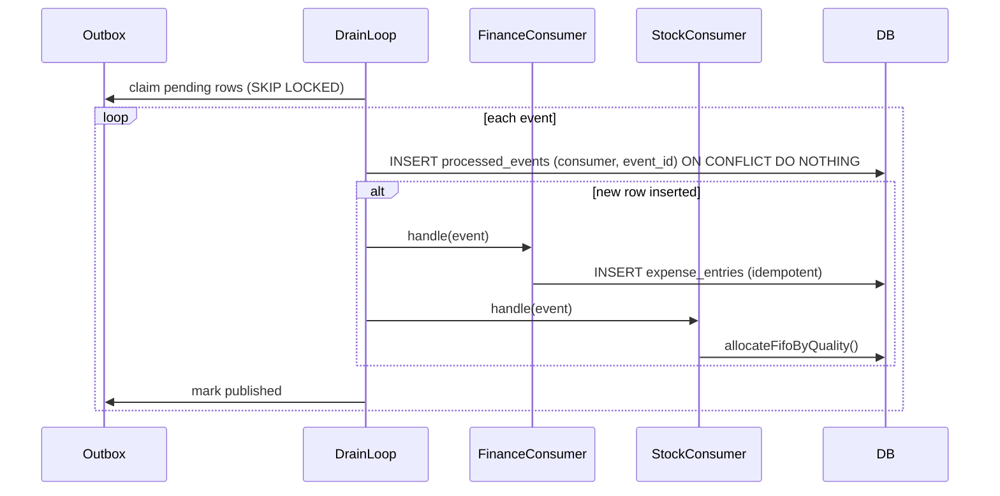

# R4 — Auto-Ledger Event Consumers: Finance + Stock outbox wiring

## Goal

The Finance and Stock modules have full service logic but their outbox event consumers are not registered in file:artifacts/api-server/src/lib/jobs.ts. The `CONSUMERS` registry currently has only `phase1.audit`. This ticket wires the Phase 2 cross-module event flows.

## Spec Reference

spec:3a092065-e868-4799-849c-f707a0553261/b7f8a421-4897-4bc3-bfc4-850e84f63a24 — Sprint 2B §2B.2–2B.3

## Dependencies

- R1 must be merged first (tables must exist)

## Changes Required

### Register in `CONSUMERS` — file:artifacts/api-server/src/lib/jobs.ts

| Consumer key | Trigger event | Action |
| --- | --- | --- |
| `finance.stock-purchased` | `STOCK_PURCHASED` | Create `expense_entries` row (category: `feed_and_nutrition` or `health_and_medicine` based on item category); idempotent on `(source_event, source_ref_id)` |
| `finance.health-task-completed` | `HEALTH_TASK_COMPLETED` | Create `expense_entries` row for medication cost (intensive only — check `production_system`); idempotent |
| `finance.feed-confirmed` | `FEED_FORMULATION_CONFIRMED` | Create `expense_entries` row for feed cost (intensive only); idempotent |
| `finance.batch-created` | `BATCH_CREATED` | Create `expense_entries` row only when the payload includes the initial purchase cost; otherwise no auto-entry is created and the farmer records it manually |
| `finance.egg-sale` | `EGG_SALE_RECORDED` | Create `revenue_entries` row (stub — event not yet emitted until Phase 3) |
| `stock.health-task-completed` | `HEALTH_TASK_COMPLETED` | Auto-allocate medication stock via `allocateFifoByQuality` (intensive only) |
| `stock.feed-confirmed` | `FEED_FORMULATION_CONFIRMED` | Auto-allocate ingredient stock via `allocateFifoByQuality` (intensive only) |

All consumers must use the existing `processed_events` dedup pattern already in `drainOutbox()` — insert `(consumer, event_id)` before calling the handler.

## Acceptance Criteria

- `STOCK_PURCHASED` → `expense_entries` row created with correct category
- `HEALTH_TASK_COMPLETED` → `expense_entries` row created for intensive batches only
- `FEED_FORMULATION_CONFIRMED` → `expense_entries` row created for intensive batches only
- `HEALTH_TASK_COMPLETED` → medication stock allocated via FIFO for intensive batches
- `FEED_FORMULATION_CONFIRMED` → ingredient stock allocated via FIFO for intensive batches
- Consumers use the real source-event idempotency anchor and do not double-apply on replay
- `finance.batch-created` is conditional on purchase-cost data being present in the event payload
- `pnpm run typecheck` passes