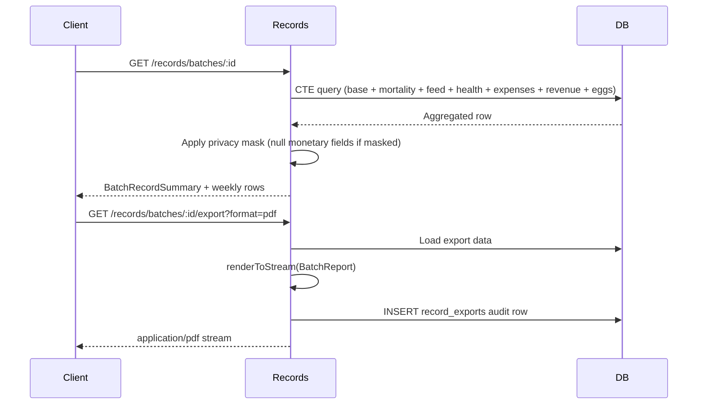

# S4.A — Records + Dashboard + Settings Backend Modules

## Goal

Implement the three remaining backend modules: Records analytics, Dashboard aggregator, and Settings. These are the last backend pieces before the platform is feature-complete.

## Spec Reference

spec:3a092065-e868-4799-849c-f707a0553261/b7f8a421-4897-4bc3-bfc4-850e84f63a24 — Sprint 4 §4.1–4.3
file:specs/08_RECORDS.md, file:specs/09_MAIN_DASHBOARD.md, file:specs/10_SETTINGS.md

## Dependencies

- S3.A (Egg Production must exist — Records aggregates egg data)
- R4 (event consumers wired — Finance auto-ledger must be live for Records financial aggregation to be meaningful)

## DB Schema

New schema additions:

| Table | Module | Notes |
| --- | --- | --- |
| `record_exports` | Records | Audit row per export — `farm_id`, `user_id`, `kind`, `batch_ids` (JSON), `masked_financials`, `bytes` |
| `user_preferences` | Settings | Per `(user_id, farm_id)` — currency (GHS/NGN), timezone, `cost_privacy_enabled`, `cost_privacy_pin_hash`, theme |
| `config_overrides` | Settings | JSONB keyed by `config_key` — L3 runtime overrides |

Add to file:lib/db/src/schema/index.ts.

## Records Module (file:artifacts/api-server/src/modules/records/)

Mount at `/api/v1/records`.

### Endpoints

| Method | Path | Notes |
| --- | --- | --- |
| `GET` | `/records/overview` | `?period=month\|quarter\|year\|all` — `OverviewKpis` via CTE |
| `GET` | `/records/trends` | `?metric=&period=` — time series |
| `GET` | `/records/batches` | Paginated list with derived KPIs (CTE) |
| `GET` | `/records/batches/:batchId` | Detail + weekly rows |
| `GET` | `/records/batches/:batchId/activity` | UNION ALL timeline, cursor-paginated |
| `POST` | `/records/compare` | 2–4 batch ids; `ComparisonResult` with insights |
| `GET` | `/records/batches/:batchId/export` | `?format=pdf\|csv` — binary response |
| `POST` | `/records/compare/export` | Compare PDF/CSV |
| `GET` | `/records/health/summary` | Task completion rates, withdrawal history |
| `GET` | `/records/finance/summary` | Proxies Finance P&L with same masking rules |

### Key implementation rules

- **All aggregations via SQL CTEs** — no client-side aggregation, no materialised views in v1 (R8)
- **Cost privacy passthrough:** when masked, all monetary fields are `null` + `"financialsMasked": true` (R3)
- **PDF export:** server-rendered via `@react-pdf/renderer` streaming response — no headless browser (R11)
- **CSV export:** RFC-4180, header row + N data rows (R11)
- **Every export writes one ****`record_exports`**** audit row** (R12)
- **Compare cardinality:** `< 2` → `400 COMPARE_TOO_FEW`; `> 4` → `400 COMPARE_TOO_MANY` (R5)
- **Best-performer flagging:** per metric direction — `lower_better` (mortality, FCR), `higher_better` (health completion, egg rate, ROI, net profit); tie → `bestBatchId: null` (R6)
- **Insights:** at minimum 2 insight rows when ≥ 2 batches with non-null metrics — mortality gap, FCR improvement, vaccination gap (R7)

## Dashboard Aggregator (file:artifacts/api-server/src/modules/dashboard/)

Mount at `/api/v1/dashboard`.

Single endpoint: `GET /dashboard/overview` — `DashboardOverview` response per file:specs/09_MAIN_DASHBOARD.md §6.6.

### Key implementation rules

- Compose from internal services — **at most one query per source module**
- Response target: **≤ 400ms p95**
- Financial values (`weekly_expenses_pesewas`, `monthly_revenue_pesewas`) follow the same server-side privacy rule as Finance and Records — `null` + privacy indicator when masked
- `active_batches[]` excludes `terminated` batches; includes `withdrawal` batches
- `tasks_today_count` = count of `health_tasks` where `status IN ('overdue', 'due_today')` in farm timezone
- `recent_activity` capped at 5 items server-side

## Settings Module (file:artifacts/api-server/src/modules/settings/)

Mount at `/api/v1/settings`.

### Endpoint groups

| Group | Endpoints | Key rules |
| --- | --- | --- |
| Preferences | `GET/PATCH /preferences`, `POST/DELETE /preferences/pin` | Currency GHS/NGN only (R-S-1); PIN is 4 digits, bcrypt stored (R-S-3) |
| Farm | `GET/PATCH /farm` | `waterSourceChlorinated` change invalidates ConfigService cache; `timezone` change re-registers pg-boss jobs |
| Houses | `GET/POST/PATCH/DELETE /houses/:houseId` | Delete blocked by active batch (R-S-6); capacity reduce blocked if below active population (R-S-7) |
| Market Prices | `GET/POST/DELETE /market-prices/:configKey` | Safety keys → `422 SAFETY_KEY_NOT_OVERRIDABLE` (R-S-5) |
| Species Config | `GET /species-config` | Read-only viewer |
| Data | `POST /export`, `DELETE /account`, `DELETE /account/cancel` | Soft-delete with 30-day recovery window (R-S-8) |

### pg-boss job

Register `account-purge` job: daily `0 2 * * *` UTC — hard-deletes accounts past their recovery window in dependency order.

## Acceptance Criteria

- `POST /records/compare` with 1 batch → `400 COMPARE_TOO_FEW`; 5 batches → `400 COMPARE_TOO_MANY`
- PDF export returns `Content-Type: application/pdf` with `%PDF` magic bytes
- CSV export returns RFC-4180 with header row
- Every export writes one `record_exports` audit row
- Privacy active → all monetary fields `null` in Records responses
- Dashboard overview responds in ≤ 400ms on a warm DB
- Dashboard financial values are `null` when privacy active
- `PATCH /settings/preferences` with `currency = 'USD'` → `400 VALIDATION_FAILED`
- `POST /settings/market-prices` with a safety key → `422 SAFETY_KEY_NOT_OVERRIDABLE`
- `DELETE /settings/houses/:id` with active batch → `409 HOUSE_OCCUPIED`
- `DELETE /settings/account` with correct phrase → `users.deleted_at` set; recovery window = now + 30 days
- `bun run typecheck` passes