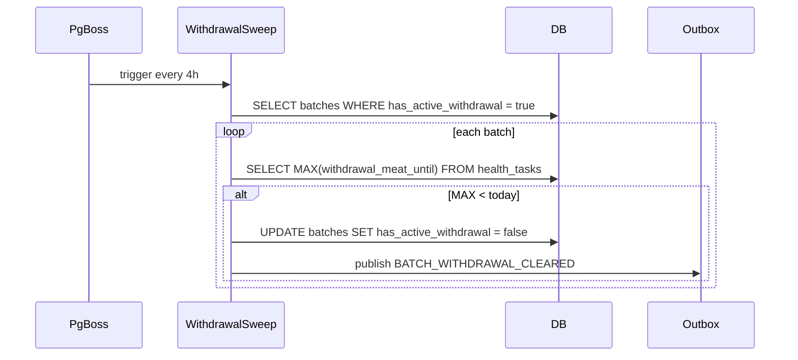

# Sprint 1.B — Species Config Seeds + Daily Task Job + Withdrawal Sweep Job

## Goal

Complete Phase 1. Seed all 6 species config rows, register `generateDailyBatchTasks` and `checkWithdrawalPeriods` as pg-boss jobs. Depends on `Sprint 1.A` (schema changes must be applied first).

## Spec Reference

spec:3a092065-e868-4799-849c-f707a0553261/b7f8a421-4897-4bc3-bfc4-850e84f63a24 — Sprint 1 §1.1–1.3

## Dependencies

- `Sprint 1.A` must be merged first (needs `species_config.variant` column)
- Sprint 0.1–0.3 must be merged first (local dev environment must work)

## Changes Required

### 1. Species Config Seed — file:scripts/src/seed-species-config.ts

Insert 6 rows into `species_config` using `onConflictDoNothing()` on `(species, variant)`:

| species | variant | Source spec |
| --- | --- | --- |
| broiler | default | file:specs/11_PROTOCOL_BROILER.md §10 |
| layer | default | file:specs/12_PROTOCOL_LAYER.md config section |
| duck | meat | file:specs/13_PROTOCOL_DUCK.md §11.1 |
| duck | layer | file:specs/13_PROTOCOL_DUCK.md §11.2 |
| turkey | default | file:specs/14_PROTOCOL_TURKEY.md §11 |
| other | default | file:specs/15_PROTOCOL_OTHER_SPECIES.md §11 |

Add `pnpm --filter @workspace/scripts run seed` command to file:scripts/package.json.

### 2. `generateDailyBatchTasks` Job — file:artifacts/api-server/src/lib/jobs.ts

Register a new pg-boss queue `health.daily-tasks` and schedule it at `0 6 * * *` per farm timezone. The worker:

1. Loads all active batches grouped by farm
2. For each batch, computes `dayOfBatch = today - start_date` in farm timezone
3. Reads the matching `species_config` row (by `species` + `variant`)
4. Finds all schedule entries where `day === dayOfBatch`
5. Inserts `health_tasks` rows using `onConflictDoNothing` on `(batch_id, medication_id, scheduled_date)` — idempotent
6. Applies duck niacin logic: daily Days 1–28, weekly thereafter (every 7 days)
7. Applies turkey Metronidazole biweekly: every 14 days from Day 1

Dose calculation: `dose_amount = medication.dose_per_gallon × (per_bird_water_ml × birds / 1000 / 3.785)`

### 3. `checkWithdrawalPeriods` Job — file:artifacts/api-server/src/lib/jobs.ts

Register a new pg-boss queue `health.withdrawal-sweep` and schedule it at `0 */4 * * *` UTC. The worker:

1. Queries all batches where `has_active_withdrawal = true`
2. For each, queries `MAX(withdrawal_meat_until)` from `health_tasks` where `status = 'completed'`
3. If `MAX < today` → sets `has_active_withdrawal = false`, publishes `BATCH_WITHDRAWAL_CLEARED` via `publish()`

## Acceptance Criteria

- `pnpm --filter @workspace/scripts run seed` inserts 6 rows; re-run is idempotent
- Duck has two rows: `(duck, meat)` and `(duck, layer)`
- `generateDailyBatchTasks` creates a Gumboro task for a broiler batch on Day 7
- Duck batch Day 1 gets a niacin task; Day 29 gets a weekly niacin task (not daily)
- Turkey batch gets Metronidazole on Day 8 and Day 22
- `checkWithdrawalPeriods` sets `has_active_withdrawal = false` after withdrawal date passes
- `BATCH_WITHDRAWAL_CLEARED` appears in `outbox_messages` after sweep
- `pnpm run typecheck` passes