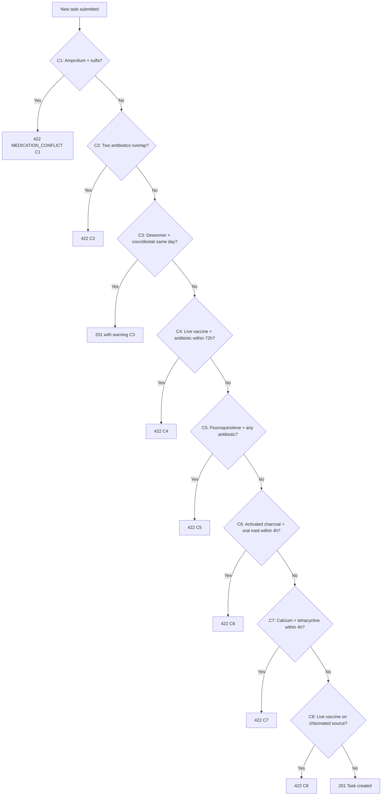

# Sprint 2A.1 — Water-Health Module Backend (Routes, Conflict Matrix, Dosing, Event Consumers)

## Goal

Implement the complete Water-Health backend module. All 7 endpoints, the C1–C8 conflict matrix, dosing formula, and event consumers. Depends on `Sprint 2A.0` (schema must exist).

## Spec Reference

spec:3a092065-e868-4799-849c-f707a0553261/b7f8a421-4897-4bc3-bfc4-850e84f63a24 — Sprint 2A §2A.2
file:specs/03_WATER_HEALTH.md

## Dependencies

- `Sprint 2A.0` merged (medications, container_types, health_tasks extended)
- `Sprint 1.A` merged (farms.water_source_chlorinated exists)

## Module Structure

New directory: file:artifacts/api-server/src/modules/water-health/

| File | Responsibility |
| --- | --- |
| `routes.ts` | Express router, Zod validation, mounts at `/api/v1/health` |
| `service.ts` | Business logic, orchestrates conflicts + dosing + DB writes |
| `conflicts.ts` | `detectConflicts(batchId, newTask, tx)` — returns C1–C8 results |
| `dosing.ts` | `computeDose(med, waterVolumeL)` — single pure function |
| `seed/medications.ts` | Full 52+ medication seed data (called from seed script) |

## Endpoints

| Method | Path | Notes |
| --- | --- | --- |
| GET | `/api/v1/health/medications` | Returns full medication catalogue |
| GET | `/api/v1/health/containers` | Returns 9 container types |
| GET | `/api/v1/health/batches/:batchId/tasks` | Farm-scoped, ordered by scheduled_at |
| POST | `/api/v1/health/tasks` | Create ad-hoc task; runs conflict matrix |
| POST | `/api/v1/health/tasks/:id/complete` | Sets status=completed, computes withdrawal dates |
| POST | `/api/v1/health/tasks/:id/skip` | Sets status=skipped |
| GET | `/api/v1/health/batches/:batchId/withdrawals` | Active withdrawal summary |

## Conflict Matrix

**Key implementation rules:**

- C4 uses `scheduled_at` timestamp — 72-hour window, not same-day
- C6/C7 use `scheduled_at` — real ±4-hour window
- C8 reads `farms.water_source_chlorinated` — must be `true` to trigger
- Injection tasks: `container_type_id`, `container_count`, `water_volume_l`, `computed_dose_amount` are all `null`; `bird_count` is set
- Dosing formula: `dose_amount = medication.dose_per_gallon × (water_volume_l / 3.785)` — no legacy multiplier

## Event Consumers

Register in file:artifacts/api-server/src/lib/jobs.ts `CONSUMERS` registry:

| Consumer key | Trigger event | Action |
| --- | --- | --- |
| `water-health.batch-created` | `BATCH_CREATED` | Generate Day-1 protocol tasks from species_config; seed duck niacin + turkey Metronidazole schedules |
| `water-health.week-advanced` | `BATCH_WEEK_ADVANCED` | Generate new week's tasks from species_config |
| `water-health.mortality-recorded` | `BATCH_MORTALITY_RECORDED` | Recompute `bird_count` on all future injection tasks for this batch |

Publish events: `HEALTH_TASK_COMPLETED`, `BATCH_WITHDRAWAL_STARTED`, `BATCH_WITHDRAWAL_CLEARED`

## Acceptance Criteria

- All 7 endpoints return correct Zod-validated responses
- C1–C8: each conflict scenario tested individually (see master plan test table)
- C4 at 71h → BLOCK; at 73h → allowed (uses real timestamps)
- C6/C7 at 3h59m → BLOCK; at 4h01m → allowed
- C8 only fires when `farms.water_source_chlorinated = true`
- Injection task for `duck_viral_hepatitis`: container fields null, bird_count set
- Dose for amprolium (1.5 tsp/gal) at 25L = 9.9 tsp
- Duck `BATCH_CREATED` → niacin tasks seeded daily Days 1–28, weekly thereafter
- Turkey `BATCH_CREATED` → Metronidazole tasks on Day 8, Day 22, Day 36…
- `BATCH_MORTALITY_RECORDED` → future injection task bird_count updated
- Completing oxytetracycline (7-day withdrawal) → `has_active_withdrawal = true` on batch
- `pnpm run typecheck` passes