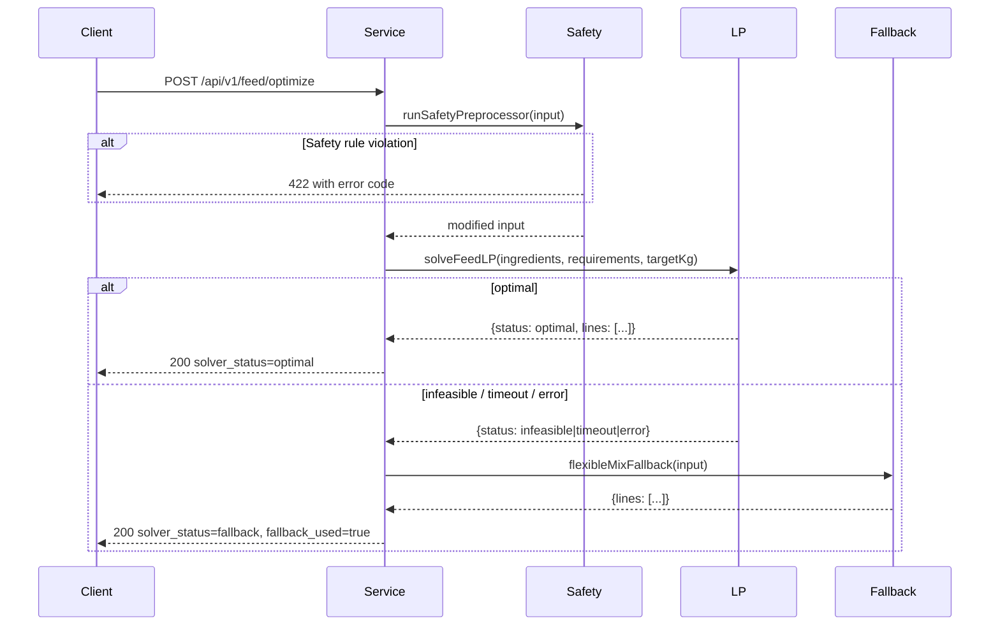

# Sprint 2A.2 — Feed Calculator Module Backend (highs-js LP, Safety Preprocessor, 4 Modes)

## Goal

Implement the complete Feed Calculator backend module. highs-js LP solver, Safety Preprocessor (5 rules), all 4 feed modes, confirm flow. Depends on `Sprint 2A.0` (schema) and `Sprint 2A.1` (Water-Health withdrawal endpoint used for pre-LP guard).

## Spec Reference

spec:3a092065-e868-4799-849c-f707a0553261/b7f8a421-4897-4bc3-bfc4-850e84f63a24 — Sprint 2A §2A.3
file:specs/04_FEED_CALCULATOR.md

## Dependencies

- `Sprint 2A.0` merged (formulations, ingredients, nutritional_requirements tables)
- `Sprint 2A.1` merged (withdrawal endpoint available for pre-LP guard)

## Module Structure

New directory: file:artifacts/api-server/src/modules/feed/

| File | Responsibility |
| --- | --- |
| `routes.ts` | Express router, Zod validation, mounts at `/api/v1/feed` |
| `service.ts` | Orchestrates mode dispatch, Safety Preprocessor, LP, fallback |
| `safety.ts` | `runSafetyPreprocessor(input)` — 5 rules, returns modified input or 422 |
| `lp.ts` | `solveFeedLP(ingredients, requirements, targetKg)` — highs-js WASM singleton, 5s timeout |
| `fallback.ts` | `flexibleMixFallback(input)` — proportional mix when LP fails |

## Endpoints

| Method | Path | Notes |
| --- | --- | --- |
| GET | `/api/v1/feed/ingredients` | Full ingredient catalogue |
| GET | `/api/v1/feed/requirements` | Nutritional requirements by species/phase |
| POST | `/api/v1/feed/optimize` | Auto LP mode |
| POST | `/api/v1/feed/flexible` | Flexible mix mode |
| POST | `/api/v1/feed/ready-made` | Ready-made feed mode |
| POST | `/api/v1/feed/concentrate-mix` | Concentrate mix mode |
| POST | `/api/v1/feed/:id/confirm` | Confirm formulation; publishes event |
| GET | `/api/v1/feed/batches/:batchId/history` | Past formulations for batch |

## Safety Preprocessor Rules

| Rule | Code | Action |
| --- | --- | --- |
| R-FC-1 | Toxin binder | Auto-add at 0.5% of target_kg for all species |
| R-FC-2 | Gossypol block | Layer + cotton-seed cake → 422 `LAYER_GOSSYPOL_BLOCKED` |
| R-FC-3 | Fish meal cap | Broiler fish meal LP upper bound capped at 10% |
| R-FC-4 | Calcium cap | Layer calcium sources capped at 8% |
| R-FC-5 | Duck niacin | **Explicitly NOT added** — niacin is Water-Health only |

## LP Solver Flow

## Confirm Flow

`POST /api/v1/feed/:id/confirm`:

- Idempotent on `Idempotency-Key` header (uses existing `idempotencyMiddleware`)
- If already confirmed → 409 `FORMULATION_ALREADY_CONFIRMED`
- Sets `confirmed_at`, publishes `FEED_FORMULATION_CONFIRMED` to outbox
- `FEED_FORMULATION_CONFIRMED` is consumed by Stock (allocate ingredients) and Finance (create expense entry) in Sprint 2B

## Acceptance Criteria

- Auto mode, broiler finisher, valid ingredients → `solver_status: 'optimal'`, `meets_requirements: true`
- Auto mode, layer + cotton-seed cake → 422 `LAYER_GOSSYPOL_BLOCKED`
- Auto mode, infeasible problem → 200 `fallback_used: true`, `fallback_reason: 'LP_INFEASIBLE'`
- Auto mode, mocked 5s timeout → `fallback_reason: 'LP_TIMEOUT'`
- Duck batch (any phase) — formulation contains **no niacin line** (R-FC-5)
- Toxin binder auto-added at 0.5% even when no aflatoxin-risk ingredients selected
- Confirm twice without idempotency key → 409 `FORMULATION_ALREADY_CONFIRMED`
- Confirm with same `Idempotency-Key` → identical 200 response
- Layer Week 19 batch → `phase = layer_production`
- `FEED_FORMULATION_CONFIRMED` event in `outbox_messages` after confirm
- `pnpm run typecheck` passes