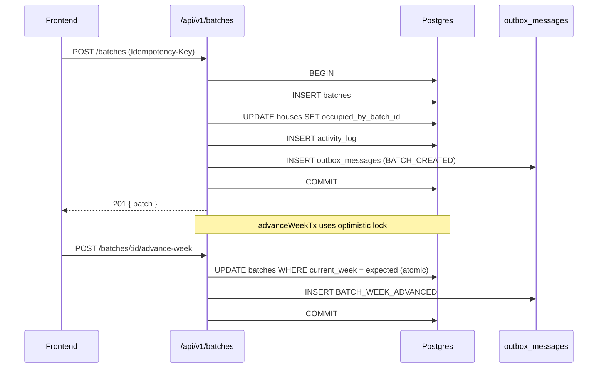
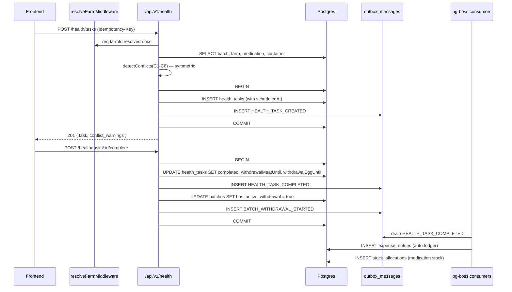
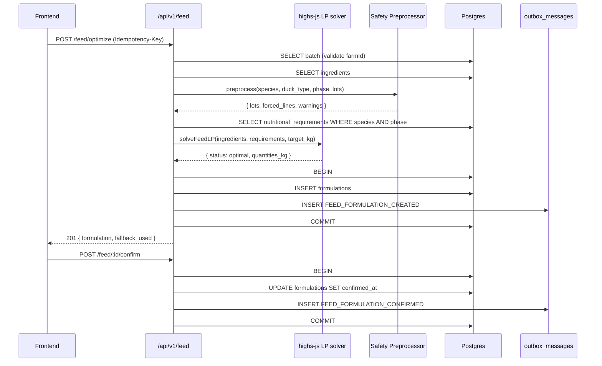
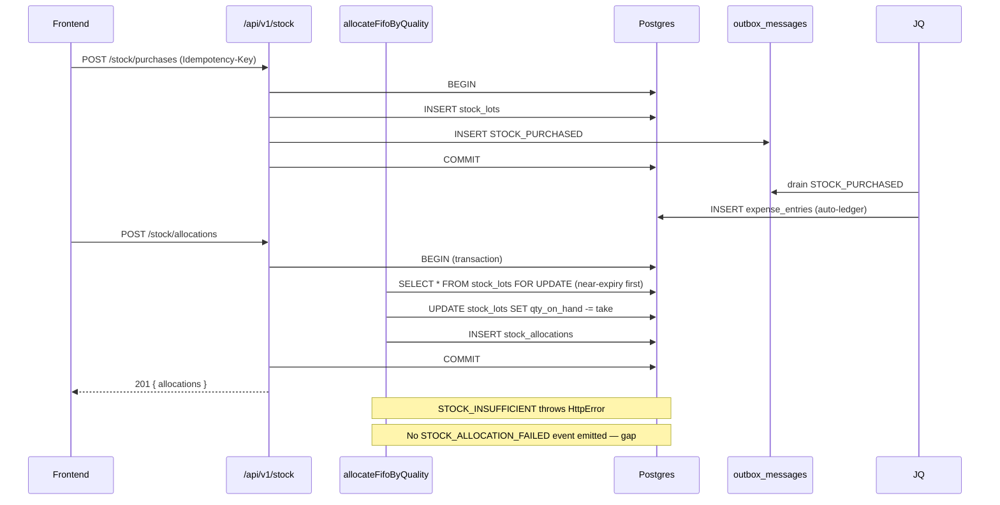
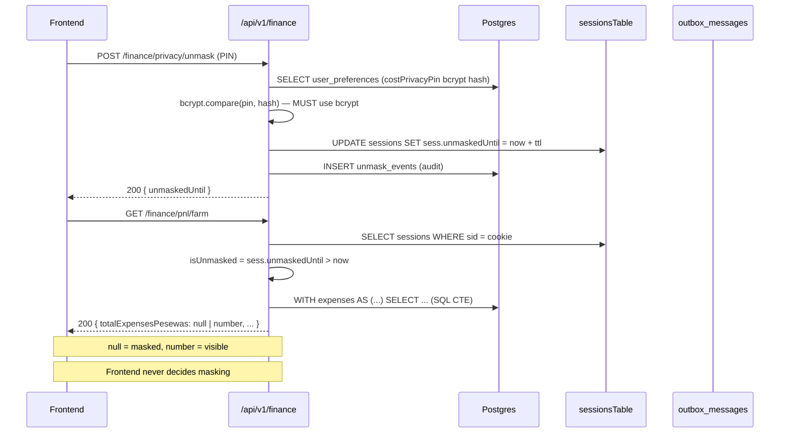
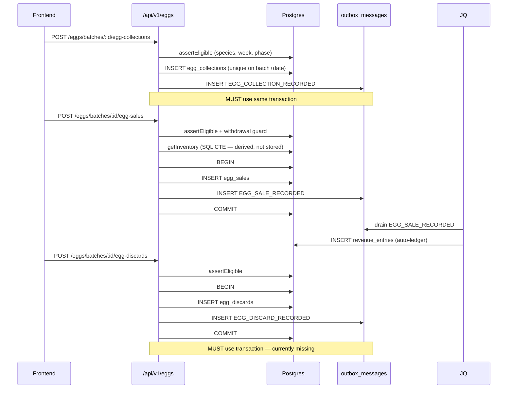
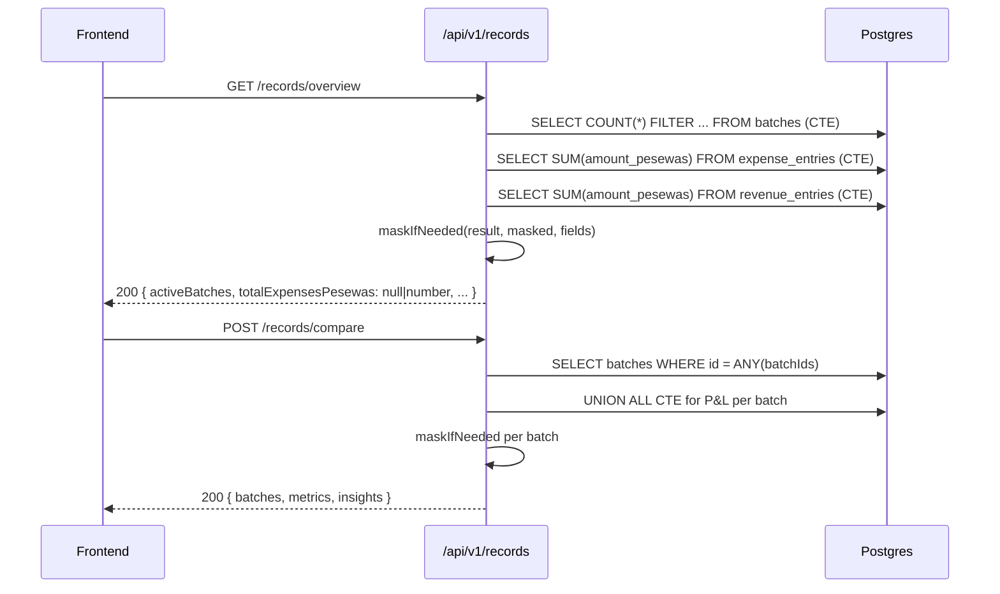
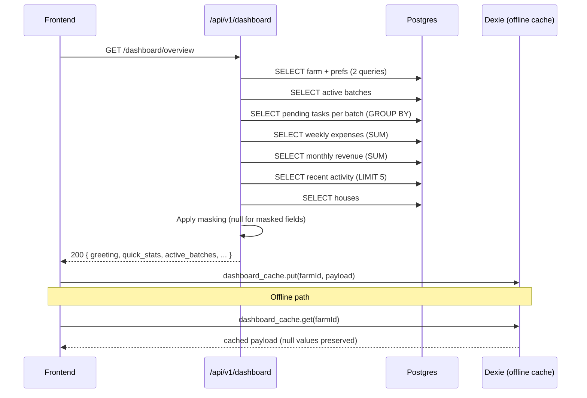
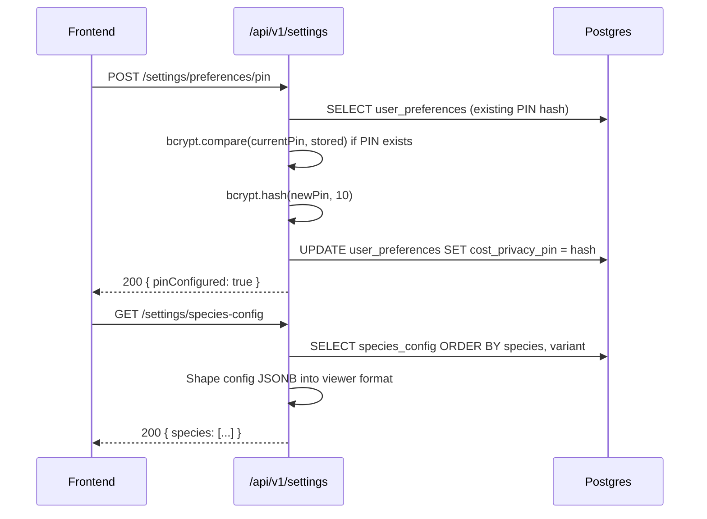
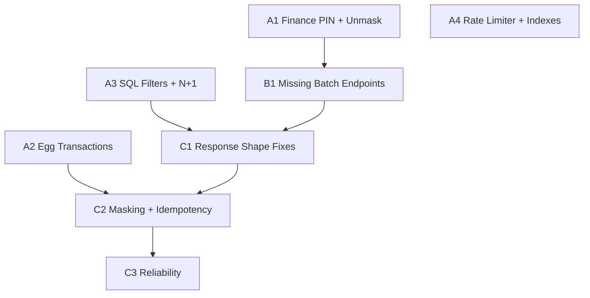

# LampFarms — Canonical Backbone & Frontend Refactoring Plan

## Problem & Context

LampFarms is a feature-complete poultry management suite for West African smallholder farmers. All 9 backend modules are mounted, all frontend pages are rebuilt, and the schema is correct. However, the project lacks a **canonical backbone** — a coherent set of backend-first principles, ACID guarantees, and frontend correctness rules that every module follows consistently.

The gaps fall into four categories:

1. **ACID violations** — events published outside transaction boundaries; filters applied in JavaScript instead of SQL
2. **Race conditions** — Finance unmask grant lost per request; PIN comparison broken; outbox flush has no concurrency guard; missing endpoints cause silent failures
3. **Missing business rule enforcement** — task filters not applied; withdrawal count incomplete; wrong endpoint paths in frontend
4. **Frontend correctness** — response shape mismatches causing empty lists; missing endpoints; function shadowing bug; wrong masking source

This plan defines the canonical approach for every system and provides the implementation-ready specification for fixing all 29 confirmed issues.

## Architectural Approach

### Backend-First Principles

**1. Every write that emits an event must use the same transaction.**

The canonical pattern is:

```
db.transaction(async (tx) => {
  await tx.insert(domainTable).values(...)
  await publish(tx, { eventType: '...' })
})
```

`publish(tx, ...)` writes to `outbox_messages` inside the same Postgres transaction. If the transaction rolls back, the event is never emitted. This is the only correct pattern. Calling `publish(db, ...)` (bare connection) outside a transaction is always wrong.

**2. All filters belong in SQL, not JavaScript.**

Loading all rows for a farm and filtering in JavaScript is a correctness risk (locale-sensitive date comparison) and a performance risk (full table scan). Every `listX` function must push all filter predicates into the Drizzle `where()` clause.

**3. ****`farmId`**** is resolved once per request, not once per function call.**

A shared `resolveFarmMiddleware` is added to the v1 router. It resolves `farmId` from `farmsTable` once and attaches it to `req.farmId`. All module routes read `req.farmId` directly — they never call `resolveFarmId()` individually.

**4. Session state is the DB-backed session, not a transient request cast.**

The real session mechanism is `sessionsTable` in Postgres, accessed via `getSession(sid)` and `updateSession(sid, data)` in file:artifacts/api-server/src/lib/auth.ts. Any state that must survive across requests (e.g. unmask grants) must be stored in the `sess` JSONB column of `sessionsTable`, not in a transient `req.session` cast.

**5. Idempotency keys are required for all write requests.**

The idempotency middleware in file:artifacts/api-server/src/lib/idempotency.ts returns `400 IDEMPOTENCY_KEY_REQUIRED` for write requests without the header. Every frontend `POST`/`PATCH`/`DELETE` call must include `'Idempotency-Key': crypto.randomUUID()`.

**6. Rate limiting uses ****`express-rate-limit`****, not an in-process Map.**

The current `rateLimitMap` in file:artifacts/api-server/src/app.ts grows unboundedly. Replace with `express-rate-limit` which has built-in cleanup and correct semantics.

### Frontend-First Principles

**1. Response shapes are consumed as-is from the server.**

Every endpoint returns a documented shape. The frontend must consume that shape directly — no `?.data ?? data ?? []` fallback chains. If the endpoint returns `{ items: [...] }`, the frontend reads `data.items`. If it returns `{ lots: [...] }`, the frontend reads `data.lots`.

**2. Masking is derived from server ****`null`**** values, never from Zustand store.**

When the server returns `null` for a financial field, the field is masked. The frontend displays `••••` for `null`. The Zustand `costPrivacyEnabled` store is used only for the privacy toggle indicator — never for deciding whether to show or hide a value.

**3. All write calls include an ****`Idempotency-Key`**** header.**

**4. ****`AbortController`**** is used for all ****`fetch`**** calls inside ****`useEffect`****.**

**5. Concurrent async operations have guards.**

`flushOutbox` must have a `let flushing = false` guard. Dashboard `useEffect` must debounce or gate on `isOnline` changes.

## Data Flow — Per System

### Batch Management



**Missing endpoints to add:**

- `GET /api/v1/batches/:id/mortality` — returns `{ items: MortalityRecord[] }` paginated
- `PATCH /api/v1/batches/:id` — updates `notes` field only (no FSM state changes)

**Frontend fix:** `BatchDetail.tsx` line 48 calls `GET /api/v1/batches/${id}/mortality` — this must exist. Line 229 calls `PATCH /api/v1/batches/${batch.id}` — this must exist.

**`batch-utils.ts`**** fix:** `cleanupBatchCompletion` sends `{ reason: 'normal' }` — must be `{ mode: 'normal' }`. `recordMortality` sends no `Idempotency-Key` — must add it.

### Water-Health



**Fixes required:**

- `listTasks` must apply `week` and `status` filters in SQL
- `listTasks` active withdrawal count must include `withdrawalEggUntil >= today` (not just meat side)
- `listMedications` must push `category` and `delivery_method` filters into SQL

**Frontend fix:** `Health.tsx` response shape — batch endpoint returns `{ items: [...] }`, tasks endpoint returns `{ items: [...], active_withdrawal_count: N }`. The `?.data ?? data ?? []` fallback must be replaced with `data.items ?? []`. The `HealthTask` interface must be extended to include `withdrawal_meat_until`, `withdrawal_eggs_until`, `task_type`, `vaccine_code`, `dose_amount`, `bird_count`, `computed_dose_amount` — eliminating all `unknown` casts.

### Feed Calculator



**Fixes required:**

- `listRequirements` must push `species` and `phase` filters into SQL
- Duck subtype: when `species = 'duck'`, the requirements query must also filter by `duck_type` (the `nutritional_requirements` table has a `duck_type` column)
- Feed fallback `flexibleMixFallback` can under-fill: if one ingredient hits its `available_kg` cap early, the remaining mass is not redistributed. The fallback must redistribute remaining mass across uncapped lots.

**Frontend fix:** `Feed.tsx` line 49 `batchData?.data ?? batchData ?? []` → `batchData.items ?? []`. The `endpointMap` uses wrong paths — `'/api/v1/feed/formulate/auto'` does not exist; the actual endpoint is `POST /api/v1/feed/optimize`. The correct map is:

- `automatic` → `POST /api/v1/feed/optimize`
- `flexible` → `POST /api/v1/feed/flexible`
- `ready_made` → `POST /api/v1/feed/ready-made`
- `concentrate_mix` → `POST /api/v1/feed/concentrate-mix`

### Stock Management



**Fixes required:**

- `listItems` must push `category` filter into SQL
- `listLots` must push `itemId` and `onHandOnly` filters into SQL
- `STOCK_ALLOCATION_FAILED` event must be emitted when `allocateFifoByQuality` throws `STOCK_INSUFFICIENT` — inside the consumer's idempotency boundary

**Frontend fix:** `Stock.tsx` lines 33–35 — `itemData?.data ?? itemData ?? []` → `itemData.items ?? []`; `lotData?.data ?? lotData ?? []` → `lotData.lots ?? []`; `lowData?.data ?? lowData ?? []` → `lowData.items ?? []`.

### Finance



**Critical fixes required:**

**Fix 1 — PIN comparison:** `finance/service.ts` line 406 compares `pin !== prefs.costPrivacyPin` — plaintext vs bcrypt hash. Must use `bcrypt.compare(pin, prefs.costPrivacyPin)`. `bcryptjs` is already installed (used in `settings/routes.ts`).

**Fix 2 — Unmask session persistence:** `grantUnmask` in `finance/privacy.ts` writes to `(req as any).session.unmaskedUntil` — a transient cast. The real session is in `sessionsTable`. The fix: after granting unmask, call `getSession(sid)`, mutate `sess.unmaskedUntil`, then call `updateSession(sid, sess)`. `isUnmasked` must read from the DB session, not from `req.session`.

**Fix 3 — SQL filters:** `listExpenses` and `listRevenue` must push `from`/`to`/`batchId`/`category`/`type` into Drizzle `where()` clauses using `gte`/`lte`/`eq` operators.

**Privacy enforcement:** The `maskFinancials` helper exists in `finance/privacy.ts` but is not called in `finance/routes.ts` or `finance/service.ts`. The P&L endpoint already returns `null` for masked fields via the CTE (it doesn't — it returns real values always). The routes must check `isUnmasked(req)` and apply `maskFinancials` to the response before sending.

### Egg Production



**Critical fixes required:**

**Fix 1 — ****`createCollection`**** publish outside transaction:** Line 161 calls `publish(db, ...)` after the `db.insert(...).returning()` — outside any transaction. Must wrap both the insert and the publish in `db.transaction(async (tx) => { ... publish(tx, ...) })`.

**Fix 2 — ****`createDiscard`**** has no transaction:** Lines 355–368 do a bare `db.insert(eggDiscards)` then `publish(db, ...)` — two separate round-trips with no transaction. Must wrap in `db.transaction`.

**Frontend fix:** `Eggs.tsx` line 180 `masked={costPrivacyEnabled}` — uses Zustand store. Must derive `masked` from whether the server returned `null` for revenue values in the sales response.

### Records



**Fix required:** `Records.tsx` line 83 — `const handleExport = async (batchId: string, fmt: 'pdf' | 'csv')` — the parameter `fmt` shadows the outer `fmt` function defined at line 49. Rename the parameter to `exportFormat`.

**Records service note:** `computePnlCte` is imported statically from `finance/service.ts` — this is correct. The dynamic import concern from the previous analysis was incorrect; the actual code uses a static import at line 17.

### Dashboard



**Dashboard is correct.** The `cost_privacy_enabled` field name in the response matches what `Dashboard.tsx` reads. Masking is server-side. The Dexie cache stores the server response as-is.

**Fix required:** `Dashboard.tsx` `useEffect` dependency array includes `isOnline` — every online/offline toggle triggers a full reload. Add a minimum-interval guard (e.g. only reload if last fetch was more than 30 seconds ago).

### Settings



**Settings is correct.** PIN uses bcrypt. Species-config reads from DB. Export is real (fetches batches, expenses, revenues, houses). No password UI. GHS/NGN only.

## Missing Indexes

Two additive indexes are needed. No schema changes — only `drizzle-kit push` additions:

**Index 1 — ****`health_tasks`**** composite:**
Covers `listTasks` filter, `getWithdrawals` query, and `generateDailyBatchTasks` job query simultaneously.

```
idx_health_tasks_farm_batch_status ON health_tasks (farm_id, batch_id, status, scheduled_date)
```

**Index 2 — ****`stock_lots`**** partial:**
Covers the FIFO allocator's `WHERE farm_id = ... AND item_id = ... AND quality_grade <> 'damaged' AND qty_on_hand > 0` query.

```
idx_stock_lots_farm_item_onhand ON stock_lots (farm_id, item_id, qty_on_hand) WHERE qty_on_hand > 0 AND quality_grade <> 'damaged'
```

## Complete Issue Registry

| # | Severity | Layer | File | Issue | Fix |
| --- | --- | --- | --- | --- | --- |
| 1 | Critical | Backend | `finance/service.ts:406` | PIN plaintext vs bcrypt | `bcrypt.compare(pin, hash)` |
| 2 | Critical | Backend | `finance/privacy.ts:28` | Unmask grant transient | Write to DB-backed `sessionsTable` |
| 3 | Critical | Backend | `finance/routes.ts` | Privacy not enforced on responses | Call `maskFinancials` before `res.json` |
| 4 | Critical | Backend | `egg-production/service.ts:161` | `publish(db)` outside transaction | Use `db.transaction` + `publish(tx)` |
| 5 | Critical | Backend | `egg-production/service.ts:355` | `createDiscard` no transaction | Wrap in `db.transaction` |
| 6 | Critical | Frontend | `batch-utils.ts:89` | `{ reason: 'normal' }` → wrong key | `{ mode: 'normal' }` |
| 7 | Critical | Frontend | `BatchDetail.tsx:48` | `GET /batches/:id/mortality` missing | Add endpoint |
| 8 | Critical | Frontend | `BatchDetail.tsx:229` | `PATCH /batches/:id` missing | Add endpoint |
| 9 | Critical | Frontend | `Health.tsx:45,60` | `?.data ?? data ?? []` wrong shape | `data.items ?? []` |
| 10 | Critical | Frontend | `Feed.tsx:49` | `?.data ?? batchData ?? []` wrong shape | `batchData.items ?? []` |
| 11 | Critical | Frontend | `Feed.tsx:66` | Wrong endpoint paths in `endpointMap` | Use `/optimize`, `/flexible`, `/ready-made`, `/concentrate-mix` |
| 12 | Critical | Frontend | `Stock.tsx:33-35` | Wrong response shape fallbacks | `itemData.items`, `lotData.lots`, `lowData.items` |
| 13 | Critical | Frontend | `Records.tsx:83` | `fmt` parameter shadows outer `fmt` | Rename to `exportFormat` |
| 14 | High | Backend | `water-health/service.ts:17` | `listTasks` ignores `week`/`status` filters | Push to SQL `where()` |
| 15 | High | Backend | `water-health/service.ts:29` | Withdrawal count misses egg side | Include `withdrawalEggUntil >= today` |
| 16 | High | Backend | `water-health/service.ts:381` | `listMedications` JS filter | Push to SQL |
| 17 | High | Backend | `feed/service.ts:19` | `listRequirements` JS filter | Push to SQL |
| 18 | High | Backend | `feed/service.ts:76` | Duck subtype ignored in requirements | Add `duck_type` to query |
| 19 | High | Backend | `feed/fallback.ts:22` | Fallback can under-fill target mass | Redistribute remaining mass |
| 20 | High | Backend | `finance/service.ts:56` | `listExpenses` JS filter | Push to SQL |
| 21 | High | Backend | `finance/service.ts:226` | `listRevenue` JS filter | Push to SQL |
| 22 | High | Backend | `stock/service.ts:54` | `listItems` JS filter | Push to SQL |
| 23 | High | Backend | `stock/service.ts:183` | `listLots` JS filter | Push to SQL |
| 24 | High | Backend | `stock/allocator.ts` | `STOCK_ALLOCATION_FAILED` not emitted | Publish inside consumer idempotency boundary |
| 25 | High | Backend | All module routers | `resolveFarmId` N+1 per request | `resolveFarmMiddleware` on v1 router |
| 26 | High | Frontend | `Eggs.tsx:180` | `masked={costPrivacyEnabled}` from Zustand | Derive from server `null` values |
| 27 | Medium | Backend | `app.ts:15` | Rate limiter memory leak | Replace with `express-rate-limit` |
| 28 | Medium | Frontend | `sync.ts:132` | `flushOutbox` no concurrency guard | Add `let flushing = false` guard |
| 29 | Medium | Frontend | `AuthContext.tsx:49` | No `AbortController` on fetch calls | Add `AbortController` |
| 30 | Medium | Frontend | `Dashboard.tsx:113` | Re-fetches on every `isOnline` change | Add minimum-interval guard |
| 31 | Medium | Frontend | `Health.tsx:99-108` | `unknown` casts on `HealthTask` | Extend `HealthTask` interface |
| 32 | Medium | Frontend | `AppSidebar.tsx` | "Water & Health" label | "Water-Health" |
| 33 | Medium | Backend | `batch-utils.ts:75` | `recordMortality` no `Idempotency-Key` | Add header |
| 34 | Medium | Schema | `lib/db/src/schema` | Missing composite index on `health_tasks` | Add `idx_health_tasks_farm_batch_status` |
| 35 | Medium | Schema | `lib/db/src/schema` | Missing partial index on `stock_lots` | Add `idx_stock_lots_farm_item_onhand` |

## Implementation Grouping

### Group A — Backend Correctness (no dependencies, can start immediately)

**A1 — Finance PIN + Unmask Session** (issues 1, 2, 3)

- `finance/service.ts`: replace plaintext comparison with `bcrypt.compare`
- `finance/privacy.ts`: rewrite `grantUnmask` and `isUnmasked` to use `sessionsTable` via `getSession`/`updateSession`
- `finance/routes.ts`: call `isUnmasked(req)` and apply `maskFinancials` before `res.json` on all financial endpoints

**A2 — Egg Production Transactions** (issues 4, 5)

- `egg-production/service.ts`: wrap `createCollection` in `db.transaction`, use `publish(tx, ...)`
- `egg-production/service.ts`: wrap `createDiscard` in `db.transaction`, use `publish(tx, ...)`

**A3 — SQL Filters + N+1 Elimination** (issues 14–25)

- Add `resolveFarmMiddleware` to `routes/index.ts` v1 router
- Push all JS-side filters into SQL in: `listTasks`, `listMedications`, `listRequirements`, `listExpenses`, `listRevenue`, `listItems`, `listLots`
- Add duck subtype to requirements query
- Fix fallback mass redistribution
- Emit `STOCK_ALLOCATION_FAILED` in consumer

**A4 — Rate Limiter + Missing Indexes** (issues 27, 34, 35)

- Replace `rateLimitMap` with `express-rate-limit`
- Add two additive indexes to schema

### Group B — Missing Endpoints (depends on A1 for correctness)

**B1 — Batch Endpoints**

- `GET /api/v1/batches/:id/mortality` — returns `{ items: MortalityRecord[], nextCursor }` paginated
- `PATCH /api/v1/batches/:id` — updates `notes` field only, returns `{ batch }`

### Group C — Frontend Correctness (depends on B1 for missing endpoints)

**C1 — Response Shape Fixes** (issues 9, 10, 11, 12, 13)

- `Health.tsx`, `Feed.tsx`, `Stock.tsx`: fix response shape consumption
- `Feed.tsx`: fix `endpointMap` paths
- `Records.tsx`: rename `fmt` parameter to `exportFormat`

**C2 — Masking + Idempotency** (issues 6, 26, 33)

- `batch-utils.ts`: fix `{ reason: 'normal' }` → `{ mode: 'normal' }`, add `Idempotency-Key`
- `Eggs.tsx`: derive `masked` from server `null` values

**C3 — Reliability** (issues 28, 29, 30, 31, 32)

- `sync.ts`: add `flushOutbox` concurrency guard
- `AuthContext.tsx`: add `AbortController`
- `Dashboard.tsx`: add minimum-interval guard on `isOnline`
- `Health.tsx`: extend `HealthTask` interface, eliminate `unknown` casts
- `AppSidebar.tsx`: fix label

## Dependency Graph



A1, A2, A3, A4 can all start in parallel. B1 depends on A1 (Finance correctness should be verified before adding more endpoints). C1 depends on A3 and B1. C2 depends on A2 and C1. C3 depends on C2.