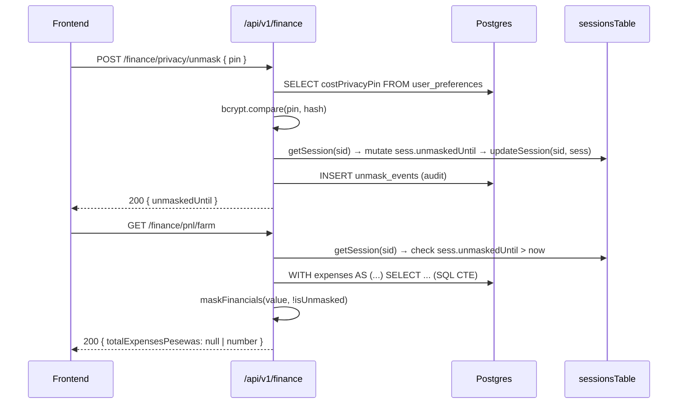

# A1 — Finance PIN Verification + Unmask Session Persistence

## Scope

Fix the two Finance privacy correctness blockers that make cost privacy non-functional end-to-end.

### Included

- Replace plaintext PIN comparison with `bcrypt.compare` in file:artifacts/api-server/src/modules/finance/service.ts
- Rewrite `grantUnmask` and `isUnmasked` in file:artifacts/api-server/src/modules/finance/privacy.ts to use the real DB-backed session mechanism
- Apply `maskFinancials` to all financial response fields in file:artifacts/api-server/src/modules/finance/routes.ts

### Explicitly out

- UI changes to Finance or Settings pages
- Changes to the privacy product rule itself

## Why these two issues are one ticket

They are the same broken flow. PIN comparison must work before the unmask grant can be tested. The grant must persist before masking enforcement is meaningful. Fixing one without the other leaves the feature broken.

## Data flow



## Fix 1 — PIN comparison (`finance/service.ts` line 406)

Current: `if (!pin || pin !== prefs.costPrivacyPin)`

Required: `if (!pin || !(await bcrypt.compare(pin, prefs.costPrivacyPin)))`

`bcryptjs` is already installed — used in file:artifacts/api-server/src/modules/settings/routes.ts.

## Fix 2 — Unmask session persistence (`finance/privacy.ts`)

Current: `grantUnmask` writes to `(req as any).session.unmaskedUntil` — a transient cast that is never persisted.

Required: use `getSession(sid)` and `updateSession(sid, data)` from file:artifacts/api-server/src/lib/auth.ts. The `sid` is available via `getSessionId(req)`. The `sess` JSONB column of `sessionsTable` must carry `unmaskedUntil`. `isUnmasked` must read from the DB session, not from `req.session`.

**`SessionData`**** interface extension:** The `SessionData` interface in file:artifacts/api-server/src/lib/auth.ts currently has no `unmaskedUntil` field. It must be extended:

```ts
export interface SessionData {
  user: AuthUser;
  access_token: string;
  refresh_token?: string;
  expires_at?: number;
  unmaskedUntil?: number;  // epoch ms — added for Finance privacy
}
```

This is an additive change. Existing sessions without `unmaskedUntil` will have `undefined`, which `isUnmasked` correctly treats as masked.

## Fix 3 — Apply masking to responses (`finance/routes.ts`)

`maskFinancials` exists in file:artifacts/api-server/src/modules/finance/privacy.ts but is never called in routes or service. All P&L and summary endpoints must call `isUnmasked(req)` and apply `maskFinancials` to financial fields before `res.json`.

## Acceptance criteria

- A PIN set via `POST /api/v1/settings/preferences/pin` can be used to unmask via `POST /api/v1/finance/privacy/unmask`
- Incorrect PINs are rejected with `401 PIN_REQUIRED`
- The unmask grant persists across requests for the configured TTL (default 15 minutes)
- After TTL expires, financial endpoints return `null` for masked fields without any client-side intervention
- `GET /api/v1/finance/pnl/farm` returns `null` for `totalExpensesPesewas`, `totalRevenuePesewas`, `netProfitPesewas`, `roiPct` when privacy is active and no valid grant exists
- No plaintext PIN comparison remains anywhere in the Finance path

## Dependencies

None — can start immediately.

## Plan reference

spec:3a092065-e868-4799-849c-f707a0553261/ecd0ec8f-4fe6-44c2-afee-fa2592de59b8 — Finance data flow section, issues 1, 2, 3.