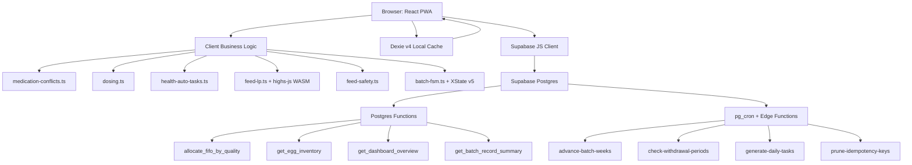
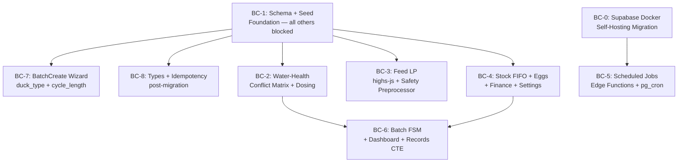
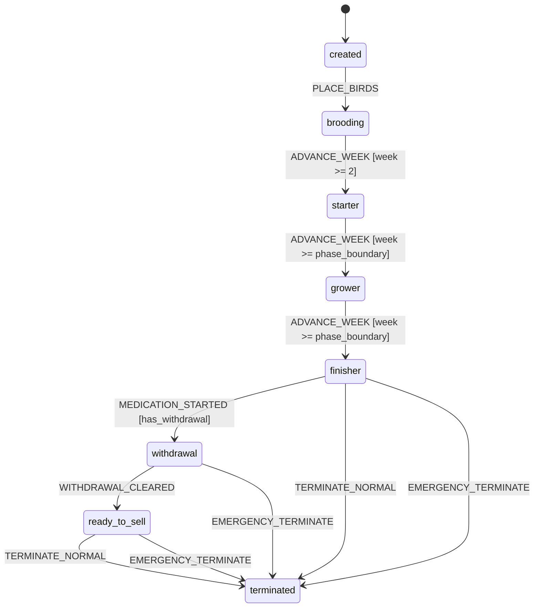

# LampFarms — Definitive Master Implementation Plan (Cross-Validated)

## Problem & Context

LampFarms is an offline-first poultry farm management PWA for West African smallholder farmers. Tracks A, E, and D are complete. The remaining work (Track B+C) implements the backend business logic, schema, and scheduled jobs that make the app correct, safe, and complete.

**Platform decision (final):** Supabase-native. No Express server. Business logic runs client-side (TypeScript modules) and in Supabase Edge Functions + pg_cron. The specs' `artifacts/api-server/` is the authoritative domain model — not the deployment topology.

**ACID approach:** Every write operation is either atomic (single Supabase insert/update) or wrapped in a Postgres function with explicit transaction boundaries. Idempotency is enforced via `ON CONFLICT DO NOTHING` on `(source, source_ref)` for all auto-ledger entries. The FIFO allocator uses `FOR UPDATE` row locking. The batch FSM uses optimistic locking (`UPDATE WHERE current_week = $expected`).

## Cross-Validation Corrections (applied to this plan)

The following bugs and inconsistencies were found during cross-validation and are corrected here:

| # | File | Bug | Fix |
| --- | --- | --- | --- |
| 1 | `useStockData.ts` line 88 | `item_id` → should be `stock_item_id` | Fix in BC-1 |
| 2 | `useStockData.ts` line 92 | `total_amount` → should be `total_cost` | Fix in BC-1 |
| 3 | `useFinanceData.ts` line 121 | `b.initial_population` → should be `b.initial_quantity` | Fix in BC-4 |
| 4 | `revenue` table | Missing `source TEXT` and `source_ref TEXT` columns | Add in BC-1 Migration 4 |
| 5 | M1 spec | `feed_ingredients.unit_price` and `total_cost` not in pesewas conversion | Add to BC-1 Migration 5 |
| 6 | BC-6 ticket | `xstate` not in `package.json` | Add `xstate` to `package.json` in BC-6 |
| 7 | M5 spec | Edge Function phase recomputation doesn't handle `duck_type` | Specify duck_type handling in BC-5 |

## Architecture



## Implementation Sequence

### Sprint 0 — Self-Hosting (BC-0)

Before any Edge Functions can be deployed, the Supabase project must be migrated from the cloud free tier (which pauses after 1 week of inactivity) to a self-hosted Docker instance. This is a prerequisite for BC-5 only — all other tickets can proceed against Supabase Cloud.

### Sprint 1 — Safety Foundation (BC-1 → BC-2 + BC-3)

The P0 safety gaps. BC-1 is the sole blocker for everything. BC-2 (conflict matrix) and BC-3 (LP solver) are the highest-value deliverables — they fix bird health safety and nutritional correctness.

### Sprint 2 — Correctness & Completeness (BC-4 + BC-7 + BC-8)

Stock FIFO, egg guards, finance auto-ledger, Settings 5-tab, BatchCreate wizard extensions, TypeScript types sync, idempotency keys.

### Sprint 3 — Automation & Aggregation (BC-0 prerequisite → BC-5 + BC-6)

Scheduled jobs (requires self-hosted Supabase), Batch FSM, Dashboard aggregator, Records CTE.



**Sprint 1 scope (this sprint):** BC-1 → BC-2 + BC-3 only.
**Sprint 2 scope (next sprint):** BC-4 + BC-7 + BC-8.
**Sprint 3 scope (deferred):** BC-0 → BC-5 + BC-6.

## BC-1 — Schema Migrations & Seed Data (Foundation)

### Migration 4 — Column additions (additive, no data loss)

**`farms`**** additions:**

- `water_source_chlorinated BOOLEAN NOT NULL DEFAULT false`
- `timezone TEXT NOT NULL DEFAULT 'Africa/Accra'`
- `currency TEXT NOT NULL DEFAULT 'GHS'`
- `egg_low_inventory_crates INTEGER NOT NULL DEFAULT 5`

**`batches`**** additions:**

- `duck_type TEXT CHECK (duck_type IN ('meat', 'layer'))`
- `cycle_length_weeks INTEGER NOT NULL DEFAULT 8`
- `has_active_withdrawal BOOLEAN NOT NULL DEFAULT false`
- `termination_reason TEXT CHECK (termination_reason IN ('normal', 'emergency'))`
- CHECK constraint: `duck_type IS NOT NULL WHEN species = 'duck'`
- Partial unique index: `ON batches(house_id) WHERE status <> 'terminated' AND house_id IS NOT NULL`

**`houses`**** additions:**

- `occupied_by_batch_id UUID REFERENCES batches(id) ON DELETE SET NULL`

**`health_tasks`**** additions (12 columns):**

- `medication_id TEXT` — FK to `medications.id` (soft reference, not FK constraint — medications are reference data)
- `delivery_method TEXT DEFAULT 'drinking_water'`
- `container_type_id TEXT` — soft reference to `container_types.id`
- `container_count INTEGER`
- `water_volume_l NUMERIC`
- `computed_dose_amount NUMERIC`
- `computed_dose_unit TEXT`
- `bird_count INTEGER`
- `withdrawal_meat_until DATE`
- `withdrawal_eggs_until DATE`
- `cost_pesewas INTEGER`
- `blocked_reason TEXT`

**`egg_sales`**** additions:**

- `batch_id UUID REFERENCES batches(id) ON DELETE SET NULL`
- `crates_sold INTEGER NOT NULL DEFAULT 0`
- `looses_sold INTEGER NOT NULL DEFAULT 0`
- `price_per_crate_pesewas INTEGER NOT NULL DEFAULT 0`
- `price_per_loose_pesewas INTEGER NOT NULL DEFAULT 0`
- `total_revenue_pesewas INTEGER NOT NULL DEFAULT 0`
- `payment_method TEXT NOT NULL DEFAULT 'cash'`
- `ledger_entry_id TEXT`

**`user_preferences`**** additions:**

- `cost_privacy_pin TEXT`
- `timezone TEXT`

**`revenue`**** additions (cross-validation fix #4):**

- `source TEXT NOT NULL DEFAULT 'manual'`
- `source_ref TEXT`

### Migration 5 — Money conversion (NUMERIC → INTEGER pesewas)

All money columns converted to integer pesewas. Strategy: add `_pesewas` column, populate with `ROUND(old_column * 100)::INTEGER`, drop old column. Runs in a single transaction.

**Affected columns:**

- `expenses.amount` → `expenses.amount_pesewas INTEGER`
- `revenue.amount` → `revenue.amount_pesewas INTEGER`
- `stock_items.unit_price` → `stock_items.unit_price_pesewas INTEGER`
- `stock_transactions.unit_price` → `stock_transactions.unit_price_pesewas INTEGER`
- `stock_transactions.total_cost` → `stock_transactions.total_cost_pesewas INTEGER`
- `egg_sales.unit_price` → removed (replaced by `price_per_crate_pesewas` / `price_per_loose_pesewas`)
- `egg_sales.total_amount` → removed (replaced by `total_revenue_pesewas`)
- `feed_ingredients.unit_price` → `feed_ingredients.unit_price_pesewas INTEGER` **(cross-validation fix #5)**
- `feed_ingredients.total_cost` → `feed_ingredients.total_cost_pesewas INTEGER` **(cross-validation fix #5)**

### Migration 6 — New reference tables

| Table | Purpose | RLS |
| --- | --- | --- |
| `medications` | 52 canonical medications | Farm-scoped SELECT; no INSERT/UPDATE from client |
| `container_types` | 9 canonical container types | Farm-scoped SELECT |
| `ingredients` | 25 canonical feed ingredients | Farm-scoped SELECT |
| `nutritional_requirements` | Per-species/phase nutritional targets | Farm-scoped SELECT |
| `config_overrides` | L3 runtime overrides (farm-scoped) | Full CRUD, farm-scoped |
| `idempotency_keys` | Client-generated key deduplication | Farm-scoped INSERT/SELECT |
| `stock_lots` | Lot-level stock tracking (FIFO+quality) | Full CRUD, farm-scoped |
| `stock_allocations` | Allocation records per lot | Full CRUD, farm-scoped |

### Migration 7 — Seed data

All seed data uses `INSERT ... ON CONFLICT DO NOTHING` — idempotent, safe to re-run.

**52 medications** — key entries:

| id | name | category | delivery | dose/gal | wd_meat | wd_eggs | is_live_vaccine |
| --- | --- | --- | --- | --- | --- | --- | --- |
| `amprolium` | Amprolium (CORID) | coccidiostat | drinking_water | 1.5 tsp | 1 | 0 | false |
| `oxytetracycline` | Oxytetracycline | antibiotic | drinking_water | 1.5 tsp | 7 | 7 | false |
| `tylosin` | Tylosin (Tylan) | antibiotic | drinking_water | 1 tsp | 5 | 5 | false |
| `enrofloxacin` | Enrofloxacin (Baytril) | antibiotic | drinking_water | 1 tsp | 14 | 14 | false |
| `fenbendazole` | Fenbendazole | dewormer | drinking_water | 1 tsp | 0 | 0 | false |
| `metronidazole` | Metronidazole | antiprotozoal | drinking_water | 1 tsp | 5 | 0 | false |
| `niacin` | Niacin (Duck) | supplement | drinking_water | 1.5 tsp | 0 | 0 | false |
| `gumboro_intermediate` | Gumboro Intermediate | vaccine | drinking_water | — | 0 | 0 | true |
| `lasota` | Lasota (Newcastle) | vaccine | drinking_water | — | 0 | 0 | true |
| `duck_viral_hepatitis` | Duck Viral Hepatitis | vaccine | injection_subcutaneous | — | 0 | 0 | true |
| `fowl_pox` | Fowl Pox | vaccine | injection_wing_web | — | 0 | 0 | true |

**9 container types** (per CONVENTIONS §2.3):

| id | name | volume_l |
| --- | --- | --- |
| `bell_drinker_small` | Small Bell Drinker | 1 |
| `bell_drinker_1gal` | Bell Drinker 1 gal | 3 |
| `bell_drinker_6l` | Bell Drinker 6L | 6 |
| `local_drinker_10l` | Local Drinker 10L | 10 |
| `jumbo_bell_14l` | Jumbo Bell 14L | 14 |
| `bucket_5gal` | 5 Gallon Bucket | 20 |
| `jerry_can_25l` | Jerry Can 25L | 25 |
| `drum_50l` | 50L Drum | 50 |
| `nipple_tank_100l` | Nipple Tank 100L | 100 |

**Nutritional requirements** — per species/phase (sample):

| species | duck_type | phase | protein_min | energy_min | energy_max | calcium_min | calcium_max | phosphorus_min | lysine_min | methionine_min |
| --- | --- | --- | --- | --- | --- | --- | --- | --- | --- | --- |
| broiler | null | starter | 22 | 3000 | 3200 | 0.9 | 1.1 | 0.45 | 1.1 | 0.50 |
| broiler | null | grower | 20 | 3100 | 3300 | 0.85 | 1.0 | 0.40 | 1.0 | 0.45 |
| broiler | null | finisher | 18 | 3150 | 3350 | 0.80 | 1.0 | 0.38 | 0.9 | 0.40 |
| layer | null | layer_production | 17 | 2750 | 2950 | 3.4 | 4.2 | 0.40 | 0.85 | 0.38 |
| duck | meat | starter | 22 | 2900 | 3100 | 0.9 | 1.1 | 0.42 | 1.0 | 0.42 |
| duck | layer | layer_production | 17 | 2750 | 2950 | 3.2 | 4.0 | 0.40 | 0.82 | 0.36 |
| turkey | null | starter | 28 | 2800 | 3000 | 1.1 | 1.3 | 0.55 | 1.5 | 0.55 |

### Frontend bug fixes in BC-1

- `useStockData.ts` line 88: `item_id` → `stock_item_id` **(cross-validation fix #1)**
- `useStockData.ts` line 92: `total_amount` → `total_cost` **(cross-validation fix #2)**
- `types.ts`: regenerate to reflect all new columns and tables

## BC-2 — Water-Health: Conflict Matrix, Dosing, Auto-Tasks

### New lib modules

**`src/lib/medication-conflicts.ts`** — pure function, no side effects:

```ts
detectConflicts(args: {
  newMed: Medication;
  neighborhood: { task: HealthTask; med: Medication }[];
  waterSourceChlorinated: boolean;
}): ConflictHit[]
```

**8 conflict rules:**

| Code | Rule | Severity | Window |
| --- | --- | --- | --- |
| C1 | Coccidiostat + Sulfa drug | BLOCK | [today, +5d] |
| C2 | Two antibiotics overlap | BLOCK | task duration overlap |
| C3 | Dewormer + Coccidiostat same day | WARN | same day |
| C4 | Live vaccine ± antibiotic | BLOCK | ±72 hours |
| C5 | Enrofloxacin + any antibiotic | BLOCK | task duration overlap |
| C6 | Activated charcoal + oral med | BLOCK | ±4 hours |
| C7 | Calcium + Tetracycline | BLOCK | ±4 hours |
| C8 | Live vaccine + chlorinated water | BLOCK | always |

**`src/lib/dosing.ts`** — pure function:

- `computeDose(med, waterVolumeL)` → `amount = dose_per_gallon × (waterVolumeL / 3.785)`
- Returns `null` for injection delivery methods

**`src/lib/health-auto-tasks.ts`**:

- Duck batches: niacin daily Days 1–28, weekly from Week 5 to Week 20
- Turkey batches: Metronidazole every 2 weeks from Week 1 to `cycle_length_weeks`

### `useHealthData.ts` updates

- Load `medications` and `container_types` from Supabase on mount (replaces hardcoded `MEDICATION_TEMPLATES`)
- Load `farm.water_source_chlorinated` on mount
- `addMedication`: call `detectConflicts()` → BLOCK rejects with toast showing conflict code; WARN allows with warning toast
- `addMedication`: call `computeDose()` for `drinking_water` delivery; populate new `health_tasks` columns
- `markTaskComplete`: compute `withdrawal_meat_until` and `withdrawal_eggs_until`; set `batches.has_active_withdrawal = true`

### Medication dialog UI

```wireframe

<html>
<head>
<style>
body { font-family: sans-serif; max-width: 480px; margin: 20px auto; padding: 0 16px; }
.dialog { border: 1px solid #e5e7eb; border-radius: 10px; padding: 20px; }
h3 { margin: 0 0 16px; font-size: 16px; }
.field { margin-bottom: 14px; }
label { display: block; font-size: 12px; font-weight: 600; color: #6b7280; margin-bottom: 4px; text-transform: uppercase; letter-spacing: 0.05em; }
select, input { width: 100%; padding: 8px 10px; border: 1px solid #d1d5db; border-radius: 6px; font-size: 14px; box-sizing: border-box; }
.row2 { display: grid; grid-template-columns: 1fr 1fr; gap: 10px; }
.badge { display: inline-block; padding: 2px 8px; border-radius: 12px; font-size: 11px; font-weight: 600; background: #f3f4f6; color: #374151; }
.badge-water { background: #dbeafe; color: #1e40af; }
.badge-inject { background: #fce7f3; color: #9d174d; }
.computed { background: #f0fdf4; border: 1px solid #bbf7d0; border-radius: 6px; padding: 10px; font-size: 13px; margin-bottom: 14px; }
.conflict-block { background: #fef2f2; border: 1px solid #fca5a5; border-radius: 6px; padding: 10px; font-size: 13px; color: #dc2626; margin-bottom: 14px; }
.btn { width: 100%; padding: 10px; border-radius: 6px; border: none; cursor: pointer; font-size: 14px; font-weight: 600; }
.btn-primary { background: #111827; color: white; }
.btn-disabled { background: #e5e7eb; color: #9ca3af; cursor: not-allowed; }
.divider { border: none; border-top: 1px solid #f3f4f6; margin: 14px 0; }
</style>
</head>
<body>
<div class="dialog">
  <h3>Add Medication / Treatment</h3>
  <div class="field">
    <label>Medication</label>
    <select>
      <option>Amprolium (CORID) — Coccidiostat</option>
      <option selected>Gumboro Intermediate — Vaccine</option>
      <option>Oxytetracycline — Antibiotic</option>
    </select>
  </div>
  <div class="field">
    <label>Delivery Method</label>
    <span class="badge badge-water">💧 Drinking Water</span>
  </div>
  <hr class="divider">
  <div class="row2">
    <div class="field">
      <label>Container Type</label>
      <select><option>Bell Drinker 6L</option></select>
    </div>
    <div class="field">
      <label>Container Count</label>
      <input type="number" value="8" />
    </div>
  </div>
  <div class="computed">
    ✓ Water volume: <strong>48 L</strong> &nbsp;|&nbsp; Computed dose: <strong>19.0 tsp</strong>
  </div>
  <div class="conflict-block">
    ⛔ C4 Conflict: Live vaccine cannot be given within 72h of an antibiotic. Oxytetracycline was given 2 days ago.
  </div>
  <div class="field">
    <label>Scheduled Date</label>
    <input type="date" value="2026-05-15" />
  </div>
  <div class="field">
    <label>Notes (optional)</label>
    <input placeholder="Additional notes..." />
  </div>
  <button class="btn btn-disabled">Cannot Add — Conflict Detected</button>
</div>
</body>
</html>
```

## BC-3 — Feed Calculator: highs-js LP Solver + Safety Preprocessor

### Package addition

`"highs-js": "^1.5.1"` added to `package.json` dependencies.

### New lib modules

**`src/lib/feed-lp.ts`** — replaces `feed-optimizer.ts` entirely:

- `solveFeedLP(input, timeoutMs = 5000)` — WASM singleton + `Promise.race` timeout
- `buildCplexLp(ingredients, requirements, targetKg, forcedLines)` — generates CPLEX-LP text format
- 9 constraints: mass balance + protein + energy_min + energy_max + calcium_min + calcium_max + phosphorus + lysine + methionine
- Fallback chain: infeasible → timeout → WASM error → flexible mix with `meets_requirements: false`

**`src/lib/feed-safety.ts`** — Safety Preprocessor:

| Rule | Trigger | Action |
| --- | --- | --- |
| R-FC-1 | Always | Toxin binder at 0.5% of target_kg, `auto_added: true`, non-removable |
| R-FC-2 | Layer + gossypol ingredient | BLOCK with `LAYER_GOSSYPOL_BLOCKED` |
| R-FC-3 | Broiler + fish meal | Cap fish meal at 10% of target_kg, emit warning |
| R-FC-4 | Multiple calcium sources | Keep last, emit warning |
| R-FC-5 | Duck batch | Explicitly must NOT add niacin |

### LP formulation (precise)

**Decision variables:** `x_i` = kg of ingredient `i`

**Objective:** Minimize `Σ(unit_price_pesewas_i × x_i)`

**9 constraints:**

1. `Σ(x_i) = target_kg`
2. `Σ(protein_pct_i × x_i) ≥ protein_min × target_kg`
3. `Σ(energy_i × x_i) ≥ energy_min × target_kg`
4. `Σ(energy_i × x_i) ≤ energy_max × target_kg`
5. `Σ(calcium_pct_i × x_i) ≥ calcium_min × target_kg`
6. `Σ(calcium_pct_i × x_i) ≤ calcium_max × target_kg`
7. `Σ(phosphorus_pct_i × x_i) ≥ phosphorus_min × target_kg`
8. `Σ(lysine_pct_i × x_i) ≥ lysine_min × target_kg`
9. `Σ(methionine_pct_i × x_i) ≥ methionine_min × target_kg`

**Bounds:** `0 ≤ x_i ≤ min(available_kg_i, max_share_i × target_kg)` where `max_share_i = 0.10` for fish meal in broilers; forced lines have `lb = ub = forced_kg`.

### Solver status states

| Status | Meaning | UI badge |
| --- | --- | --- |
| `optimal` | LP solved, all constraints met | Green ✓ Optimal |
| `fallback` | LP failed, flexible mix used | Amber ⚠ Fallback |
| `manual` | Farmer manually adjusted quantities | Gray ✎ Manual |

## BC-4 — Stock FIFO, Eggs, Finance, Settings

### Stock — FIFO+Quality Allocator

Postgres function `allocate_fifo_by_quality(farm_id, item_id, qty_needed, batch_id, reason, source_ref_id)`:

- `FOR UPDATE` row lock on `stock_lots`
- Sort: near-expiry (≤30d) bucket first → `expiry_date ASC NULLS LAST` → `received_at ASC`
- Exclude `quality_grade = 'damaged'`
- Raises exception if `qty_needed` cannot be satisfied → full transaction rollback

**`useStockData.ts`**** fixes:**

- Fix `initial_population` → `initial_quantity` in `batchAnalysis` **(cross-validation fix #3)**
- Fix purchase expense category mapping: `feed_ingredients` → `feed_and_nutrition`; `medications` → `health_and_medicine`; `supplies` → `other_expenses`

### Eggs — Inventory Guards

Postgres function `get_egg_inventory(batch_id, farm_id)`:

```
good_eggs_on_hand = SUM(egg_records.good)
  - SUM(egg_sales.crates_sold * 30 + egg_sales.looses_sold)
  - SUM(egg_discards.count)
WHERE batch_id = $batch_id
```

Guards in `useEggData.ts`:

- **R10:** `recordSale` → call `get_egg_inventory()` → reject if insufficient
- **R11:** `recordSale` → check `batch.has_active_withdrawal` → reject if true
- **R5:** `recordCollection` → check duplicate `(batch_id, date)` → reject if exists
- **R2/R3:** `recordCollection` → check start week (layer ≥ 19, duck-layer ≥ 20)

### Finance — Auto-Ledger (6 triggers)

| Trigger | Hook/Page | Category | Idempotency anchor |
| --- | --- | --- | --- |
| Stock purchase | `useStockData.ts` | mapped by item category | `('auto:stock', lot_id)` |
| Health task complete | `useHealthData.ts` | `health_and_medicine` | `('auto:health', task_id)` |
| Feed formulation confirmed | `FeedFormulation.tsx` | `feed_and_nutrition` | `('auto:feed', formulation_id)` |
| Batch created | `BatchCreate.tsx` | `chicks_and_birds` | `('auto:batch', batch_id)` |
| Egg sale | `useEggData.ts` | revenue `egg_sales` | `('auto:eggs', sale_id)` |
| Batch terminated with sale | `BatchDetail.tsx` | revenue `bird_sales` | `('auto:batch', batch_id + ':terminate')` |

All use `ON CONFLICT DO NOTHING` on `(source, source_ref)`.

**`useFinanceData.ts`**** fix:** `b.initial_population` → `b.initial_quantity` in `batchAnalysis` **(cross-validation fix #3)**

### Settings — 5-Tab Completion

```wireframe

<html>
<head>
<style>
body { font-family: sans-serif; max-width: 680px; margin: 20px auto; padding: 0 16px; }
.tabs { display: flex; border-bottom: 2px solid #e5e7eb; margin-bottom: 20px; gap: 0; }
.tab { padding: 10px 18px; cursor: pointer; font-size: 14px; color: #6b7280; border-bottom: 2px solid transparent; margin-bottom: -2px; }
.tab.active { color: #111827; border-bottom-color: #111827; font-weight: 600; }
.card { border: 1px solid #e5e7eb; border-radius: 8px; padding: 16px; margin-bottom: 12px; }
.field { margin-bottom: 14px; }
label { display: block; font-size: 12px; font-weight: 600; color: #6b7280; margin-bottom: 4px; text-transform: uppercase; }
input, select { width: 100%; padding: 8px 10px; border: 1px solid #d1d5db; border-radius: 6px; font-size: 14px; box-sizing: border-box; }
.toggle-row { display: flex; justify-content: space-between; align-items: center; padding: 10px 0; border-bottom: 1px solid #f3f4f6; font-size: 14px; }
.toggle { width: 40px; height: 22px; background: #059669; border-radius: 11px; position: relative; cursor: pointer; }
.toggle-dot { width: 18px; height: 18px; background: white; border-radius: 50%; position: absolute; top: 2px; right: 2px; }
.btn { padding: 8px 16px; border-radius: 6px; border: none; cursor: pointer; font-size: 14px; font-weight: 600; }
.btn-primary { background: #111827; color: white; }
.btn-danger { background: #dc2626; color: white; }
.override-row { display: flex; justify-content: space-between; align-items: center; padding: 8px 10px; background: #f9fafb; border-radius: 6px; margin-bottom: 6px; font-size: 13px; }
.section-title { font-size: 13px; font-weight: 600; color: #374151; margin-bottom: 10px; }
</style>
</head>
<body>
<div class="tabs">
  <div class="tab">Profile</div>
  <div class="tab active">Farm</div>
  <div class="tab">Preferences</div>
  <div class="tab">Market Prices</div>
  <div class="tab">Data</div>
</div>
<div class="card">
  <div class="section-title">Farm Details</div>
  <div class="field"><label>Farm Name</label><input value="Dev Farm" /></div>
  <div class="field"><label>Region</label><select><option>Greater Accra</option></select></div>
  <div class="field"><label>Timezone</label><select><option>Africa/Accra (GMT+0)</option><option>Africa/Lagos (GMT+1)</option></select></div>
  <div class="field"><label>Currency</label><select><option>GHS — Ghana Cedi</option><option>NGN — Nigerian Naira</option></select></div>
  <div class="toggle-row"><span>Chlorinated water source</span><div class="toggle"><div class="toggle-dot"></div></div></div>
  <div class="field" style="margin-top:12px"><label>Egg low-inventory alert (crates)</label><input type="number" value="5" /></div>
  <button class="btn btn-primary" style="margin-top:8px">Save Changes</button>
</div>
<div class="card">
  <div class="section-title">Market Price Overrides</div>
  <div class="override-row"><span>ingredient.maize.price_per_kg_ghs</span><span>3.80 <button style="background:none;border:none;color:#dc2626;cursor:pointer;font-size:14px">✕</button></span></div>
  <div class="override-row"><span>ingredient.soybean_meal.price_per_kg_ghs</span><span>6.50 <button style="background:none;border:none;color:#dc2626;cursor:pointer;font-size:14px">✕</button></span></div>
  <div style="display:flex;gap:8px;margin-top:10px">
    <input placeholder="config.key" style="flex:2" />
    <input placeholder="value" style="flex:1" />
    <button class="btn btn-primary">Add</button>
  </div>
</div>
</body>
</html>
```

## BC-5 — Scheduled Jobs: Edge Functions + pg_cron

### Cross-validation fix #7 — duck_type phase recomputation

The Edge Function `advance-batch-weeks` must handle `duck_type` when recomputing phase:

| Species | duck_type | Phase boundaries |
| --- | --- | --- |
| broiler | — | starter wk1–3, grower wk4–5, finisher wk6+ |
| layer | — | chick wk1–8, grower wk9–18, layer_production wk19+ |
| duck | meat | starter wk1–3, grower wk4–6, finisher wk7+ |
| duck | layer | starter wk1–8, grower wk9–19, layer_production wk20+ |
| turkey | — | starter wk1–4, grower wk5–12, finisher wk13+ |

The function queries `batches.duck_type` alongside `batches.species` and uses the correct boundary table above.

### 4 Edge Functions

| Function | pg_cron schedule | Purpose |
| --- | --- | --- |
| `advance-batch-weeks` | `0 0 * * 0` (Sunday UTC) | Increment `current_week`, recompute `phase` |
| `check-withdrawal-periods` | `0 */4 * * *` (every 4h) | Clear `has_active_withdrawal` when all dates passed |
| `generate-daily-tasks` | `0 6 * * *` (06:00 UTC, filtered by farm timezone) | Create `batch_tasks` for today |
| `prune-idempotency-keys` | `0 3 * * *` (03:00 UTC daily) | Delete expired idempotency keys |

All jobs are idempotent — running twice produces the same result.

## BC-6 — Batch FSM, Dashboard Aggregator, Records CTE

### Cross-validation fix #6 — add `xstate` to `package.json`

`"xstate": "^5.18.0"` added to `package.json` dependencies.

### Batch FSM — XState v5



Key guard: `TERMINATE_NORMAL` is not defined from `withdrawal` state — the FSM structurally prevents it.

### Dashboard Postgres function

`get_dashboard_overview(p_farm_id UUID)` returns JSONB:

- Active batch count + list
- Tasks today count (from `health_tasks` where `scheduled_date = CURRENT_DATE` and not completed)
- Weekly expenses (last 7 days)
- Monthly revenue (current month)
- Recent activity (last 5 from `activity_log`)

Result cached in Dexie `dashboard_cache` with 1-hour TTL. Offline load serves from cache.

### Records CTE Postgres function

`get_batch_record_summary(p_farm_id UUID, p_batch_ids UUID[])` — single CTE joining 7 tables. Replaces 6 parallel queries in `useRecordsPerformance.ts`.

## BC-7 — BatchCreate Wizard Extensions

### Step 1b — Duck sub-type (new)

When `species = 'duck'` selected, show Step 1b before proceeding:

```wireframe

<html>
<head>
<style>
body { font-family: sans-serif; max-width: 500px; margin: 20px auto; padding: 0 16px; }
h3 { font-size: 16px; margin-bottom: 4px; }
p { font-size: 13px; color: #6b7280; margin-bottom: 20px; }
.cards { display: grid; grid-template-columns: 1fr 1fr; gap: 12px; }
.card { border: 2px solid #e5e7eb; border-radius: 10px; padding: 16px; cursor: pointer; text-align: center; }
.card.selected { border-color: #111827; background: #f9fafb; }
.card-icon { font-size: 32px; margin-bottom: 8px; }
.card-title { font-size: 14px; font-weight: 600; margin-bottom: 4px; }
.card-sub { font-size: 12px; color: #6b7280; }
.btn { width: 100%; padding: 10px; border-radius: 6px; border: none; cursor: pointer; font-size: 14px; font-weight: 600; background: #111827; color: white; margin-top: 16px; }
</style>
</head>
<body>
<h3>Duck Production Type</h3>
<p>Select the purpose of this duck batch</p>
<div class="cards">
  <div class="card selected">
    <div class="card-icon">🦆</div>
    <div class="card-title">Meat Duck</div>
    <div class="card-sub">8–10 weeks<br>No egg production</div>
  </div>
  <div class="card">
    <div class="card-icon">🥚</div>
    <div class="card-title">Layer Duck</div>
    <div class="card-sub">72+ weeks<br>Eggs from Week 20+</div>
  </div>
</div>
<button class="btn">Continue →</button>
</body>
</html>
```

### Cycle length slider

- Turkey: 12–20 weeks (default 16)
- Layer: 72–78 weeks (default 78)
- Duck-layer: 72–78 weeks (default 78)
- Broiler / Duck-meat: fixed, no slider

## BC-8 — Cross-cutting: Types + Idempotency + Delta Sync Cursor

- Regenerate `types.ts` after BC-1 migrations applied
- `src/lib/idempotency.ts` — UUIDv7 key generation, stored in `idempotency_keys` with `expires_at = NOW() + 24h`
- All write operations in `useHealthData`, `useEggData`, `useStockData`, `useFinanceData` include idempotency keys
- `sync.ts` writes `last_synced_at` to `sync_meta` after each successful Supabase pull

## ACID Guarantees Summary

| Operation | ACID mechanism |
| --- | --- |
| Stock allocation | Postgres function + `FOR UPDATE` row lock + exception on overdraw |
| Auto-ledger entries | `ON CONFLICT DO NOTHING` on `(source, source_ref)` |
| Batch week advancement | Optimistic lock: `UPDATE WHERE current_week = $expected` |
| Batch termination | FSM guard: `TERMINATE_NORMAL` structurally blocked from `withdrawal` state |
| Egg sale | Pre-flight inventory check via Postgres function before insert |
| Medication add | Pre-flight conflict check (pure function) before insert |
| Money conversion | Two-phase: Phase A adds `_pesewas` columns + populates (old columns stay); Phase B drops old columns after frontend deployed |
| Seed data | `ON CONFLICT DO NOTHING` — idempotent |

## Explicit Exclusions

- No Express server, no Drizzle ORM, no pg-boss
- No `artifacts/api-server/` directory
- No OpenAPI spec
- No pino logging
- No rate limiting middleware (Supabase handles this)
- No server-side cost privacy masking (client-side Zustand masking is correct for this deployment)
- No delta sync endpoint (full pulls are adequate at current scale; `sync_meta` cursor is written for future use)

## BC-0 — Supabase Docker Self-Hosting Migration

This workstream eliminates the cloud free-tier pausing problem before BC-5 Edge Functions are deployed.

### What self-hosting provides

- No inactivity pausing (free tier pauses after 1 week)
- Full `pg_cron` access (required for Edge Function scheduling)
- Full Postgres superuser access (required for `cron.schedule()`)
- Cost: ~$6–20/month VPS vs $25/month Supabase Cloud Pro

### Migration steps

1. Provision a VPS (Hetzner CX21 or DigitalOcean Droplet — 2 vCPU, 4 GB RAM minimum for Supabase Docker stack)
2. Clone `github.com/supabase/supabase` and configure `docker-compose.yml` with env vars
3. Run `supabase db push` to apply all existing migrations to the self-hosted instance
4. Update `VITE_SUPABASE_URL` and `VITE_SUPABASE_PUBLISHABLE_KEY` env vars to point to the VPS
5. Verify all existing frontend functionality works against self-hosted instance
6. Enable `pg_cron` extension on the self-hosted Postgres instance
7. Deploy Edge Functions via `supabase functions deploy`

### What does NOT change in the frontend

file:src/integrations/supabase/client.ts reads from env vars — no code changes needed. All hooks, pages, and components are identical.

### Acceptance criteria for BC-0

1. Self-hosted Supabase instance running and accessible
2. All 3 existing migrations applied successfully
3. All existing frontend functionality verified against self-hosted instance
4. `pg_cron` extension enabled
5. No pausing — instance stays live after 1 week of inactivity

## BC-3 — highs-js WASM Load Time (Stress-Test Correction)

The original BC-3 spec assumed WASM loads on first formulation request. On West African 3G connections (~1–3 Mbps), the 2.5 MB `highs-js` WASM takes 7–20 seconds to load. The 5-second solver timeout would fire before the solver even starts.

**Requirement change:** WASM must be pre-loaded on app startup, not on first formulation request.

- `src/lib/feed-lp.ts` singleton initialises the WASM loader immediately on module import (not lazily)
- `App.tsx` imports `feed-lp.ts` at startup to trigger pre-loading
- The Feed Calculator page shows a `"Feed calculator loading..."` skeleton state while `highsReady` is false
- The 5-second timeout applies only to the **solve phase** — `Promise.race([solver.solve(lp), timer(5000)])`
- WASM load itself has no timeout — it completes or the page shows a persistent error state

## BC-1 — Pesewas Migration — Two-Phase Approach (Stress-Test Correction)

The original spec dropped old money columns in the same migration that added `_pesewas` columns. This creates a deployment window where the DB has new columns but the frontend still references old column names.

**Requirement change:** Two-phase migration.

- **Migration 5A (Phase A — deploy first):** Add `_pesewas` INTEGER columns alongside existing NUMERIC columns. Populate `_pesewas` from `ROUND(old_column * 100)::INTEGER`. Old columns stay. Frontend continues to work.
- **Migration 5B (Phase B — deploy after frontend updated):** Drop old NUMERIC columns. Frontend must be updated to use `_pesewas` column names before this migration runs.

This eliminates the deployment window risk entirely.

## Acceptance Criteria (master)

1. All migrations apply cleanly on a fresh Supabase instance and are idempotent
2. `batches_house_active_uniq` index rejects a second active batch on the same house
3. `duck_type_required` CHECK constraint rejects a duck batch without `duck_type`
4. `detectConflicts` returns BLOCK for all 8 conflict scenarios; C4 window is exactly 72h
5. `solveFeedLP` returns `optimal` for a valid problem; `fallback` for infeasible/timeout
6. Toxin binder auto-added at 0.5%; duck formulation contains no niacin line
7. FIFO allocator: near-expiry first; damaged excluded; concurrent calls don't overdraw
8. Egg sale rejected when inventory insufficient or withdrawal active
9. All auto-ledger entries idempotent via `ON CONFLICT DO NOTHING`
10. `TERMINATE_NORMAL` blocked when `has_active_withdrawal = true`; `EMERGENCY_TERMINATE` always succeeds
11. `advance-batch-weeks` correctly handles `duck_type` for phase boundary computation
12. `useStockData.ts` uses `stock_item_id` and `total_cost` (not `item_id` / `total_amount`)
13. `useFinanceData.ts` uses `initial_quantity` (not `initial_population`)
14. `revenue` table has `source` and `source_ref` columns
15. `feed_ingredients` money columns converted to pesewas
16. `xstate` in `package.json`; `highs-js` in `package.json`