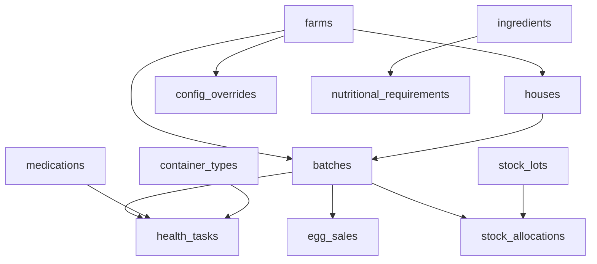

# M1 — Schema Migrations & Seed Data (Foundation Layer)

## Problem & Context

The current Supabase schema is missing 12 columns and 7 tables that every other module depends on. No business logic can be correctly implemented until the schema is complete. This is the P0 foundation — everything else is blocked on it.

**Key facts from the actual migrations:**

- `farms` table: missing `water_source_chlorinated`, `timezone`, `currency`, `egg_low_inventory_crates`
- `batches` table: missing `duck_type`, `cycle_length_weeks`, `has_active_withdrawal`, `termination_reason`
- `houses` table: missing `occupied_by_batch_id`
- `health_tasks` table: missing `medication_id`, `delivery_method`, `container_type_id`, `container_count`, `water_volume_l`, `computed_dose_amount`, `computed_dose_unit`, `bird_count`, `withdrawal_meat_until`, `withdrawal_eggs_until`, `cost_pesewas`, `blocked_reason`
- `egg_sales` table: missing `batch_id` FK (currently farm-level only — breaks per-batch egg inventory)
- `user_preferences` table: missing `cost_privacy_pin`, `timezone`
- `stock_transactions` table: `useStockData.ts` inserts using `item_id` but schema has `stock_item_id` — **live bug**
- Money stored as `NUMERIC` floats — spec requires integer pesewas (`INTEGER`)
- 7 new tables needed: `medications`, `container_types`, `ingredients`, `nutritional_requirements`, `config_overrides`, `idempotency_keys`, `stock_lots`, `stock_allocations`

**Constraints:**

- All migrations must be additive — no destructive changes to existing data
- Money migration (NUMERIC → INTEGER pesewas) requires a multiplier of 100 on existing values
- RLS policies must be added for every new table
- The `stock_item_id` bug fix must be handled carefully — the column already exists with the correct name in the DB; the bug is in `useStockData.ts` which uses `item_id` in the insert payload

## Technical Approach

### Migration 4 — Core column additions (additive, no data loss)

**`farms`**** table additions:**

```sql
ALTER TABLE farms
  ADD COLUMN water_source_chlorinated BOOLEAN NOT NULL DEFAULT false,
  ADD COLUMN timezone TEXT NOT NULL DEFAULT 'Africa/Accra',
  ADD COLUMN currency TEXT NOT NULL DEFAULT 'GHS',
  ADD COLUMN egg_low_inventory_crates INTEGER NOT NULL DEFAULT 5;
```

**`batches`**** table additions:**

```sql
ALTER TABLE batches
  ADD COLUMN duck_type TEXT CHECK (duck_type IN ('meat', 'layer')),
  ADD COLUMN cycle_length_weeks INTEGER NOT NULL DEFAULT 8,
  ADD COLUMN has_active_withdrawal BOOLEAN NOT NULL DEFAULT false,
  ADD COLUMN termination_reason TEXT CHECK (termination_reason IN ('normal', 'emergency'));

-- Enforce: duck_type required when species = 'duck'
ALTER TABLE batches ADD CONSTRAINT duck_type_required
  CHECK (species <> 'duck' OR duck_type IS NOT NULL);

-- Partial unique index: one non-terminated batch per house
CREATE UNIQUE INDEX batches_house_active_uniq
  ON batches (house_id)
  WHERE status <> 'terminated' AND house_id IS NOT NULL;
```

**`houses`**** table additions:**

```sql
ALTER TABLE houses
  ADD COLUMN occupied_by_batch_id UUID REFERENCES batches(id) ON DELETE SET NULL;
```

**`health_tasks`**** table additions:**

```sql
ALTER TABLE health_tasks
  ADD COLUMN medication_id TEXT,
  ADD COLUMN delivery_method TEXT DEFAULT 'drinking_water',
  ADD COLUMN container_type_id TEXT,
  ADD COLUMN container_count INTEGER,
  ADD COLUMN water_volume_l NUMERIC,
  ADD COLUMN computed_dose_amount NUMERIC,
  ADD COLUMN computed_dose_unit TEXT,
  ADD COLUMN bird_count INTEGER,
  ADD COLUMN withdrawal_meat_until DATE,
  ADD COLUMN withdrawal_eggs_until DATE,
  ADD COLUMN cost_pesewas INTEGER,
  ADD COLUMN blocked_reason TEXT;
```

**`egg_sales`**** table additions:**

```sql
ALTER TABLE egg_sales
  ADD COLUMN batch_id UUID REFERENCES batches(id) ON DELETE SET NULL,
  ADD COLUMN crates_sold INTEGER NOT NULL DEFAULT 0,
  ADD COLUMN looses_sold INTEGER NOT NULL DEFAULT 0,
  ADD COLUMN price_per_crate_pesewas INTEGER NOT NULL DEFAULT 0,
  ADD COLUMN price_per_loose_pesewas INTEGER NOT NULL DEFAULT 0,
  ADD COLUMN total_revenue_pesewas INTEGER NOT NULL DEFAULT 0,
  ADD COLUMN payment_method TEXT NOT NULL DEFAULT 'cash',
  ADD COLUMN ledger_entry_id TEXT;
```

**`user_preferences`**** table additions:**

```sql
ALTER TABLE user_preferences
  ADD COLUMN cost_privacy_pin TEXT,
  ADD COLUMN timezone TEXT;
```

### Migration 5 — Money conversion (NUMERIC → INTEGER pesewas)

This is the most sensitive migration. All existing `NUMERIC` money columns are multiplied by 100 and cast to `INTEGER`. The conversion runs in a single transaction.

Affected columns:

- `expenses.amount` → `expenses.amount_pesewas INTEGER`
- `revenue.amount` → `revenue.amount_pesewas INTEGER`
- `stock_items.unit_price` → `stock_items.unit_price_pesewas INTEGER`
- `stock_transactions.unit_price`, `total_cost` → `unit_price_pesewas`, `total_cost_pesewas INTEGER`
- `egg_sales.unit_price`, `total_amount` → `price_per_crate_pesewas`, `total_revenue_pesewas INTEGER`

**Strategy:** Add new `_pesewas` columns, populate from existing columns × 100, then drop old columns. This is safe because the frontend hooks will be updated in the same ticket to use the new column names.

### Migration 6 — New reference tables

Seven new tables with full RLS:

```
medications          — 52 canonical medications (seed data)
container_types      — 9 canonical container types (seed data)
ingredients          — 25 canonical feed ingredients (seed data)
nutritional_requirements — per-species/phase nutritional targets (seed data)
config_overrides     — L3 runtime overrides (farm-scoped)
idempotency_keys     — client-generated key deduplication
stock_lots           — lot-level stock tracking (FIFO+quality)
stock_allocations    — allocation records per lot
```

### Migration 7 — Seed data

All seed data is inserted via `INSERT ... ON CONFLICT DO NOTHING` so re-running migrations is safe.

**Medications (52 entries)** — key entries:

| id | name | category | delivery | dose/gal | unit | wd_meat | wd_eggs | is_live_vaccine |
| --- | --- | --- | --- | --- | --- | --- | --- | --- |
| `amprolium` | Amprolium (CORID) | coccidiostat | drinking_water | 1.5 | tsp | 1 | 0 | false |
| `oxytetracycline` | Oxytetracycline | antibiotic | drinking_water | 1.5 | tsp | 7 | 7 | false |
| `tylosin` | Tylosin (Tylan) | antibiotic | drinking_water | 1 | tsp | 5 | 5 | false |
| `enrofloxacin` | Enrofloxacin (Baytril) | antibiotic | drinking_water | 1 | tsp | 14 | 14 | false |
| `fenbendazole` | Fenbendazole | dewormer | drinking_water | 1 | tsp | 0 | 0 | false |
| `metronidazole` | Metronidazole | antiprotozoal | drinking_water | 1 | tsp | 5 | 0 | false |
| `niacin` | Niacin (Duck) | supplement | drinking_water | 1.5 | tsp | 0 | 0 | false |
| `gumboro_intermediate` | Gumboro Intermediate | vaccine | drinking_water | 0 | ml | 0 | 0 | true |
| `lasota` | Lasota (Newcastle) | vaccine | drinking_water | 0 | ml | 0 | 0 | true |
| `duck_viral_hepatitis` | Duck Viral Hepatitis | vaccine | injection_subcutaneous | 0 | ml | 0 | 0 | true |
| `fowl_pox` | Fowl Pox | vaccine | injection_wing_web | 0 | ml | 0 | 0 | true |

**Container types (9 entries)** — per CONVENTIONS §2.3:

| id | name | volume_l | volume_gal |
| --- | --- | --- | --- |
| `bell_drinker_small` | Small Bell Drinker | 1 | 0.26 |
| `bell_drinker_1gal` | Bell Drinker 1 gal | 3 | 0.79 |
| `bell_drinker_6l` | Bell Drinker 6L | 6 | 1.59 |
| `local_drinker_10l` | Local Drinker 10L | 10 | 2.64 |
| `jumbo_bell_14l` | Jumbo Bell 14L | 14 | 3.70 |
| `bucket_5gal` | 5 Gallon Bucket | 20 | 5.28 |
| `jerry_can_25l` | Jerry Can 25L | 25 | 6.60 |
| `drum_50l` | 50L Drum | 50 | 13.21 |
| `nipple_tank_100l` | Nipple Tank 100L | 100 | 26.42 |

**Nutritional requirements** — per species/phase (broiler starter: protein_min 22%, energy_min 3000 kcal/kg, energy_max 3200, calcium_min 0.9%, calcium_max 1.1%, phosphorus_min 0.45%, lysine_min 1.1%, methionine_min 0.5%):

| species | duck_type | phase | protein_min | energy_min | energy_max | calcium_min | calcium_max | phosphorus_min | lysine_min | methionine_min |
| --- | --- | --- | --- | --- | --- | --- | --- | --- | --- | --- |
| broiler | null | starter | 22 | 3000 | 3200 | 0.9 | 1.1 | 0.45 | 1.1 | 0.50 |
| broiler | null | grower | 20 | 3100 | 3300 | 0.85 | 1.0 | 0.40 | 1.0 | 0.45 |
| broiler | null | finisher | 18 | 3150 | 3350 | 0.80 | 1.0 | 0.38 | 0.9 | 0.40 |
| layer | null | starter | 20 | 2900 | 3100 | 0.9 | 1.1 | 0.42 | 1.0 | 0.42 |
| layer | null | grower | 16 | 2800 | 3000 | 0.9 | 1.1 | 0.38 | 0.8 | 0.35 |
| layer | null | layer_production | 17 | 2750 | 2950 | 3.4 | 4.2 | 0.40 | 0.85 | 0.38 |
| duck | meat | starter | 22 | 2900 | 3100 | 0.9 | 1.1 | 0.42 | 1.0 | 0.42 |
| duck | layer | layer_production | 17 | 2750 | 2950 | 3.2 | 4.0 | 0.40 | 0.82 | 0.36 |
| turkey | null | starter | 28 | 2800 | 3000 | 1.1 | 1.3 | 0.55 | 1.5 | 0.55 |
| turkey | null | grower | 22 | 2900 | 3100 | 0.9 | 1.1 | 0.45 | 1.1 | 0.45 |
| turkey | null | finisher | 18 | 3000 | 3200 | 0.85 | 1.0 | 0.40 | 0.9 | 0.40 |

### ACID guarantees

- All column additions are in separate `ALTER TABLE` statements within a single migration transaction — Postgres rolls back the entire migration on any failure
- The pesewas conversion uses `BEGIN; ... COMMIT;` with explicit rollback on error
- Seed data uses `ON CONFLICT DO NOTHING` — idempotent, safe to re-run
- The `batches_house_active_uniq` partial index enforces the one-active-batch-per-house invariant at the DB level

### Data Model



### Acceptance Criteria

1. `farms` has `water_source_chlorinated`, `timezone`, `currency`, `egg_low_inventory_crates` — all with correct defaults
2. `batches` has `duck_type`, `cycle_length_weeks`, `has_active_withdrawal`, `termination_reason` — CHECK constraint enforces `duck_type` required for ducks
3. `batches_house_active_uniq` partial index exists and rejects a second active batch on the same house
4. `houses` has `occupied_by_batch_id`
5. `health_tasks` has all 12 new columns
6. `egg_sales` has `batch_id` FK
7. `user_preferences` has `cost_privacy_pin` and `timezone`
8. All money columns are `INTEGER` pesewas; existing data multiplied by 100
9. `medications` table has exactly 52 rows; `container_types` has exactly 9 rows
10. `nutritional_requirements` has rows for all species/phase combinations
11. `stock_lots` and `stock_allocations` tables exist with full RLS
12. `idempotency_keys` table exists
13. All new tables have RLS enabled with farm-scoped policies
14. `useStockData.ts` `item_id` → `stock_item_id` bug is fixed in the hook (not the schema — the schema is already correct)