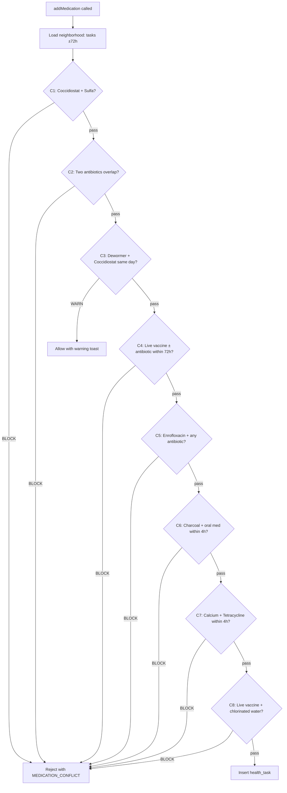

# M2 — Water-Health: Conflict Matrix, Dosing, Auto-Tasks

## Problem & Context

The Water-Health module is the most operationally critical system in LampFarms. Currently `addMedication` in file:src/hooks/useHealthData.ts inserts directly into `health_tasks` with zero conflict checking. A farmer can give a live vaccine and an antibiotic on the same day (C4 — kills the vaccine), two antibiotics simultaneously (C2 — resistance + toxicity), or a live vaccine on chlorinated water (C8 — kills the vaccine). This is a **bird health safety gap**, not a UX gap.

Additionally, the dosing UI is missing entirely — `dose_per_gallon: null` is hardcoded in every insert. Duck niacin auto-tasks and turkey Metronidazole auto-tasks are not generated.

**Constraints:**

- M1 (schema + seed) must be complete before this module can be implemented
- The conflict matrix must run client-side (no Express server) — it reads from the `medications` table via Supabase
- All 8 conflicts must be evaluated on every task create — no partial implementation
- The 72-hour window for C4 (vaccine + antibiotic) is non-negotiable per CONVENTIONS §2.2

## Technical Approach

### Architectural Approach

The conflict matrix, dosing calculator, and auto-task generator are implemented as pure TypeScript modules in `src/lib/`:

```
src/lib/medication-conflicts.ts   — detectConflicts() pure function
src/lib/dosing.ts                 — computeDose() pure function
src/lib/health-auto-tasks.ts      — generateInitialTasks() for duck/turkey
```

`useHealthData.ts` is updated to:

1. Load `medications` and `container_types` from Supabase on mount (cached, rarely changes)
2. Call `detectConflicts()` before every `addMedication` insert
3. Call `computeDose()` when container type and count are selected
4. Call `generateInitialTasks()` on batch creation (triggered from `BatchCreate.tsx`)

### Conflict Matrix — all 8 rules



**C1:** New task `medication.category = 'coccidiostat'` AND any active/scheduled task in `[today, +5d]` has `is_sulfa = true` → BLOCK

**C2:** New task `medication.category = 'antibiotic'` AND any other antibiotic task overlaps the window → BLOCK

**C3:** New task `medication.category = 'dewormer'` AND coccidiostat scheduled same day → WARN (allow)

**C4:** `medication.is_live_vaccine = true` AND any antibiotic task within ±72 hours (3 days) → BLOCK. Symmetric: new antibiotic AND live vaccine within ±72 hours → BLOCK

**C5:** `medication.id = 'enrofloxacin'` AND any other antibiotic overlaps → BLOCK

**C6:** `medication.is_activated_charcoal = true` AND any oral medication within ±4 hours → BLOCK

**C7:** `medication.contains_calcium = true` AND `is_tetracycline = true` task within ±4 hours → BLOCK

**C8:** `medication.is_live_vaccine = true` AND `farm.water_source_chlorinated = true` → BLOCK

The `detectConflicts` function signature:

```ts
detectConflicts(args: {
  newMed: Medication;
  neighborhood: { task: HealthTask; med: Medication }[];
  waterSourceChlorinated: boolean;
}): ConflictHit[]
```

The neighborhood query fetches all `health_tasks` for the batch within a ±72-hour window of the new task's `scheduled_date`, joined with their medication records.

### Dosing Calculator

Per CONVENTIONS §2.13:

```ts
computeDose(med: Medication, waterVolumeL: number): { amount: number; unit: DoseUnit } | null
// amount = med.dose_per_gallon * (waterVolumeL / 3.785)
// Returns null for injection delivery methods
```

The medication dialog branches on `delivery_method`:

- `drinking_water` → show container type picker (9 types from `container_types` table) + container count → compute `water_volume_l = container.volume_l × count` → compute dose
- `injection_subcutaneous` / `injection_wing_web` → show injection site + `dose_per_bird_ml × bird_count` → hide container fields

### Auto-task generation

`generateInitialTasks(batch)` is called from `BatchCreate.tsx` after the batch is inserted:

**Duck batches (****`species = 'duck'`****):**

- Days 1–28: daily niacin task (`medication_id = 'niacin'`, `delivery_method = 'drinking_water'`, `dose_per_gallon = 1.5 tsp`)
- Week 5 onwards: weekly niacin task until termination (generated up to Week 20 at creation time; regenerated on week advance)

**Turkey batches (****`species = 'turkey'`****):**

- Every 2 weeks: Metronidazole task (`medication_id = 'metronidazole'`) for blackhead prophylaxis, from Week 1 until `cycle_length_weeks`

### Withdrawal tracking

When `markTaskComplete` is called for a task with `withdrawal_meat_days > 0`:

1. Compute `withdrawal_meat_until = completed_at + withdrawal_meat_days`
2. Compute `withdrawal_eggs_until = completed_at + withdrawal_eggs_days`
3. Update `health_tasks` row with both dates
4. Update `batches.has_active_withdrawal = true`

The withdrawal sweep (Edge Function job, see M5) clears `has_active_withdrawal` when all withdrawal dates have passed.

### UI changes

**Medication dialog** — new fields:

- Medication picker (dropdown from `medications` table, grouped by category)
- Delivery method (auto-populated from medication record, read-only)
- For `drinking_water`: container type picker + container count → computed dose display
- For injections: injection site (read-only from medication) + dose per bird display

**Health task list** — new columns:

- `blocked_reason` badge (C1–C8 code) when `status = 'blocked'`
- Withdrawal countdown when `withdrawal_meat_until` or `withdrawal_eggs_until` is in the future

### Acceptance Criteria

1. `detectConflicts` returns a BLOCK for all 8 conflict scenarios per the test cases in `specs/03_WATER_HEALTH.md` §12
2. C4 window is exactly 72 hours — antibiotic at +73h passes
3. C8 blocks live vaccine when `farm.water_source_chlorinated = true`; passes when `false`
4. `addMedication` rejects with a toast showing the conflict code when any BLOCK is returned
5. C3 (WARN) allows the insert but shows a warning toast
6. Dose computation: `amprolium` (1.5 tsp/gal) at 25L water → `1.5 × (25/3.785) ≈ 9.9 tsp`
7. Injection tasks show `dose_per_bird_ml × bird_count`; container fields are null
8. Duck batch creation seeds niacin tasks daily Days 1–28 then weekly from Week 5
9. Turkey batch creation seeds Metronidazole every 2 weeks
10. `markTaskComplete` with `withdrawal_meat_days > 0` sets `batches.has_active_withdrawal = true` and populates `withdrawal_meat_until`
11. `useHealthData.ts` loads `medications` and `container_types` from Supabase on mount (not hardcoded)