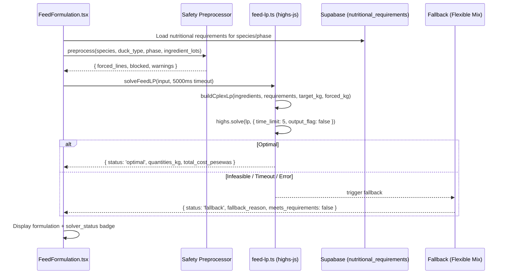

# M3 — Feed Calculator: highs-js LP Solver + Safety Preprocessor

## Problem & Context

The current file:src/lib/feed-optimizer.ts is a 178-line greedy binary-search heuristic. It does not use `highs-js`. It does not enforce nutritional constraints. A formulation it produces may not meet protein/energy/calcium/phosphorus/lysine/methionine requirements — the farmer gets a number but not a guarantee. `highs-js` is not in `package.json`.

The spec (`specs/04_FEED_CALCULATOR.md` §7) provides the complete LP formulation: 9 constraints (mass balance + 8 nutritional), CPLEX-LP text format, `Promise.race` timeout pattern, and fallback chain. This is the most technically complex single item in the entire plan.

**Constraints:**

- `highs-js` must be added to `package.json` as a production dependency
- The WASM module must be loaded once and cached (singleton promise pattern)
- The 5-second timeout is hard — solver must race against a timeout promise
- On any failure (infeasible, timeout, WASM error) the API must return HTTP 200 with a fallback Flexible Mix, not an error
- Duck niacin must NOT be added by the Safety Preprocessor (CONVENTIONS §2.9 — it is a Water-Health auto-task)
- The `nutritional_requirements` table (seeded in M1) is the source of truth for constraints — not hardcoded values

## Technical Approach

### Architectural Approach

The LP solver replaces `feed-optimizer.ts` entirely. The new file is `src/lib/feed-lp.ts`. The existing `FeedFormulation.tsx` page and `Feed.tsx` page are updated to use the new solver.



### Safety Preprocessor — 5 rules

Implemented in `src/lib/feed-safety.ts`:

**R-FC-1 (Aflatoxin binder — COMPULSORY):** If any ingredient has `contains_aflatoxin_risk = true` (maize, groundnut cake) — or unconditionally for broiler/layer/duck/turkey — append `toxin_binder` at 0.5% of `target_kg`, `auto_added = true`. Cannot be removed.

**R-FC-2 (Gossypol block):** If `species = 'layer'` and any ingredient `contains_gossypol = true` (cotton seed cake) → block with `LAYER_GOSSYPOL_BLOCKED`.

**R-FC-3 (Fish meal cap):** If `species = 'broiler'` and fish meal is selected → set LP upper bound for fish meal at `0.10 × target_kg`. Emit warning `BROILER_FISH_MEAL_CAPPED`.

**R-FC-4 (Single calcium source):** If multiple `category = 'calcium'` ingredients are supplied → keep only the last selection. Emit warning `CALCIUM_SOURCE_REPLACED`.

**R-FC-5 (Duck niacin — MUST NOT add):** The preprocessor explicitly must not inject a niacin line. Duck niacin is a Water-Health auto-task (CONVENTIONS §2.9).

### LP Solver — precise specification

**Decision variables:** `x_i` = kg of ingredient `i` (one per ingredient in the lot)

**Objective:** Minimize `Σ(cost_per_kg_pesewas_i × x_i)`

**Constraints (9 total):**

1. Mass balance: `Σ(x_i) = target_kg`
2. Protein: `Σ(protein_pct_i × x_i) ≥ protein_min × target_kg`
3. Energy min: `Σ(energy_kcal_per_kg_i × x_i) ≥ energy_min × target_kg`
4. Energy max: `Σ(energy_kcal_per_kg_i × x_i) ≤ energy_max × target_kg`
5. Calcium min: `Σ(calcium_pct_i × x_i) ≥ calcium_min × target_kg`
6. Calcium max: `Σ(calcium_pct_i × x_i) ≤ calcium_max × target_kg`
7. Phosphorus: `Σ(phosphorus_pct_i × x_i) ≥ phosphorus_min × target_kg`
8. Lysine: `Σ(lysine_pct_i × x_i) ≥ lysine_min × target_kg`
9. Methionine: `Σ(methionine_pct_i × x_i) ≥ methionine_min × target_kg`

**Bounds:**

- `0 ≤ x_i ≤ min(available_kg_i, max_share_i × target_kg)` where `max_share_i` is `0.10` for fish meal in broilers, `Infinity` otherwise
- `x_i = forced_kg[i]` (lb = ub = value) for compulsory ingredients (toxin binder)

**CPLEX-LP text format** (built by `buildCplexLp`):

```
Minimize
 obj: 11500 x_maize + 38000 x_soybean_meal + 3500 x_oyster_shell + 0 x_toxin_binder
Subject To
 mass:        x_maize + x_soybean_meal + x_oyster_shell + x_toxin_binder = 500
 protein:     0.085 x_maize + 0.44 x_soybean_meal + 0 x_oyster_shell + 0 x_toxin_binder >= 90
 energy_min:  3350 x_maize + 2230 x_soybean_meal + 0 x_oyster_shell + 0 x_toxin_binder >= 1550000
 ...
Bounds
 0 <= x_maize <= 400
 x_toxin_binder = 2.5
End
```

**Timeout pattern:** `Promise.race([work, timer])` where `timer` resolves to `{ status: 'timeout' }` after 5000ms.

**WASM singleton:** `let highsPromise: Promise<any> | null = null; async function getHighs() { if (!highsPromise) highsPromise = highsLoader(); return highsPromise; }`

### Fallback behaviour

When `solveFeedLP` returns `status ∈ {infeasible, timeout, error}`:

1. Build a formulation in `flexible` mode with ingredients at even shares of `target_kg` minus forced lines
2. Run nutrition totals; set `meets_requirements = false`
3. Set `solver_status = 'fallback'`, `mode = 'automatic'`
4. Return with `fallback_used = true` and `fallback_reason ∈ {LP_INFEASIBLE, LP_TIMEOUT, LP_WASM_ERROR}`
5. UI shows banner: "Could not auto-optimise — switched to Flexible Mix. Adjust quantities below."

### UI changes

**FeedFormulation.tsx** — new elements:

- `solver_status` badge: `optimal` (green), `fallback` (amber), `manual` (gray)
- Fallback banner with reason
- Nutritional compliance indicators (protein ✓/✗, energy ✓/✗, calcium ✓/✗, etc.)
- Auto-added toxin binder line (non-removable, visually distinct)
- Blocked ingredient warning (gossypol for layers)

```wireframe

<html>
<head>
<style>
body { font-family: sans-serif; max-width: 700px; margin: 20px auto; padding: 0 16px; }
.card { border: 1px solid #ddd; border-radius: 8px; padding: 16px; margin-bottom: 12px; }
.badge { display: inline-block; padding: 2px 8px; border-radius: 12px; font-size: 12px; font-weight: 600; }
.badge-optimal { background: #d1fae5; color: #065f46; }
.badge-fallback { background: #fef3c7; color: #92400e; }
.badge-manual { background: #f3f4f6; color: #374151; }
.banner { background: #fef3c7; border: 1px solid #f59e0b; border-radius: 6px; padding: 10px 14px; margin-bottom: 12px; font-size: 13px; }
.row { display: flex; justify-content: space-between; align-items: center; padding: 6px 0; border-bottom: 1px solid #f3f4f6; }
.auto-tag { font-size: 11px; background: #ede9fe; color: #5b21b6; padding: 1px 6px; border-radius: 4px; }
.check { color: #059669; } .cross { color: #dc2626; }
.nutrition-grid { display: grid; grid-template-columns: 1fr 1fr 1fr; gap: 8px; margin-top: 8px; }
.nut-item { background: #f9fafb; border-radius: 6px; padding: 8px; font-size: 12px; }
</style>
</head>
<body>
<div class="card">
  <div style="display:flex;justify-content:space-between;align-items:center;margin-bottom:12px">
    <strong>Feed Formulation — Broiler Starter</strong>
    <span class="badge badge-optimal">✓ Optimal</span>
  </div>
  <div class="row"><span>Maize (Yellow Corn)</span><span>312.5 kg (62.5%)</span></div>
  <div class="row"><span>Soybean Meal</span><span>125.0 kg (25.0%)</span></div>
  <div class="row"><span>Oyster Shell</span><span>10.0 kg (2.0%)</span></div>
  <div class="row"><span>Toxin Binder <span class="auto-tag">auto-added</span></span><span>2.5 kg (0.5%)</span></div>
  <div class="row" style="font-weight:600;border:none"><span>Total</span><span>500 kg — GHS 4,250</span></div>
</div>
<div class="card">
  <strong>Nutritional Compliance</strong>
  <div class="nutrition-grid">
    <div class="nut-item"><div class="check">✓ Protein</div><div>22.1% ≥ 22%</div></div>
    <div class="nut-item"><div class="check">✓ Energy</div><div>3,050 kcal/kg</div></div>
    <div class="nut-item"><div class="check">✓ Calcium</div><div>0.95%</div></div>
    <div class="nut-item"><div class="check">✓ Phosphorus</div><div>0.47%</div></div>
    <div class="nut-item"><div class="check">✓ Lysine</div><div>1.12%</div></div>
    <div class="nut-item"><div class="check">✓ Methionine</div><div>0.52%</div></div>
  </div>
</div>
<div class="card" style="background:#fef3c7;border-color:#f59e0b">
  <strong>⚠ Fallback Mode</strong>
  <p style="margin:4px 0;font-size:13px">Could not auto-optimise (LP_INFEASIBLE) — switched to Flexible Mix. Adjust quantities below.</p>
</div>
</body>
</html>
```

### Acceptance Criteria

1. `highs-js` is in `package.json` dependencies
2. `solveFeedLP` returns `status: 'optimal'` for a valid broiler-finisher problem with maize + soybean meal + oyster shell + toxin binder
3. Infeasible problem (only maize for a 22% protein starter) → `status: 'fallback'`, `fallback_reason: 'LP_INFEASIBLE'`, `meets_requirements: false`
4. Mocked timeout → `status: 'fallback'`, `fallback_reason: 'LP_TIMEOUT'`
5. Layer + cotton seed cake → blocked with `LAYER_GOSSYPOL_BLOCKED` before LP runs
6. Broiler + fish meal lot 200 kg of 500 kg target → final fish meal line ≤ 50 kg
7. Two calcium ingredients → only the last persists, warning emitted
8. Toxin binder auto-added at 0.5% of target_kg; cannot be removed by farmer
9. Duck batch formulation contains NO niacin line in any mode
10. Nutritional requirements loaded from `nutritional_requirements` table, not hardcoded
11. `solver_status` badge displayed correctly in UI for all 5 states
12. Mass balance: `Σ(lines.quantity_kg) = target_kg` within ±0.5 kg tolerance