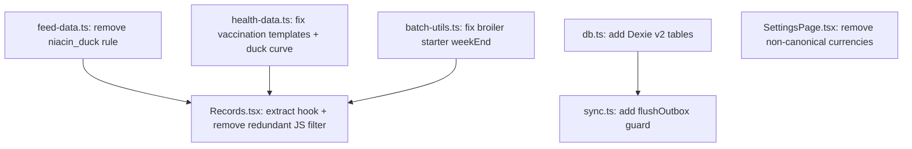

# Track A — Frontend Code Realignment Plan

## Problem & Context

The frontend codebase has accumulated several inconsistencies against the canonical spec (file:specs/00_CONVENTIONS.md and domain specs). These are not architectural changes — they are targeted corrections to existing lib files and pages. The work is purely technical with no user-visible UX changes except the currency picker narrowing and the Records page performance improvement.

**Constraints:**

- No monolithic files — each change must keep files focused and composable
- No spaghetti: no cross-cutting state mutations, no logic embedded in render
- Supabase remains the data layer (no backend migration in this track)
- The password change dialog is **kept** — it is functional and correct for Supabase email/password auth; the spec's prohibition applies only to OIDC-based deployments
- No route changes, no design changes

## Technical Approach

### Architectural Approach

All changes are **surgical replacements** within existing files. No new pages, no new routes, no new components. The principle is: fix the wrong value/logic, leave everything else untouched.

The one structural addition is the Dexie schema version bump — this requires a new `version(2)` block in file:src/lib/db.ts to add the three missing tables without breaking the existing v1 data.

For file:src/pages/Records.tsx, the client-side aggregation is the most complex change. The current pattern fires 5 parallel Supabase queries and then filters in JS. The fix keeps the same Supabase data layer but moves the per-batch filtering into the query itself (using `.in()` with individual batch IDs is already done — the JS filter is redundant and can be removed). The `mask()` function is replaced with a direct read from the Zustand store inline, which is what it already does — the spec concern about server-side masking doesn't apply until the Express backend exists.

### Change-by-Change Breakdown

#### 1. file:src/lib/feed-data.ts — Remove niacin duck safety rule

**What changes:**

- Delete the `niacin_duck` entry from `SAFETY_RULES` (the entire object, lines 131–140)
- Delete the duck niacin block from `getCompulsorySupplements` (lines 209–215)
- The `Niacin (Vitamin B3)` entry in `INGREDIENTS` (line 68) stays — it's a valid ingredient a farmer can manually select; it just must not be auto-forced

**Why:** CONVENTIONS §2.9 — niacin is a water additive, not a feed ingredient. Auto-forcing it in the feed calculator is wrong.

**Risk:** Zero. Removing an auto-add rule cannot break existing formulations. Farmers who manually selected niacin in a formulation are unaffected.

#### 2. file:src/lib/health-data.ts — Fix broiler vaccination templates + duck egg curve

**What changes in ****`VACCINATION_TEMPLATES`****:**

Replace the current broiler entries with exactly the 5 canonical vaccinations from CONVENTIONS §2.8:

| Day | Vaccine | Route |
| --- | --- | --- |
| Day 7 (Week 1) | Gumboro Intermediate | Drinking water |
| Day 14 (Week 2) | HB1 (Newcastle + IB) | Eye drop / Drinking water |
| Day 21 (Week 3) | Gumboro Intermediate Plus | Drinking water |
| Day 28 (Week 4) | Lasota (Newcastle) | Drinking water |
| Day 35 (Week 5) | Gumboro Intermediate Plus | Drinking water |

The current template uses `scheduledWeek` (integer). The canonical schedule is day-based. The field should be interpreted as the week number (Day 7 = Week 1, Day 14 = Week 2, etc.) — no schema change needed, just correct values.

**What changes in ****`EGG_PRODUCTION_CURVES`****:**

- Duck `Rearing` phase: `weekEnd: 20` → `weekEnd: 19` (rearing ends at week 19)
- Duck `Early` phase: `weekStart: 21` → `weekStart: 20` (production starts at week 20, CONVENTIONS §2.7)

**Risk:** Low. These are reference data arrays used for display and scheduling. No stored data is affected.

#### 3. file:src/lib/batch-utils.ts — Fix broiler starter phase boundary

**What changes:**

- `PHASE_DEFINITIONS.broiler[0].weekEnd`: `2` → `3` (starter ends at week 3, not week 2)

This aligns with file:specs/02_BATCH_MANAGEMENT.md §2.3: broiler starter = weeks 1–3.

**Risk:** Low. This affects the `getBatchAge()` return value for broilers in weeks 1–3. A broiler in week 3 currently shows as "grower" — after the fix it correctly shows "starter". No data is written based on this value in the current frontend.

#### 4. file:src/lib/db.ts — Add missing Dexie tables

**What changes:**

Add a `version(2)` schema upgrade that introduces three new tables:

```
sync_meta: 'entity, &entity'   // keyed by entity name
conflicts: '++id, entity, record_id'
dashboard_cache: 'farm_id'     // keyed by farm_id
```

**Interfaces to add:**

```ts
interface SyncMeta { entity: string; last_synced_at: string; server_version: string | null; }
interface ConflictRecord { id?: number; entity: string; record_id: string; local_data: unknown; server_data: unknown; created_at: string; }
interface DashboardCache { farm_id: string; payload: unknown; fetched_at: string; }
```

The existing `version(1)` block is untouched. Dexie handles the migration automatically on next open.

**Risk:** Low. Additive schema change. Existing data in v1 tables is preserved. The new tables start empty.

#### 5. file:src/lib/sync.ts — Add `flushOutbox` concurrency guard

**What changes:**

- Add a module-level `let flushing = false` flag
- At the top of `flushOutbox`: if `flushing` is true, return early
- Set `flushing = true` before the loop, `flushing = false` in a `finally` block

This prevents the `online` event from triggering two simultaneous flush loops.

**Risk:** Zero. Pure guard addition, no logic change.

#### 6. file:src/pages/SettingsPage.tsx — Remove non-canonical currencies

**What changes:**

- `CURRENCIES` array: keep only `GHS` and `NGN`, remove USD, KES, GBP, EUR, XOF, ZAR
- If the user's stored currency preference is one of the removed values, the select will show an empty state — add a fallback: if `currency` is not in `['GHS', 'NGN']`, default to `'GHS'` on load

**What does NOT change:**

- Password change dialog stays — it is correct for Supabase email/password auth
- All other settings functionality is untouched

**Risk:** Low. Any user who previously saved a non-GHS/NGN currency will be silently defaulted to GHS on next load. This is acceptable — the spec explicitly prohibits those currencies.

#### 7. file:src/pages/Records.tsx — Remove client-side aggregation and client-side masking

**Current problem:**

- 5 parallel Supabase queries fetch all rows for the farm, then JS `.filter(m => m.batch_id === b.id)` runs per batch in a loop — O(batches × rows) in JS
- `mask()` function reads from Zustand `costPrivacyEnabled` — this is actually correct for the current Supabase-backed frontend (server-side masking requires the Express backend). The function itself is fine; the spec concern doesn't apply yet.

**What changes:**

- Remove the redundant JS `.filter()` calls — the data is already scoped to the farm via `.eq('farm_id', farmId)` and `.in('batch_id', batchIds)`. The per-batch grouping in JS is still needed (to build the `perf` map), but the filter is redundant since `.in()` already limits the result set. The loop structure stays; only the inner `.filter()` calls are replaced with a `Map` pre-built from the query results for O(1) lookup instead of O(n) per batch.
- The `mask()` function and `costPrivacyEnabled` usage stays — it is correct for this platform

**Structural improvement:** Extract the performance data loading into a dedicated `useRecordsPerformance(batchIds, farmId)` hook so `Records.tsx` is not a monolith. The page component becomes a thin orchestrator; the data logic lives in the hook.

**File size target:** `Records.tsx` is currently 321 lines. After extracting the hook, the page component should be under 200 lines.

### Data Model

Only file:src/lib/db.ts changes the data model — three new Dexie tables added in `version(2)`. No Supabase schema changes. No new migrations.

### Component Architecture

No new components are introduced. The one structural change is extracting a `useRecordsPerformance` hook from `Records.tsx`:

```
src/hooks/useRecordsPerformance.ts   ← new hook (extracted from Records.tsx)
src/pages/Records.tsx                ← slimmed page, imports the hook
```

All other changes are in-place edits to existing files.

### Change Dependency Graph



A, B, C, D, F are fully independent. E depends on D (same file context). G is independent but benefits from A/B/C being done first so the data it displays is correct.

### Business Rules Enforced by This Plan

| Rule | Source | Change |
| --- | --- | --- |
| Niacin is water-health, not feed | CONVENTIONS §2.9 | `feed-data.ts` |
| Broiler has exactly 5 vaccinations | CONVENTIONS §2.8 | `health-data.ts` |
| Duck-layer egg production starts Week 20 | CONVENTIONS §2.7 | `health-data.ts` |
| Broiler starter = weeks 1–3 | `02_BATCH_MANAGEMENT.md` §2.3 | `batch-utils.ts` |
| Dexie must have sync_meta, conflicts, dashboard_cache | CONVENTIONS §4.6 | `db.ts` |
| Currency must be GHS or NGN only | CONVENTIONS §4.3 | `SettingsPage.tsx` |
| No concurrent outbox flushes | `second/` plan issue #28 | `sync.ts` |

### Out of Scope for This Track

- No backend (Express, Drizzle, pg-boss) — that is Track B
- No design changes — that is Track D (Grawing)
- No route changes
- No Supabase schema migrations
- No changes to Auth, Dashboard, Feed, Health, Stock, Finance, Eggs, Batches pages
- Password change dialog stays (correct for Supabase auth)
- `AppSidebar.tsx` label "Care & Water" stays — it matches the `.lovable/plan.md` Grawing naming, not the spec's "Water-Health". Changing it is Track D scope.

### Acceptance Criteria

1. `feed-data.ts`: `SAFETY_RULES` has no `niacin_duck` entry; `getCompulsorySupplements` never auto-adds niacin for duck species
2. `health-data.ts`: broiler `VACCINATION_TEMPLATES` has exactly 5 entries matching CONVENTIONS §2.8; duck egg curve `Early` phase starts at week 20
3. `batch-utils.ts`: broiler starter `weekEnd` is `3`; a broiler in week 3 returns `phase: 'starter'`
4. `db.ts`: Dexie `version(2)` adds `sync_meta`, `conflicts`, `dashboard_cache` tables; existing v1 data is intact
5. `sync.ts`: concurrent calls to `flushOutbox` do not double-process the outbox
6. `SettingsPage.tsx`: currency picker shows only GHS and NGN; users with other stored currencies default to GHS on load
7. `Records.tsx`: page component is under 200 lines; performance data loading is in a dedicated hook; no O(n²) JS filtering