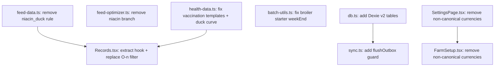

# Track A — Frontend Code Realignment Plan (Complete)

## Problem & Context

The LampFarms frontend has accumulated 8 precise inconsistencies against the canonical specs (file:specs/00_CONVENTIONS.md, file:specs/11_PROTOCOL_BROILER.md, file:specs/13_PROTOCOL_DUCK.md, file:specs/04_FEED_CALCULATOR.md). These are not architectural changes — they are targeted corrections to existing lib files and pages. The work is purely technical with no user-visible UX changes except the currency picker narrowing.

**Constraints:**

- No monolithic files — each change must keep files focused and composable
- No spaghetti: no cross-cutting state mutations, no logic embedded in render
- Supabase remains the data layer (no backend migration in this track)
- No route changes, no design changes, no new pages
- The password change dialog in file:src/pages/SettingsPage.tsx is **kept** — it calls `supabase.auth.updateUser({ password })` which is the correct and only in-app mechanism for Supabase email/password auth. file:specs/10_SETTINGS.md Rule R-S-2 ("no password change UI") was written for OIDC deployments where passwords are managed externally. It does not apply here. Removing the dialog would break real user functionality with no benefit. This decision is final for this platform.

## Technical Approach

### Architectural Approach

All changes are **surgical replacements** within existing files. The principle: fix the wrong value or logic, leave everything else untouched. No new pages, no new routes.

Two structural additions:

1. A `version(2)` block in file:src/lib/db.ts — additive Dexie schema upgrade, no data loss
2. A `useRecordsPerformance` hook extracted from file:src/pages/Records.tsx — moves data logic out of the page component

One cross-cutting adjustment is also required at the auth/session boundary: file:src/contexts/AuthContext.tsx must normalize any invalid stored currency to `GHS` so the rest of the app never sees non-canonical values during the current session. This is not a new abstraction; it is the simplest codebase-fit way to make the currency rule hold end-to-end.

Everything else is in-place edits.

### Change 1 — file:src/lib/feed-data.ts: Remove niacin duck safety rule

**Exact lines affected:**

- Lines 131–140: the entire `niacin_duck` entry in `SAFETY_RULES` — delete it
- Lines 209–215: the duck niacin block in `getCompulsorySupplements` — delete it
- Line 68: the `Niacin (Vitamin B3)` entry in `INGREDIENTS` — **stays** (valid ingredient a farmer can manually select; just not auto-forced)

**Why:** CONVENTIONS §2.9 — niacin is a water additive, not a feed ingredient. Auto-forcing it in the feed calculator is wrong. The Water-Health module (when built) will auto-generate niacin tasks for duck batches.

**Risk:** Zero. Removing an auto-add rule cannot break existing formulations.

### Change 2 — file:src/lib/feed-optimizer.ts: Remove niacin allocation branch

**Exact line affected:**

- Line 52: `else if (name.includes('niacin')) allocations[idx] = targetKg * 0.001;` — delete this branch

**Why:** The optimizer treats niacin as a feed supplement with a fixed 0.1% allocation. Since niacin is not a feed ingredient (CONVENTIONS §2.9), this branch is wrong. A farmer who manually adds niacin to a formulation should have it allocated by the generic `else` branch (0.5% default), not a special niacin-specific rule.

**Risk:** Zero. The `else` branch at line 53 already handles any supplement not explicitly named.

### Change 3 — file:src/lib/health-data.ts: Fix broiler vaccination templates + duck egg curve

**Broiler ****`VACCINATION_TEMPLATES`**** — replace current 6 entries with canonical 5:**

| # | `scheduledWeek` | `name` | `route` |
| --- | --- | --- | --- |
| 1 | 1 | Gumboro Intermediate | Drinking water |
| 2 | 2 | HB1 (Newcastle + IB) | Eye drop / Drinking water |
| 3 | 3 | Gumboro Intermediate Plus | Drinking water |
| 4 | 4 | Lasota (Newcastle) | Drinking water |
| 5 | 5 | Gumboro Intermediate Plus | Drinking water |

The existing `VaccineTemplate` interface uses `scheduledWeek` (integer). Day 7 = Week 1, Day 14 = Week 2, etc. No interface change needed — just correct values.

**Current wrong entries to remove:** Marek's Disease (week 0), Newcastle HB1 (week 1), Gumboro IBD 1st (week 2), Gumboro IBD 2nd (week 3), Newcastle Lasota (week 4), Fowl Pox (week 6). These are replaced by the 5 canonical entries above.

**Non-broiler entries that stay:** Newcastle Booster (layer/duck, week 8), Fowl Typhoid (layer, week 10), Newcastle Komarov (layer, week 16), Duck Hepatitis (duck, week 1), Duck Plague (duck, week 8), Blackhead (turkey, week 3).

**Duck ****`EGG_PRODUCTION_CURVES`**** — fix Early phase start:**

- Line 66: `{ phase: 'Rearing', weekStart: 1, weekEnd: 20, ... }` → `weekEnd: 19`
- Line 67: `{ phase: 'Early', weekStart: 21, ... }` → `weekStart: 20`

**Why:** CONVENTIONS §2.7 — duck egg production starts Week 20, not Week 21. The rearing phase ends at Week 19 (not 20) to avoid overlap.

**Downstream impact on ****`BatchCreate.tsx`****:** `BatchCreate.tsx` line 82 calls `VACCINATION_TEMPLATES.filter(v => v.species.includes(species))` and seeds `vaccination_schedule` in Supabase. After fixing `health-data.ts`, new broiler batches will get the correct 5 vaccinations seeded. Existing batches in the DB are unaffected (historical data). This is the correct behaviour — no migration needed.

**Risk:** Low. Reference data arrays used for display and scheduling. No stored data is retroactively changed.

### Change 4 — file:src/lib/batch-utils.ts: Fix broiler starter phase boundary

**Exact line affected:**

- Line 7: `{ name: 'starter', weekEnd: 2 }` → `{ name: 'starter', weekEnd: 3 }`

**Why:** file:specs/02_BATCH_MANAGEMENT.md §2.3 — broiler starter = weeks 1–3. Currently a broiler in week 3 returns `phase: 'grower'` from `getBatchAge()`. After the fix it correctly returns `phase: 'starter'`.

**No other changes in this file.** The `cleanupBatchCompletion` function uses Supabase directly and is correct. The `recordMortality` function is correct and already shared across Dashboard, Batches, and BatchDetail.

**Risk:** Low. `getBatchAge()` is used for display only in the current frontend (phase badge, Records page). No data is written based on this value.

### Change 5 — file:src/lib/db.ts: Add missing Dexie tables

Add a `version(2)` schema upgrade block after the existing `version(1)` block. Three new tables:

| Table | Index spec | Purpose |
| --- | --- | --- |
| `sync_meta` | `entity` (primary key) | Tracks last sync cursor per entity type |
| `conflicts` | `++id, entity, record_id` | Stores server vs. local divergences |
| `dashboard_cache` | `farm_id` (primary key) | Caches dashboard payload per farm |

Three new TypeScript interfaces to add to the file:

```ts
interface SyncMeta { entity: string; last_synced_at: string; server_version: string | null; }
interface ConflictRecord { id?: number; entity: string; record_id: string; local_data: unknown; server_data: unknown; created_at: string; }
interface DashboardCache { farm_id: string; payload: unknown; fetched_at: string; }
```

The `LampFarmsDB` class gets three new `Table` properties typed to these interfaces.

**Why:** CONVENTIONS §4.6 — the Dexie schema must include `sync_meta`, `conflicts`, and `dashboard_cache`. These tables are required for the offline-first sync architecture.

**Risk:** Zero. Dexie handles additive schema migrations automatically on next `db.open()`. Existing v1 data is preserved. The new tables start empty.

### Change 6 — file:src/lib/sync.ts: Add `flushOutbox` concurrency guard

**What changes:**

- Add a module-level `let flushing = false` flag
- At the top of `flushOutbox`: if `flushing` is true, return early
- Set `flushing = true` before the loop, `flushing = false` in a `finally` block

**Why:** The `online` event (registered in `setupOnlineListener`) can fire multiple times in quick succession (e.g. network flicker). Without a guard, two concurrent `flushOutbox` calls can both read the same pending items and attempt to flush them twice, causing duplicate Supabase writes.

**Risk:** Zero. Pure guard addition, no logic change to the flush loop itself.

### Change 7 — file:src/pages/SettingsPage.tsx + file:src/contexts/AuthContext.tsx: Remove non-canonical currencies and normalize session currency

**Exact lines affected in ****`SettingsPage.tsx`****:**

- Lines 32–41: the `CURRENCIES` array — keep only `GHS` and `NGN`, remove USD, KES, GBP, EUR, XOF, ZAR
- `savePreferences()` should trigger `recheckFarm()` after a successful save so the current session immediately reflects the new currency without requiring a reload

**Exact lines affected in ****`AuthContext.tsx`****:**

- In `checkFarmSetup()`, when loading `user_preferences`, clamp any stored currency outside `['GHS', 'NGN']` to `'GHS'`
- If a non-canonical stored value is encountered, perform a best-effort Supabase update to persist the corrected `'GHS'` value back to `user_preferences`
- The correction write must not block auth/session hydration; if it fails, the session still proceeds with local `'GHS'`

**Why:** Restricting the picker alone is not enough because the rest of the app reads currency from `useAuth().currency`. Normalizing at the auth/session boundary ensures invalid historic values never leak into Dashboard, Finance, or Records during the current session. Persisting the correction removes the bad state at the source instead of only hiding it.

**What does NOT change:**

- Password change dialog (lines 82–87, 309–328, 839+) — stays, it is correct for Supabase auth
- All other settings functionality is untouched

**Risk:** Low. Any user with a stored non-GHS/NGN currency is normalized to GHS immediately, and the bad stored value is corrected best-effort in the background. If the correction write fails, the user still sees canonical `GHS` locally and can continue using the app.

### Change 8 — file:src/pages/FarmSetup.tsx: Remove non-canonical currencies

**Exact lines affected:**

- Lines 267–273: the currency `<SelectContent>` — keep only GHS and NGN, remove USD and KES

**Why:** Same as Change 7. `FarmSetup.tsx` is the onboarding flow where a user's currency preference is first set. Allowing USD/KES here creates the non-canonical stored values that Change 7 has to defensively handle.

**Risk:** Zero. New users only see GHS/NGN. Existing users are unaffected.

### Change 9 — file:src/pages/Records.tsx: Extract hook + replace O(n) filter with Map

**Current problem (lines 57–100):**
The `loadPerf` async function fires 5 parallel Supabase queries, then for each batch runs `.filter(m => m.batch_id === b.id)` — this is O(batches × rows) in JS. With 20 batches and 200 mortality records, that's 4,000 comparisons just for mortality.

**What changes:**

1. **Extract ****`useRecordsPerformance`**** hook** to file:src/hooks/useRecordsPerformance.ts:
  - Accepts `batchIds: string[]` and `farmId: string`
  - Returns `{ data: Record<string, BatchPerformance>, loading: boolean }`
  - Contains the 5 parallel Supabase queries
  - Replaces the per-batch `.filter()` loop with a `Map` pre-built from each query result, keyed by `batch_id` — O(1) lookup per batch
  - Immediately resets to `{}` with `loading = false` when `batchIds.length === 0`, so stale performance data cannot linger when filters produce no results
  - Ignores late results from superseded async loads, so rapid filter changes cannot allow an older request to overwrite newer state
2. **Slim ****`Records.tsx`** to import and use the hook:
  - Remove the `loadPerf` `useEffect` and `performanceData` / `perfLoading` state
  - Replace with `const { data: performanceData, loading: perfLoading } = useRecordsPerformance(batchIds, farmId)`
  - Page component drops from 321 lines to under 200 lines

**The ****`mask()`**** function (line 102) stays** — it reads from Zustand `costPrivacyEnabled` which is correct for the current Supabase-backed frontend. Server-side masking is a Track B concern.

**Risk:** Low. Pure refactor — same Supabase queries, same data shape, same render output. The observable changes are faster performance on farms with many batches plus removal of stale-data edge cases during rapid filter changes.

### Data Model

Only file:src/lib/db.ts changes the data model — three new Dexie tables added in `version(2)`. No Supabase schema migrations. No new SQL files.

### Component Architecture

One new file is introduced:

```
src/hooks/useRecordsPerformance.ts   ← extracted from Records.tsx
src/pages/Records.tsx                ← slimmed page, imports the hook
```

All other changes are in-place edits to existing files. No new pages, no new routes, no new components. `AuthContext.tsx` gets a small normalization branch for currency clamping and best-effort correction of invalid stored values; this is intentionally kept inside the existing auth boundary rather than introducing a new preferences abstraction.

### Change Dependency Graph



A, B, C, D, E, G, H are fully independent. F depends on E (same file context). I is independent but benefits from A/C being done first so the data it displays is correct.

### Business Rules Enforced

| Rule | Source | Change |
| --- | --- | --- |
| Niacin is water-health, not feed | CONVENTIONS §2.9 | Changes 1 + 2 |
| Broiler has exactly 5 vaccinations | CONVENTIONS §2.8 | Change 3 |
| Duck egg production starts Week 20 | CONVENTIONS §2.7 | Change 3 |
| Broiler starter = weeks 1–3 | `02_BATCH_MANAGEMENT.md` §2.3 | Change 4 |
| Dexie must have sync_meta, conflicts, dashboard_cache | CONVENTIONS §4.6 | Change 5 |
| No concurrent outbox flushes | `second/` plan issue #28 | Change 6 |
| Currency must be GHS or NGN only | CONVENTIONS §4.3 | Changes 7 + 8 |
| No O(n²) JS aggregation in Records | Code quality | Change 9 |

### Out of Scope for This Track

- No backend (Express, Drizzle, pg-boss) — Track B
- No design changes — Track D (Grawing)
- No route changes
- No Supabase schema migrations
- No changes to Auth, Dashboard, Feed, Health, Stock, Finance, Eggs, Batches pages
- Password change dialog stays (correct for Supabase auth)
- `AppSidebar.tsx` label "Care & Water" stays — matches `.lovable/plan.md` Grawing naming; changing it is Track D scope
- Mortality modal duplication (Dashboard/Batches/BatchDetail) — **Track E scope**. The business logic (`recordMortality`) is already shared via `batch-utils.ts`. What remains is a structural decomposition into a shared `MortalityDialog` component — that is Track E's mandate, not Track A's. Track A must stay surgical and independently reviewable.
- Health.tsx, Eggs.tsx, Finance.tsx, Stock.tsx decomposition — Track E scope

### Acceptance Criteria

1. `feed-data.ts`: `SAFETY_RULES` has no `niacin_duck` entry; `getCompulsorySupplements` never auto-adds niacin for duck species
2. `feed-optimizer.ts`: no niacin-specific allocation branch; niacin falls through to the generic supplement `else` branch
3. `health-data.ts`: broiler `VACCINATION_TEMPLATES` has exactly 5 entries matching CONVENTIONS §2.8; duck `EGG_PRODUCTION_CURVES` Early phase starts at week 20, Rearing ends at week 19
4. `batch-utils.ts`: broiler starter `weekEnd` is `3`; `getBatchAge()` returns `phase: 'starter'` for a broiler in week 3
5. `db.ts`: opening an existing v1 Dexie database succeeds; existing cached rows in `farms`, `houses`, `batches`, `activity_log`, and `sync_outbox` remain readable; `version(2)` adds `sync_meta`, `conflicts`, and `dashboard_cache`, which start empty with the correct index specs
6. `sync.ts`: concurrent calls to `flushOutbox` do not double-process the outbox; the second call returns early
7. `SettingsPage.tsx`: currency picker shows only GHS and NGN; after a successful preferences save, the current session currency refreshes immediately without a reload
8. `AuthContext.tsx`: invalid stored currency values are clamped to `GHS` during session hydration and corrected back to Supabase best-effort without blocking auth
9. `FarmSetup.tsx`: currency picker shows only GHS and NGN
10. `Records.tsx`: page component is under 200 lines; performance data loading is in `src/hooks/useRecordsPerformance.ts`; per-batch grouping uses a `Map` for O(1) lookup; the hook clears data when `batchIds` is empty and ignores stale async results from superseded loads