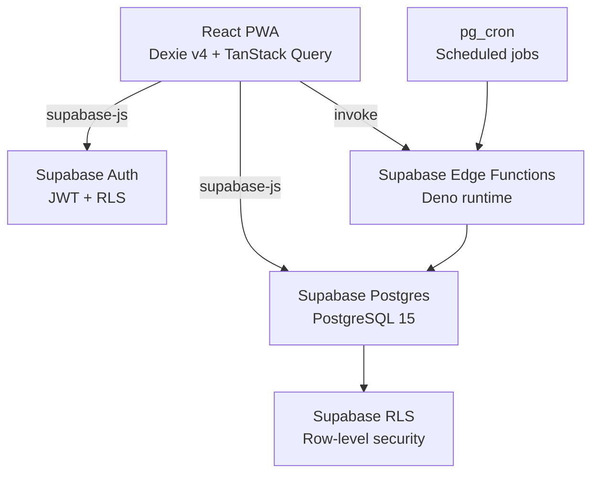
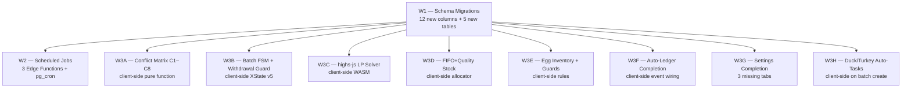

# Track B+C — Backend Business Logic & Schema Completion Plan

## 1. Problem & Context

LampFarms is a working offline-first PWA for West African smallholder poultry farmers. Tracks A, E, and D have cleaned up the frontend — data corrections, monolith decomposition, design pivot. What remains is the **business logic layer**: the rules, constraints, and automation that make the app safe and correct for farmers managing real birds.

The specs (`specs/00_CONVENTIONS.md` through `specs/15_PROTOCOL_OTHER_SPECIES.md`) define a comprehensive domain model. The planning documents in `specs/first/` and `specs/second/` provide implementation-ready detail. The current codebase implements none of the critical business rules — no conflict matrix, no batch FSM, no true LP solver, no FIFO stock allocation, no scheduled jobs, and no schema columns for the missing domain fields.

**The platform decision is Supabase-native.** The spec's Express/Drizzle/pg-boss topology was written for a Replit-hosted monorepo that doesn't exist here. The business logic the specs describe must be built; the Express server does not need to be. Every spec module maps to a Supabase-native equivalent.

**The ****`specs/first/`**** and ****`specs/second/`**** documents are the primary implementation reference** for this track. They contain exact endpoint signatures, exact Drizzle schemas (which map directly to Supabase SQL migrations), exact pg-boss job registrations (which map to Supabase Edge Functions + pg_cron), and exact conflict matrix logic. This plan adapts those documents to the Supabase-native deployment context.

## 2. Architecture Decision: Supabase-Native



| Spec canonical | Supabase-native equivalent |
| --- | --- |
| Express 5 routes | Supabase RLS + direct client queries |
| Drizzle ORM schema | Supabase SQL migrations |
| pg-boss scheduled jobs | Supabase Edge Functions + pg_cron |
| XState v5 batch FSM | Client-side XState v5 in `src/lib/batch-fsm.ts` |
| `highs-js` LP solver | Client-side WASM in `src/lib/feed-lp.ts` |
| Conflict matrix (C1–C8) | Client-side in `src/lib/medication-conflicts.ts` |
| Outbox relay | Existing `src/lib/sync.ts` `flushOutbox` |
| Idempotency table | `ON CONFLICT DO NOTHING` + client UUIDs |
| Cost privacy (server-side) | Supabase RLS column-level security |

## 3. Workstream Overview

Track B+C has three sequential workstreams. W1 must land first — W2 and W3 depend on the schema columns it adds.



W3A through W3H are fully independent of each other and can be implemented in parallel after W1.

## 4. Workstream 1 — Schema Migrations

### 4.1 Additive columns on existing tables

All migrations are **additive only** — no renames, no drops, no type changes. Every new column has a safe default so existing rows are not broken.

**`farms`**** table — 3 new columns:**

| Column | Type | Default | Purpose |
| --- | --- | --- | --- |
| `water_source_chlorinated` | `BOOLEAN` | `false` | Drives C8 conflict (live vaccine + chlorinated water) |
| `timezone` | `TEXT` | `'Africa/Accra'` | Per-farm timezone for scheduled jobs |
| `egg_low_inventory_crates` | `INTEGER` | `5` | Threshold for low-inventory alert |

**`batches`**** table — 4 new columns:**

| Column | Type | Default | Purpose |
| --- | --- | --- | --- |
| `duck_type` | `TEXT` | `null` | `'meat'` or `'layer'` — required when `species = 'duck'` |
| `cycle_length_weeks` | `INTEGER` | `null` | Turkey configurable cycle (12–20 weeks) |
| `has_active_withdrawal` | `BOOLEAN` | `false` | Cached withdrawal state — drives FSM guard |
| `fsm_state` | `TEXT` | `'created'` | XState machine state persisted to DB |

**`health_tasks`**** table — 5 new columns:**

| Column | Type | Default | Purpose |
| --- | --- | --- | --- |
| `delivery_method` | `TEXT` | `'drinking_water'` | `drinking_water \| injection_subcutaneous \| injection_wing_web \| in_feed \| topical` |
| `container_type_id` | `TEXT` | `null` | One of 9 canonical container IDs |
| `container_count` | `INTEGER` | `null` | Number of containers |
| `computed_dose_amount` | `NUMERIC` | `null` | `dose_per_gallon × (water_volume_l / 3.785)` |
| `computed_dose_unit` | `TEXT` | `null` | `tsp \| tbsp \| ml \| g` |

**`houses`**** table — 1 new column:**

| Column | Type | Default | Purpose |
| --- | --- | --- | --- |
| `occupied_by_batch_id` | `UUID` | `null` | FK to `batches.id` — set on batch create, cleared on terminate |

**`user_preferences`**** table — 1 new column:**

| Column | Type | Default | Purpose |
| --- | --- | --- | --- |
| `cost_privacy_pin` | `TEXT` | `null` | SHA-256 hash of 4-digit PIN |

### 4.2 New tables

**`medications`**** — canonical medication database (52+ rows seeded):**

The full medication seed is defined in `specs/03_WATER_HEALTH.md` §3.2. Key columns: `id` (text PK), `name`, `category`, `delivery_method`, `dose_per_gallon`, `dose_unit`, `dose_per_bird_ml`, `injection_site`, `withdrawal_meat_days`, `withdrawal_eggs_days`, `is_live_vaccine`, `is_sulfa`, `is_tetracycline`, `contains_calcium`, `is_activated_charcoal`.

RLS: read-only for all authenticated users (no farm_id filter — this is a reference table).

**`container_types`**** — 9 canonical container types (seeded):**

Defined in `specs/00_CONVENTIONS.md` §2.3. Columns: `id` (text PK), `name`, `volume_l`, `volume_gal`. Read-only reference table.

**`species_config`**** — 5 species protocol JSON blobs (seeded):**

Defined in `specs/11_PROTOCOL_BROILER.md` §10, `specs/12_PROTOCOL_LAYER.md`, `specs/13_PROTOCOL_DUCK.md` §11, `specs/14_PROTOCOL_TURKEY.md` §11, `specs/15_PROTOCOL_OTHER_SPECIES.md` §11. Columns: `id`, `species`, `variant` (for duck meat/layer), `config` (JSONB), `schema_version`. Read-only reference table.

**`config_overrides`**** — per-farm L3 runtime overrides:**

Columns: `id`, `farm_id`, `config_key`, `config_value` (JSONB), `updated_at`. Unique constraint on `(farm_id, config_key)`. RLS: farm-scoped.

**`idempotency_keys`**** — client-generated key deduplication:**

Columns: `key` (text PK), `farm_id`, `request_hash`, `response` (JSONB), `expires_at`. RLS: farm-scoped. Rows expire after 24 hours (pg_cron cleanup job).

### 4.3 Schema corrections

**`stock_transactions`**** column name bug:** The Supabase type in file:src/integrations/supabase/types.ts shows `stock_item_id` as the FK column name, but file:src/hooks/useStockData.ts inserts using `item_id`. The migration must add `item_id` as an alias or the hook must be corrected to use `stock_item_id`. The correct fix is to update the hook to use `stock_item_id` (the actual DB column name).

**`egg_sales`**** missing ****`batch_id`****:** The current `egg_sales` table has no `batch_id` column. The spec (`specs/05_EGG_PRODUCTION.md` §3) requires it for per-batch egg inventory and withdrawal guard. Add `batch_id UUID REFERENCES batches(id) ON DELETE SET NULL`.

### 4.4 RLS policies for new tables

All new farm-scoped tables follow the existing pattern: `SELECT/INSERT/UPDATE/DELETE` policies that check `EXISTS (SELECT 1 FROM farms WHERE farms.id = table.farm_id AND farms.user_id = auth.uid())`.

Reference tables (`medications`, `container_types`, `species_config`) use: `FOR SELECT USING (auth.uid() IS NOT NULL)` — any authenticated user can read.

## 5. Workstream 2 — Scheduled Jobs (Edge Functions + pg_cron)

Three background jobs replace the pg-boss workers described in the specs. The fourth job (`outboxRelay`) is already handled by `flushOutbox` in file:src/lib/sync.ts.

### 5.1 `generateDailyBatchTasks` — 06:00 farm timezone

**What it does:** For each active batch on a farm, reads the species protocol from `species_config` and materialises `health_tasks` rows for the current day per the schedule. Handles duck niacin auto-task (CONVENTIONS §2.9) and turkey Metronidazole biweekly (CONVENTIONS §2.10).

**pg_cron schedule:** `0 6 * * *` UTC. The function body filters by `farm.timezone` to determine which farms are at 06:00 local time. This is the workaround for pg_cron's UTC-only limitation.

**Implementation:** Supabase Edge Function `generate-daily-tasks`. Reads `species_config.config` JSONB, resolves today's schedule entries, inserts into `health_tasks` with `ON CONFLICT DO NOTHING` on `(batch_id, scheduled_date, medication_id)`.

**Duck niacin special case:** For any batch with `species = 'duck'`, the function checks if today is within Days 1–28 (daily niacin) or after Day 28 (weekly niacin on Mondays). Inserts a niacin task using the `niacin` medication row from the `medications` table.

**Turkey Metronidazole special case:** For any batch with `species = 'turkey'`, the function checks if today falls on a Metronidazole day (every 14 days from batch start). Inserts using the `metronidazole` medication row.

### 5.2 `advanceBatchWeeks` — Sunday 00:00 farm timezone

**What it does:** For each active batch, increments `current_week` using the optimistic UPDATE pattern from CONVENTIONS §2.14. Recomputes `phase` based on species thresholds. Emits phase change to `activity_log`.

**pg_cron schedule:** `0 0 * * 0` UTC. Same timezone filter as above.

**Optimistic lock:** `UPDATE batches SET current_week = current_week + 1 WHERE id = $id AND current_week = $expected RETURNING *`. Zero rows returned → skip (farmer already advanced manually).

**Phase recomputation:** Uses the `PHASE_BOUNDARIES` table from `specs/02_BATCH_MANAGEMENT.md` §4.1. For turkey, uses `cycle_length_weeks` from the batch row to scale thresholds.

### 5.3 `checkWithdrawalPeriods` — every 4 hours UTC

**What it does:** Finds batches where all active withdrawal periods have cleared. Sets `has_active_withdrawal = false`. Logs to `activity_log`.

**pg_cron schedule:** `0 */4 * * *` UTC.

**Query:** Finds batches where `has_active_withdrawal = true` AND no `health_tasks` row exists with `completed = true AND (scheduled_date + duration_days + withdrawal_meat_days) > CURRENT_DATE`.

## 6. Workstream 3 — Client-Side Business Logic

### 6A. Conflict Matrix C1–C8

**File:** `src/lib/medication-conflicts.ts` (new)

**What it is:** A pure function `detectConflicts(args)` that takes the new task, the medication record, the neighborhood of existing tasks (±72h window), and the farm's `water_source_chlorinated` flag. Returns an array of `ConflictHit[]`.

**The 8 rules** (from CONVENTIONS §2.2, confirmed in `specs/03_WATER_HEALTH.md` §6):

| Code | Trigger | Severity |
| --- | --- | --- |
| C1 | New task = coccidiostat AND any active/scheduled sulfa antibiotic in [today, +5d] | BLOCK |
| C2 | New task category = antibiotic AND any other antibiotic overlaps the window | BLOCK |
| C3 | New task = dewormer AND coccidiostat scheduled same day | WARN |
| C4 | Live vaccine + antibiotic within **72 hours** (symmetric) | BLOCK |
| C5 | Enrofloxacin + any other antibiotic overlap | BLOCK |
| C6 | Activated charcoal + any oral medication within ±4 hours | BLOCK |
| C7 | Calcium supplement + tetracycline within ±4 hours | BLOCK |
| C8 | Live vaccine on `farm.water_source_chlorinated = true` | BLOCK |

**Integration point:** Called in `useHealthData.ts` `addMedication` before the Supabase insert. Any BLOCK result prevents the insert and surfaces the conflict code to the UI. WARN results allow the insert but surface a warning banner.

**The neighborhood query:** Before calling `detectConflicts`, `addMedication` fetches all `health_tasks` for the batch within a ±72h window of the new task's `scheduled_date`. This is a single Supabase query: `health_tasks WHERE batch_id = $id AND scheduled_date BETWEEN $minus72h AND $plus72h`.

### 6B. Batch FSM + Withdrawal Guard

**File:** `src/lib/batch-fsm.ts` (new)

**What it is:** An XState v5 machine (client-side) that is the decision engine for batch phase transitions. The DB is the system of record; the FSM is the transition validator.

**The 8 states** (from `specs/02_BATCH_MANAGEMENT.md` §4.1): `created → brooding → starter → grower → finisher → withdrawal → ready_to_sell → terminated`.

**Phase boundaries** (from CONVENTIONS §2.4–2.8):

| Species | Brooding ends | Starter ends | Grower ends | Finisher ends |
| --- | --- | --- | --- | --- |
| broiler | wk 1 | wk 3 | wk 5 | wk 8 |
| layer | wk 4 | wk 8 | wk 18 | wk 78 |
| duck (meat) | wk 1 | wk 3 | wk 6 | wk 10 |
| duck (layer) | wk 4 | wk 8 | wk 19 | wk 78 |
| turkey | 12.5% of cycle | 25% | 50% | 95% |

**The withdrawal guard:** `TERMINATE_NORMAL` is blocked when `has_active_withdrawal = true`. This is enforced in `batch-utils.ts` `cleanupBatchCompletion` — before calling the Supabase update, check `batch.has_active_withdrawal`. If true, throw an error and surface `WITHDRAWAL_ACTIVE` to the UI.

**Integration point:** `batch-utils.ts` `getBatchAge` is replaced by a function that hydrates the FSM from the batch row and returns the canonical phase. The FSM's `always` transitions handle automatic phase advancement when `current_week` crosses a boundary.

**`fsm_state`**** persistence:** After any FSM transition, the new state is written to `batches.fsm_state`. This allows the FSM to be re-hydrated from the DB without recomputing from `current_week`.

### 6C. `highs-js` LP Solver

**File:** `src/lib/feed-lp.ts` (new)

**What it is:** A true linear program solver using `highs-js` (WASM port of HiGHS). Replaces the greedy heuristic in file:src/lib/feed-optimizer.ts.

**Package addition:** `highs-js` must be added to `package.json`. It is a WASM module that runs in the browser. For ≤41 variables (the realistic maximum for this app), it runs in under 500ms.

**The LP formulation** (from `specs/04_FEED_CALCULATOR.md` §7):

- **Decision variables:** `x_i` = kg of ingredient `i`
- **Objective:** minimize `sum(cost_i × x_i)` (pesewas)
- **Constraints:**
  - Mass balance: `sum(x_i) = target_kg`
  - Protein: `sum(protein_pct_i × x_i) ≥ protein_min × target_kg`
  - Energy min/max: two constraints
  - Calcium min/max: two constraints
  - Phosphorus min: one constraint
  - Lysine min: one constraint
  - Methionine min: one constraint
- **Bounds:** `0 ≤ x_i ≤ min(available_kg_i, max_share_i × target_kg)`
- **Forced:** `x_toxin_binder = 0.005 × target_kg` (fixed bounds)

**The CPLEX-LP text format** is built programmatically and passed to `highs.solve(lp, { time_limit: 5, output_flag: false })`.

**Fallback behaviour** (from `specs/04_FEED_CALCULATOR.md` §8): On `infeasible`, `timeout`, or WASM error → fall back to the existing greedy heuristic in `feed-optimizer.ts`, set `solver_status = 'fallback'`, surface a banner: "Could not auto-optimise — switched to Flexible Mix."

**Nutritional requirements:** The `nutritional_requirements` table (new, seeded) stores per-species, per-phase requirements. The LP reads from this table via a Supabase query before solving.

**Safety Preprocessor** (from `specs/04_FEED_CALCULATOR.md` §6):

1. R-FC-1: Toxin binder auto-added at 0.5% — compulsory, cannot be removed
2. R-FC-2: Cotton-seed cake blocked for layers (gossypol)
3. R-FC-3: Fish meal capped at 10% for broilers (LP upper bound)
4. R-FC-4: Only one calcium source — second selection replaces first
5. R-FC-5: Duck niacin **not** added here — it is a Water-Health auto-task

**Integration point:** `src/components/feed/CustomFormulation.tsx` calls `solveFeedLP` instead of `optimizeFormulation`. The result is displayed with a `solver_status` badge (`optimal`, `fallback`, `infeasible`).

### 6D. FIFO+Quality Stock Allocation

**File:** `src/hooks/useStockData.ts` — `recordTransaction` function

**What it is:** The stock allocation algorithm from CONVENTIONS §2.15. Currently `recordTransaction` does a simple `current_quantity + qty` or `- qty` on `stock_items`. This must be replaced with lot-level tracking.

**The algorithm** (from `specs/06_STOCK_MANAGEMENT.md` §5.3):

1. Exclude lots with `quality_grade = 'damaged'`
2. Exclude lots with `expiry_date ≤ today`
3. Sort: near-expiry (≤30d) bucket first, then `expiry_date ASC`, then `received_at ASC`
4. Allocate from each lot in order until `qty_needed` is satisfied
5. If insufficient stock → surface `STOCK_INSUFFICIENT` error

**Schema dependency:** This requires the `stock_lots` table (new, from W1). The current `stock_items` table tracks aggregate quantity; `stock_lots` tracks individual purchase lots with quality grades and expiry dates.

**Integration point:** `useStockData.ts` `recordTransaction` for `type = 'usage'` calls the FIFO allocator. `type = 'purchase'` creates a new lot row. The `stock_items.current_quantity` is kept in sync as a derived aggregate.

**Stock purchase auto-expense:** When `type = 'purchase'`, the current code creates an expense with `category: 'equipment'` — wrong. The correct mapping (from `specs/07_FINANCE.md` §6.2): `feed_ingredients/finished_feed → feed_and_nutrition`, `medications/vaccines → health_and_medicine`, `supplies → other_expenses`.

### 6E. Egg Inventory + Withdrawal Guard

**File:** `src/hooks/useEggData.ts` — `recordSale` and `recordCollection` functions

**Three rules to enforce** (from `specs/05_EGG_PRODUCTION.md`):

**R10 — Inventory non-negative:** Before `recordSale`, compute `goodEggsOnHand = SUM(good_count from egg_records) - SUM(quantity from egg_sales) - SUM(count from egg_discards)`. If `goodEggsOnHand < qty_to_sell` → surface `INSUFFICIENT_EGG_INVENTORY` error.

**R11 — Withdrawal guard:** Before `recordSale`, check `batch.has_active_withdrawal`. If true → surface `WITHDRAWAL_ACTIVE` error. Sale is blocked (not just warned).

**R5 — One record per day:** Before `recordCollection`, check if a record already exists for `(batch_id, date)`. If yes → surface `DUPLICATE_COLLECTION` error.

**Schema dependency:** `egg_sales.batch_id` column (from W1) is required for the inventory query.

**Layer/duck-layer eligibility:** `recordCollection` must check `batch.species === 'layer' OR (batch.species === 'duck' AND batch.duck_type === 'layer')`. Broiler/turkey/duck-meat → surface `EGG_TRACKING_NOT_APPLICABLE`.

**Week eligibility:** Layer batches require `current_week >= 19` (CONVENTIONS §2.1). Duck-layer requires `current_week >= 20` (CONVENTIONS §2.7).

### 6F. Auto-Ledger Completion

**File:** `src/hooks/useHealthData.ts` — `markTaskComplete`

**Current state:** `markTaskComplete` creates an expense with `amount: 0` — hardcoded zero. This is wrong.

**The fix:** When completing a health task, the expense amount should be the task's `cost_pesewas` field (if the farmer entered it) or zero if not entered. The `cost_pesewas` field must be added to the `health_tasks` table (W1 schema) and exposed in the Complete Task UI.

**Auto-ledger triggers** (from `specs/07_FINANCE.md` §6.2):

| Trigger | Action | Category |
| --- | --- | --- |
| Stock purchase | Create expense | `feed_and_nutrition` or `health_and_medicine` per item category |
| Health task complete | Create expense | `health_and_medicine` |
| Batch created | Create expense | `chicks_and_birds` (if chick cost entered) |
| Egg sale | Create revenue | `egg_sales` |

The batch-created chick expense requires a `chick_cost_pesewas` field on the batch creation wizard (Step 1 or Step 3). This is optional — if not entered, no auto-expense is created.

### 6G. Settings Completion

**File:** `src/pages/SettingsPage.tsx`

**Current state:** SettingsPage has 4 tabs (Profile, Farm, Preferences, Account). The spec requires 5 tabs (Profile, Farm, Preferences, Market Prices, Data).

**Missing tabs:**

**Market Prices tab** — L3 runtime config overrides. Reads from `config_overrides` table (W1). Farmer can set ingredient prices (e.g. `ingredient.maize.price_per_kg_ghs = 3.80`). Safety keys (prefixes: `medication.`, `withdrawal.`, `vaccination.`, `container_volume.`, `dose.`) are rejected with a UI error. The tab shows existing overrides as a list with delete buttons, and an "Add override" form with key + value inputs.

**Data tab** — Export and account deletion. Export: two buttons ("Export as JSON", "Export as CSV") that trigger parallel Supabase queries across all farm tables and download the result. Account deletion: text input requiring "DELETE MY ACCOUNT" confirmation phrase, then soft-delete (sets a `deleted_at` timestamp on the user record — requires a `deleted_at` column on `profiles` or `user_preferences`).

**Farm tab additions** (missing fields):

- `water_source_chlorinated` toggle (new column from W1)
- `egg_low_inventory_crates` number input (new column from W1)
- `timezone` select (new column from W1)

**Preferences tab additions:**

- PIN setup for cost privacy (4-digit PIN, stored as SHA-256 hash in `user_preferences.cost_privacy_pin` from W1)

### 6H. Duck/Turkey Auto-Tasks on Batch Create

**File:** `src/pages/BatchCreate.tsx`

**Current state:** `BatchCreate.tsx` generates vaccination schedules from `VACCINATION_TEMPLATES` on batch creation. It does not generate niacin tasks for duck batches or Metronidazole tasks for turkey batches.

**Duck niacin auto-tasks** (CONVENTIONS §2.9, `specs/03_WATER_HEALTH.md` §3.3):

- For `species = 'duck'`: insert daily niacin `health_tasks` for Days 1–28, then weekly from Day 29 until `cycle_length_weeks × 7`
- `delivery_method = 'drinking_water'`, `medication_id = 'niacin'` (from `medications` table)
- `dose_per_gallon = 1.5`, `dose_unit = 'tsp'`

**Turkey Metronidazole auto-tasks** (CONVENTIONS §2.10, `specs/03_WATER_HEALTH.md` §4):

- For `species = 'turkey'`: insert Metronidazole `health_tasks` every 14 days from Day 8 until `cycle_length_weeks × 7`
- `delivery_method = 'drinking_water'`, `medication_id = 'metronidazole'`
- `withdrawal_meat_days = 5`

**Schema dependency:** Both require the `medications` table (W1) to exist and be seeded before batch creation.

**Duck sub-type wizard step (Step 1b):** When `species = 'duck'` is selected in Step 1, a new Step 1b appears with two cards: "Meat Duck (8–10 weeks) — no eggs" and "Layer Duck (72+ weeks) — eggs from Week 20+". Sets `duck_type` on the batch payload. This is required by CONVENTIONS §2.6 and `specs/02_BATCH_MANAGEMENT.md` §12.

**Turkey cycle length slider:** When `species = 'turkey'` is selected, a slider (12–20 weeks, default 16) appears in Step 1. Sets `cycle_length_weeks` on the batch payload.

## 7. Wireframes

### 7.1 Conflict Matrix UI — Medication Tab

```wireframe

<html>
<head>
<style>
body { font-family: sans-serif; margin: 0; padding: 16px; background: #f9f9f9; }
.conflict-block { background: #fde8e8; border: 1px solid #dc3545; border-radius: 8px; padding: 12px; margin-bottom: 12px; }
.conflict-warn { background: #fff3cd; border: 1px solid #ffc107; border-radius: 8px; padding: 12px; margin-bottom: 12px; }
.conflict-title { font-weight: 700; font-size: 13px; margin-bottom: 4px; }
.conflict-msg { font-size: 12px; color: #555; }
.btn { padding: 8px 16px; border-radius: 20px; border: none; font-size: 13px; cursor: pointer; }
.btn-primary { background: #000; color: white; }
.btn-outline { background: white; border: 1px solid #e0e0e0; }
.dialog { background: white; border-radius: 12px; padding: 20px; max-width: 400px; box-shadow: 0 4px 24px rgba(0,0,0,0.12); }
.field { margin-bottom: 12px; }
.label { font-size: 12px; font-weight: 600; margin-bottom: 4px; display: block; }
.select { width: 100%; padding: 8px; border: 1px solid #e0e0e0; border-radius: 6px; font-size: 13px; }
.footer { display: flex; gap: 8px; justify-content: flex-end; margin-top: 16px; }
</style>
</head>
<body>
<div class="dialog">
  <h3 style="margin:0 0 16px;font-size:16px;">Add Medication</h3>

  <div class="field">
    <label class="label">Medication</label>
    <select class="select">
      <option>Oxytetracycline (Terramycin)</option>
    </select>
  </div>

  <div class="field">
    <label class="label">Scheduled date</label>
    <select class="select"><option>May 15, 2026</option></select>
  </div>

  <div class="conflict-block">
    <div class="conflict-title">⛔ C4 BLOCKED — Cannot add</div>
    <div class="conflict-msg">Gumboro vaccine was administered on May 13. No antibiotics within 72 hours of a live vaccine (clears May 16).</div>
  </div>

  <div class="conflict-warn">
    <div class="conflict-title">⚠ C3 WARNING — Allowed with caution</div>
    <div class="conflict-msg">Amprolium (coccidiostat) is scheduled for the same day. Reduced efficacy of both medications.</div>
  </div>

  <div class="footer">
    <button class="btn btn-outline">Cancel</button>
    <button class="btn btn-primary" disabled style="opacity:0.4;">Add Medication</button>
  </div>
</div>
</body>
</html>
```

### 7.2 Batch Create — Duck Sub-type Step 1b

```wireframe

<html>
<head>
<style>
body { font-family: sans-serif; margin: 0; padding: 16px; background: #f9f9f9; }
.card { background: white; border-radius: 12px; padding: 20px; max-width: 480px; box-shadow: 0 2px 12px rgba(0,0,0,0.08); }
.step-label { font-size: 12px; color: #888; margin-bottom: 4px; }
h3 { margin: 0 0 4px; font-size: 18px; }
.subtitle { font-size: 13px; color: #666; margin-bottom: 20px; }
.options { display: grid; grid-template-columns: 1fr 1fr; gap: 12px; }
.option { border: 2px solid #e0e0e0; border-radius: 10px; padding: 16px; cursor: pointer; text-align: center; }
.option.selected { border-color: #000; background: #f5f5f5; }
.option-icon { font-size: 28px; margin-bottom: 8px; }
.option-title { font-weight: 700; font-size: 14px; margin-bottom: 4px; }
.option-sub { font-size: 11px; color: #888; }
.footer { display: flex; justify-content: space-between; margin-top: 20px; }
.btn { padding: 8px 20px; border-radius: 20px; border: 1px solid #e0e0e0; font-size: 13px; cursor: pointer; background: white; }
.btn-primary { background: #000; color: white; border-color: #000; }
.progress { height: 4px; background: #e0e0e0; border-radius: 2px; margin-bottom: 20px; }
.progress-fill { height: 100%; background: #000; border-radius: 2px; width: 33%; }
</style>
</head>
<body>
<div class="card">
  <div class="progress"><div class="progress-fill"></div></div>
  <div class="step-label">Step 1b of 3</div>
  <h3>Duck Sub-type</h3>
  <p class="subtitle">Choose the production purpose for this duck batch</p>

  <div class="options">
    <div class="option selected">
      <div class="option-icon">🦆</div>
      <div class="option-title">Meat Duck</div>
      <div class="option-sub">8–10 weeks · No eggs</div>
    </div>
    <div class="option">
      <div class="option-icon">🥚</div>
      <div class="option-title">Layer Duck</div>
      <div class="option-sub">72+ weeks · Eggs from Week 20</div>
    </div>
  </div>

  <div class="footer">
    <button class="btn">← Back</button>
    <button class="btn btn-primary">Next →</button>
  </div>
</div>
</body>
</html>
```

### 7.3 Settings — Market Prices Tab

```wireframe

<html>
<head>
<style>
body { font-family: sans-serif; margin: 0; padding: 16px; background: #f9f9f9; }
.card { background: white; border-radius: 12px; padding: 20px; max-width: 560px; }
h3 { margin: 0 0 4px; font-size: 16px; }
.desc { font-size: 12px; color: #888; margin-bottom: 16px; }
.override-row { display: flex; align-items: center; justify-content: space-between; padding: 10px 0; border-bottom: 1px solid #f0f0f0; font-size: 13px; }
.key { font-family: monospace; font-size: 12px; color: #555; }
.value { font-weight: 600; }
.del { color: #dc3545; cursor: pointer; font-size: 12px; border: none; background: none; }
.add-form { margin-top: 16px; display: grid; grid-template-columns: 1fr 120px auto; gap: 8px; align-items: end; }
.field label { font-size: 11px; font-weight: 600; display: block; margin-bottom: 4px; }
.field input { width: 100%; padding: 7px; border: 1px solid #e0e0e0; border-radius: 6px; font-size: 12px; box-sizing: border-box; }
.btn { padding: 8px 14px; border-radius: 6px; border: none; background: #000; color: white; font-size: 12px; cursor: pointer; white-space: nowrap; }
.safety-note { background: #fff3cd; border-radius: 6px; padding: 8px 12px; font-size: 11px; color: #856404; margin-top: 12px; }
</style>
</head>
<body>
<div class="card">
  <h3>Market Price Overrides</h3>
  <p class="desc">Override ingredient and feed prices for your farm. Safety keys (medication doses, withdrawal periods) cannot be overridden.</p>

  <div class="override-row">
    <span class="key">ingredient.maize.price_per_kg_ghs</span>
    <span class="value">3.80</span>
    <button class="del">Remove</button>
  </div>
  <div class="override-row">
    <span class="key">ingredient.soybean_meal.price_per_kg_ghs</span>
    <span class="value">6.50</span>
    <button class="del">Remove</button>
  </div>
  <div class="override-row">
    <span class="key">ingredient.fish_meal.price_per_kg_ghs</span>
    <span class="value">8.20</span>
    <button class="del">Remove</button>
  </div>

  <div class="add-form">
    <div class="field">
      <label>Config key</label>
      <input placeholder="e.g. ingredient.maize.price_per_kg_ghs" />
    </div>
    <div class="field">
      <label>Value</label>
      <input placeholder="e.g. 3.80" />
    </div>
    <button class="btn">Add</button>
  </div>

  <div class="safety-note">⚠ Safety keys (medication.*, withdrawal.*, vaccination.*, container_volume.*, dose.*) are protected and cannot be overridden.</div>
</div>
</body>
</html>
```

### 7.4 Feed Formulation — LP Result with Solver Status

```wireframe

<html>
<head>
<style>
body { font-family: sans-serif; margin: 0; padding: 16px; background: #f9f9f9; }
.card { background: white; border-radius: 12px; padding: 20px; max-width: 520px; }
.header { display: flex; justify-content: space-between; align-items: center; margin-bottom: 16px; }
h3 { margin: 0; font-size: 16px; }
.badge { font-size: 11px; padding: 3px 10px; border-radius: 10px; background: #e8f5e9; color: #2e7d32; font-weight: 600; }
.badge.fallback { background: #fff3cd; color: #856404; }
.row { display: flex; justify-content: space-between; padding: 8px 0; border-bottom: 1px solid #f5f5f5; font-size: 13px; }
.row:last-child { border-bottom: none; }
.ing-name { color: #333; }
.ing-kg { font-weight: 600; }
.ing-pct { color: #888; font-size: 11px; }
.nutrition { display: grid; grid-template-columns: repeat(3, 1fr); gap: 8px; margin-top: 16px; }
.nut-box { background: #f5f5f5; border-radius: 8px; padding: 10px; text-align: center; }
.nut-val { font-weight: 700; font-size: 16px; }
.nut-label { font-size: 10px; color: #888; margin-top: 2px; }
.nut-box.ok .nut-val { color: #2e7d32; }
.nut-box.warn .nut-val { color: #856404; }
.cost-row { display: flex; justify-content: space-between; margin-top: 16px; font-weight: 700; font-size: 14px; }
.btn { width: 100%; margin-top: 12px; padding: 10px; border-radius: 20px; border: none; background: #000; color: white; font-size: 14px; cursor: pointer; }
</style>
</head>
<body>
<div class="card">
  <div class="header">
    <h3>Formulation Result — 500 kg</h3>
    <span class="badge">✓ Optimal</span>
  </div>

  <div class="row"><span class="ing-name">Maize (Yellow Corn)</span><span><span class="ing-kg">285 kg</span> <span class="ing-pct">57%</span></span></div>
  <div class="row"><span class="ing-name">Soybean Meal</span><span><span class="ing-kg">155 kg</span> <span class="ing-pct">31%</span></span></div>
  <div class="row"><span class="ing-name">Fish Meal</span><span><span class="ing-kg">30 kg</span> <span class="ing-pct">6%</span></span></div>
  <div class="row"><span class="ing-name">Oyster Shell</span><span><span class="ing-kg">25 kg</span> <span class="ing-pct">5%</span></span></div>
  <div class="row"><span class="ing-name">Toxin Binder ✦ auto</span><span><span class="ing-kg">2.5 kg</span> <span class="ing-pct">0.5%</span></span></div>
  <div class="row"><span class="ing-name">Premix ✦ auto</span><span><span class="ing-kg">2.5 kg</span> <span class="ing-pct">0.5%</span></span></div>

  <div class="nutrition">
    <div class="nut-box ok"><div class="nut-val">22.1%</div><div class="nut-label">Protein ✓</div></div>
    <div class="nut-box ok"><div class="nut-val">3,050</div><div class="nut-label">Energy kcal/kg ✓</div></div>
    <div class="nut-box ok"><div class="nut-val">1.02%</div><div class="nut-label">Calcium ✓</div></div>
  </div>

  <div class="cost-row"><span>Total cost</span><span>GHS 1,842.50</span></div>
  <div style="font-size:11px;color:#888;text-align:right;margin-top:2px;">GHS 3.69 / kg</div>

  <button class="btn">Confirm Formulation</button>
</div>
</body>
</html>
```

## 8. Business Rules & Invariants

All rules from the specs apply. The critical ones for Track B+C:

| Code | Rule | Source |
| --- | --- | --- |
| R-WH-4 | Conflict matrix C1–C8 evaluated on every task create; any BLOCK rejects | CONVENTIONS §2.2 |
| R-WH-5 | Vaccine + antibiotic guard window is **72 h** (C4), not 48 h | CONVENTIONS §2.2 |
| R-WH-6 | Duck batches receive auto-niacin tasks: daily Days 1–28, then weekly | CONVENTIONS §2.9 |
| R-WH-7 | Turkey batches receive auto-Metronidazole every 2 weeks | CONVENTIONS §2.10 |
| R-WH-8 | Completing a task with `withdrawal_meat_days > 0` sets `has_active_withdrawal = true` | `specs/03_WATER_HEALTH.md` §8 |
| R-BM-8 | `TERMINATE_NORMAL` blocked when `has_active_withdrawal = true` | `specs/02_BATCH_MANAGEMENT.md` §8 |
| R-FC-5 | Duck niacin is **not** added by the Feed Safety Preprocessor | CONVENTIONS §2.9 |
| R-FC-6 | Automatic mode uses `highs-js` LP with 5 s timeout | `specs/04_FEED_CALCULATOR.md` §11 |
| R-FC-7 | On solver failure → HTTP 200 with fallback Flexible Mix | `specs/04_FEED_CALCULATOR.md` §11 |
| R-S-1 | Currency must be GHS or NGN only | `specs/10_SETTINGS.md` §6 |
| R-S-5 | Safety keys cannot be overridden via market prices | `specs/10_SETTINGS.md` §6 |
| R-S-6 | House delete blocked when `occupied_by_batch_id` references active batch | `specs/10_SETTINGS.md` §6 |

## 9. Implementation Sequence

| Priority | Workstream | Blocker for |
| --- | --- | --- |
| **P0** | W1 — Schema migrations | Everything else |
| **P1** | W3A — Conflict matrix | Safety-critical |
| **P1** | W3B — Batch FSM + withdrawal guard | Safety-critical |
| **P1** | W3H — Duck/turkey auto-tasks | Correctness on batch create |
| **P2** | W3C — `highs-js` LP solver | Feed correctness |
| **P2** | W3D — FIFO+quality stock | Stock correctness |
| **P2** | W3E — Egg inventory + guards | Egg correctness |
| **P3** | W2 — Scheduled jobs | Automation |
| **P3** | W3F — Auto-ledger completion | Finance completeness |
| **P4** | W3G — Settings completion | Settings completeness |

## 10. What This Plan Does NOT Build

- No Express server
- No Drizzle ORM
- No pg-boss
- No `artifacts/api-server/` directory
- No OpenAPI spec
- No pino logging
- No rate limiting middleware (Supabase has built-in)
- No server-side cost privacy masking (Supabase RLS column-level security is the equivalent)
- No PDF/CSV export (Records module — deferred to a future track)
- No batch comparison analytics (Records module — deferred)

The `specs/first/` and `specs/second/` documents remain as reference artifacts. Their business logic is implemented here; their Express/Drizzle/pg-boss topology is not applicable to this deployment.