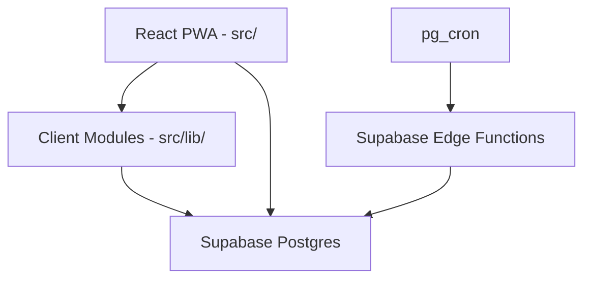
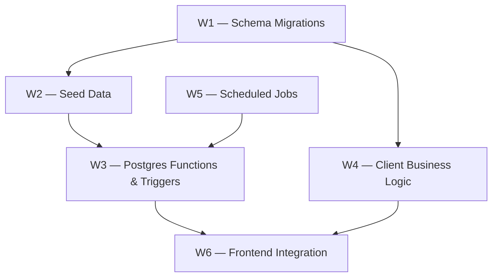
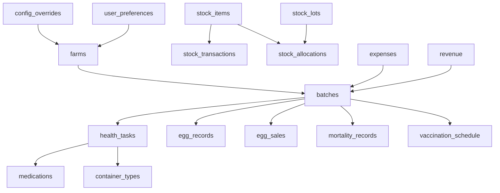

# Track B+C — Definitive Backend & Business Logic Plan (Supabase-Native)

## Problem & Context

LampFarms is an offline-first poultry farm management PWA for West African smallholder farmers. The frontend (React 18 + Vite + Dexie + Supabase JS client) is clean and decomposed after Tracks A, E, and D. The backend is a **greenfield build** — the entire business logic described across 9 spec modules does not exist in the codebase.

The specs (`specs/first/` and `specs/second/`) were written for a Replit-hosted Express 5 monorepo that does not exist here. The **domain model, business rules, conflict matrix, FSM, dosing formula, FIFO algorithm, and LP solver** in those documents are the authoritative source of truth. The **deployment topology** (Express, Drizzle, pg-boss) is not applicable to this Supabase-native project.

**Platform decision (final):** Supabase-native. No Express server. No Drizzle. No pg-boss. The 9 backend modules are implemented as:

- Supabase SQL migrations (schema)
- Supabase seed data (medications, containers, nutritional requirements, species config)
- Client-side TypeScript modules (conflict matrix, batch FSM, LP solver, FIFO allocator, dosing, auto-tasks)
- Supabase Edge Functions + pg_cron (scheduled jobs)
- Supabase Postgres functions (server-side aggregation, delta sync)

**ACID approach:** Every multi-step write uses Supabase's `rpc()` to call a Postgres function that wraps the writes in a single transaction. Client-side optimistic updates are applied immediately and rolled back on error. Idempotency is enforced via `ON CONFLICT DO NOTHING` on `(source_event, source_ref_id)` pairs.

**Constraints:**

- No monolithic files — each new module is a focused TypeScript file under 200 lines
- No spaghetti — no cross-cutting state mutations, no logic embedded in render
- No Express, no Drizzle, no pg-boss, no XState (FSM runs client-side)
- `highs-js` runs client-side (WASM) — adequate for ≤ 41-variable LP problems at this scale
- All money in integer pesewas (CONVENTIONS §4.2) — **this requires a migration to convert existing float columns**
- All farm-scoped queries include `farm_id` (CONVENTIONS §4.9)

## Architecture



| Spec component | Supabase-native equivalent | Location |
| --- | --- | --- |
| Express routes | Supabase RLS + direct client calls | `src/hooks/` |
| Drizzle schema | Supabase SQL migrations | `supabase/migrations/` |
| pg-boss jobs | Edge Functions + pg_cron | `supabase/functions/` |
| XState FSM | Client-side `src/lib/batch-fsm.ts` | `src/lib/` |
| highs-js LP | Client-side `src/lib/feed-lp.ts` | `src/lib/` |
| Conflict matrix | Client-side `src/lib/medication-conflicts.ts` | `src/lib/` |
| FIFO allocator | Postgres function `allocate_fifo_by_quality` | Migration |
| Delta sync | Postgres function `get_sync_delta` | Migration |
| Cost privacy | Postgres function `get_finance_summary` with masking | Migration |
| Auto-ledger | Postgres triggers on `health_tasks`, `egg_sales` | Migration |

## Workstream Overview



W1 must land first — everything depends on the schema. W2 and W4 can run in parallel after W1. W3 depends on W2 (seed data must exist before triggers reference it). W5 and W6 are the last layer.

## W1 — Schema Migrations

### W1.1 — `batches` table: add missing columns

The current `batches` table (confirmed from file:src/integrations/supabase/types.ts) is missing:

| Column | Type | Default | Purpose |
| --- | --- | --- | --- |
| `duck_type` | `text CHECK (duck_type IN ('meat','layer'))` | `NULL` | Required when `species = 'duck'` |
| `cycle_length_weeks` | `integer` | species-dependent | Turkey configurable 12–20 |
| `has_active_withdrawal` | `boolean` | `false` | Cached withdrawal state; drives FSM guard |
| `breed` | `text` | `NULL` | Optional breed name |
| `termination_reason` | `text CHECK (termination_reason IN ('normal','emergency'))` | `NULL` | Set on termination |
| `terminated_at` | `timestamptz` | `NULL` | Set on termination |

**CHECK constraint to add:** `species = 'duck' AND duck_type IS NOT NULL OR species != 'duck'` — enforces R-BM-2.

**Partial unique index to add:** `CREATE UNIQUE INDEX batches_house_active_uniq ON batches(house_id) WHERE status != 'terminated'` — enforces R-BM-1 (one active batch per house).

### W1.2 — `farms` table: add missing columns

| Column | Type | Default | Purpose |
| --- | --- | --- | --- |
| `water_source_chlorinated` | `boolean` | `false` | Drives C8 conflict check |
| `timezone` | `text` | `'Africa/Accra'` | Per-farm timezone for job scheduling |
| `egg_low_inventory_crates` | `integer` | `5` | Threshold for EGG_INVENTORY_LOW alert |

### W1.3 — `houses` table: add missing column

| Column | Type | Default | Purpose |
| --- | --- | --- | --- |
| `occupied_by_batch_id` | `text REFERENCES batches(id)` | `NULL` | Set on batch creation, cleared on termination |

### W1.4 — `health_tasks` table: add missing columns

The current `health_tasks` table has `product_name` (free text) and `dose_per_gallon` (nullable float). The spec requires a proper medication FK and container-based dosing. The migration adds:

| Column | Type | Default | Purpose |
| --- | --- | --- | --- |
| `medication_id` | `text REFERENCES medications(id)` | `NULL` | FK to seeded medications table |
| `delivery_method` | `text` | `'drinking_water'` | CONVENTIONS §2.12 |
| `container_type_id` | `text REFERENCES container_types(id)` | `NULL` | One of 9 canonical containers |
| `container_count` | `integer` | `NULL` | Number of containers |
| `water_volume_l` | `real` | `NULL` | Computed: `container.volume_l × container_count` |
| `computed_dose_amount` | `real` | `NULL` | CONVENTIONS §2.13 |
| `computed_dose_unit` | `text` | `NULL` | `tsp`, `tbsp`, `ml`, `g` |
| `bird_count` | `integer` | `NULL` | For injection tasks |
| `withdrawal_meat_until` | `date` | `NULL` | Absolute date (not days) |
| `withdrawal_eggs_until` | `date` | `NULL` | Absolute date |
| `cost_pesewas` | `integer` | `NULL` | Integer pesewas (CONVENTIONS §4.2) |
| `blocked_reason` | `text` | `NULL` | Conflict code (C1..C8) when blocked |

**Index to add:** `CREATE INDEX health_tasks_withdrawal_meat_idx ON health_tasks(withdrawal_meat_until) WHERE withdrawal_meat_until IS NOT NULL` — used by withdrawal sweep job.

### W1.5 — New tables: `medications` and `container_types`

These are reference/seed tables. The schema matches `specs/03_WATER_HEALTH.md` §3 exactly:

**`medications`** — 52 rows seeded in W2. Key columns: `id` (text PK), `name`, `category`, `delivery_method`, `dose_per_gallon`, `dose_unit`, `dose_per_bird_ml`, `injection_site`, `withdrawal_meat_days`, `withdrawal_eggs_days`, `is_live_vaccine`, `is_sulfa`, `is_tetracycline`, `contains_calcium`, `is_activated_charcoal`.

**`container_types`** — 9 rows seeded in W2. Columns: `id` (text PK), `name`, `volume_l`, `volume_gal`. Exactly the 9 canonical types from CONVENTIONS §2.3.

### W1.6 — New tables: `ingredients` and `nutritional_requirements`

**`ingredients`** — reference table for the LP solver. Key columns: `id`, `name`, `category`, `protein_pct`, `energy_kcal_per_kg`, `calcium_pct`, `phosphorus_pct`, `lysine_pct`, `methionine_pct`, `contains_aflatoxin_risk`, `contains_gossypol`, `is_fish_meal`, `is_toxin_binder`. Seeded in W2.

**`nutritional_requirements`** — per-species/phase nutritional targets. Columns: `id`, `species`, `duck_type`, `phase`, `protein_min_pct`, `energy_min_kcal_per_kg`, `energy_max_kcal_per_kg`, `calcium_min_pct`, `calcium_max_pct`, `phosphorus_min_pct`, `lysine_min_pct`, `methionine_min_pct`. Seeded in W2.

### W1.7 — New tables: `config_overrides` and `species_config`

**`config_overrides`** — L3 runtime overrides (Settings → Market Prices tab). Columns: `id`, `farm_id`, `config_key`, `config_value` (jsonb), `updated_at`. Unique constraint on `(farm_id, config_key)`.

**`species_config`** — seeded species lifecycle parameters. Columns: `species`, `duck_type`, `cycle_length_weeks_default`, `cycle_length_weeks_min`, `cycle_length_weeks_max`, `egg_production_start_week`, `phase_boundaries` (jsonb).

### W1.8 — New table: `idempotency_keys`

Columns: `key` (text PK), `farm_id`, `request_hash`, `response` (jsonb), `expires_at` (timestamptz). Used by all write operations that must be idempotent (offline sync replay). A daily pg_cron job prunes expired rows.

### W1.9 — `egg_sales` table: add `batch_id` column

The current `egg_sales` table has no `batch_id` FK (confirmed from `types.ts`). The spec requires it for per-batch P&L and inventory tracking. Migration adds `batch_id text REFERENCES batches(id)`.

### W1.10 — `stock_transactions` table: fix column name bug

**Critical live bug:** file:src/hooks/useStockData.ts inserts using `item_id` but the Supabase schema has `stock_item_id`. The migration does not need to rename the column (it already exists as `stock_item_id`) — the fix is in the frontend code (W6). But the migration must verify the FK constraint is correct.

### W1.11 — `user_preferences` table: add missing columns

| Column | Type | Default | Purpose |
| --- | --- | --- | --- |
| `cost_privacy_pin` | `text` | `NULL` | SHA-256 hash of 4-digit PIN |
| `timezone` | `text` | `NULL` | User-level timezone override |

### W1.12 — Money column migration (pesewas)

**Critical correctness issue:** All money columns currently store floats (`NUMERIC`). CONVENTIONS §4.2 requires integer pesewas. The migration converts:

- `expenses.amount` → `expenses.amount_pesewas INTEGER` (multiply existing values × 100, round)
- `revenue.amount` → `revenue.amount_pesewas INTEGER`
- `stock_items.unit_price` → `stock_items.unit_price_pesewas INTEGER`
- `stock_transactions.unit_price` → `stock_transactions.unit_price_pesewas INTEGER`
- `stock_transactions.total_amount` → `stock_transactions.total_cost_pesewas INTEGER`
- `egg_sales.unit_price` → `egg_sales.unit_price_pesewas INTEGER`
- `egg_sales.total_amount` → `egg_sales.total_revenue_pesewas INTEGER`

**Migration strategy:** Add new `_pesewas` columns, populate from existing float columns × 100, drop old columns. This is a breaking change — all frontend hooks must be updated in W6.

### W1.13 — RLS policies for new tables

All new tables get RLS policies: `farm_id = auth.uid()` for farm-scoped tables; `user_id = auth.uid()` for user-scoped tables. Reference tables (`medications`, `container_types`, `ingredients`, `nutritional_requirements`, `species_config`) are read-only for all authenticated users.

## W2 — Seed Data

### W2.1 — Medications seed (52 entries)

Full medication database per `specs/03_WATER_HEALTH.md` §3.2. Key entries confirmed:

| id | name | category | delivery | dose/gal | unit | wd_meat | wd_eggs | is_live_vaccine | is_sulfa | is_tetracycline | contains_calcium | is_activated_charcoal |
| --- | --- | --- | --- | --- | --- | --- | --- | --- | --- | --- | --- | --- |
| `amprolium` | Amprolium (CORID) | coccidiostat | drinking_water | 1.5 | tsp | 1 | 0 | false | false | false | false | false |
| `oxytetracycline` | Oxytetracycline | antibiotic | drinking_water | 1.5 | tsp | 7 | 7 | false | false | **true** | false | false |
| `tylosin` | Tylosin (Tylan) | antibiotic | drinking_water | 1 | tsp | 5 | 5 | false | false | false | false | false |
| `enrofloxacin` | Enrofloxacin (Baytril) | antibiotic | drinking_water | 1 | tsp | 14 | 14 | false | false | false | false | false |
| `sulfadimethoxine` | Sulfadimethoxine | antibiotic | drinking_water | 1 | tsp | 5 | 5 | false | **true** | false | false | false |
| `fenbendazole` | Fenbendazole | dewormer | drinking_water | 1 | tsp | 0 | 0 | false | false | false | false | false |
| `niacin` | Niacin (Duck) | supplement | drinking_water | 1.5 | tsp | 0 | 0 | false | false | false | false | false |
| `metronidazole` | Metronidazole | antiprotozoal | drinking_water | 1 | tsp | 5 | — | false | false | false | false | false |
| `activated_charcoal` | Activated Charcoal | supplement | drinking_water | 2 | tbsp | 0 | 0 | false | false | false | false | **true** |
| `calcium_carbonate` | Calcium Carbonate | supplement | drinking_water | 1 | tsp | 0 | 0 | false | false | false | **true** | false |
| `gumboro_intermediate` | Gumboro Intermediate | vaccine | drinking_water | 0 | ml | 0 | 0 | **true** | false | false | false | false |
| `duck_viral_hepatitis` | Duck Viral Hepatitis | vaccine | injection_subcutaneous | 0 | ml | 0 | 0 | **true** | false | false | false | false |
| `fowl_pox` | Fowl Pox | vaccine | injection_wing_web | 0 | ml | 0 | 0 | **true** | false | false | false | false |

The boolean flags (`is_live_vaccine`, `is_sulfa`, `is_tetracycline`, `contains_calcium`, `is_activated_charcoal`) are the exact inputs to the conflict matrix (W4.1).

### W2.2 — Container types seed (9 entries)

Exactly the 9 canonical types from CONVENTIONS §2.3. No 10th entry.

### W2.3 — Ingredients seed (~25 entries)

All ingredients from file:src/lib/feed-data.ts plus their nutritional profiles (protein_pct, energy_kcal_per_kg, calcium_pct, phosphorus_pct, lysine_pct, methionine_pct) and safety flags. The nutritional values are the analytic constants used by the LP solver.

### W2.4 — Nutritional requirements seed

Per-species/phase targets per `specs/04_FEED_CALCULATOR.md` §2. Example:

| species | duck_type | phase | protein_min | energy_min | energy_max | calcium_min | calcium_max | phosphorus_min | lysine_min | methionine_min |
| --- | --- | --- | --- | --- | --- | --- | --- | --- | --- | --- |
| broiler | null | starter | 22% | 3000 | 3200 | 0.9% | 1.2% | 0.45% | 1.1% | 0.5% |
| broiler | null | grower | 19% | 3100 | 3300 | 0.8% | 1.1% | 0.40% | 0.95% | 0.43% |
| broiler | null | finisher | 17% | 3150 | 3350 | 0.75% | 1.0% | 0.38% | 0.85% | 0.38% |
| layer | null | layer_production | 16% | 2700 | 2900 | 3.5% | 4.5% | 0.35% | 0.73% | 0.32% |
| duck | meat | starter | 20% | 2900 | 3100 | 0.8% | 1.1% | 0.40% | 0.90% | 0.40% |
| duck | layer | layer_production | 17% | 2700 | 2900 | 3.0% | 4.0% | 0.35% | 0.70% | 0.30% |
| turkey | null | starter | 28% | 2800 | 3000 | 1.2% | 1.5% | 0.55% | 1.5% | 0.55% |

### W2.5 — Species config seed

Per-species lifecycle parameters including phase boundaries, cycle length defaults/ranges, and egg production start weeks. Matches `specs/02_BATCH_MANAGEMENT.md` §2.3 exactly.

## W3 — Postgres Functions & Triggers

### W3.1 — `allocate_fifo_by_quality` Postgres function

A `SECURITY DEFINER` Postgres function implementing the FIFO+quality allocation algorithm from CONVENTIONS §2.15. Called by the frontend via `supabase.rpc('allocate_fifo_by_quality', {...})`.

**Algorithm (exact):**

1. Query `stock_lots` with `FOR UPDATE` row lock (prevents concurrent overdraw)
2. Filter: `farm_id = $farm_id AND item_id = $item_id AND quality_grade != 'damaged' AND qty_on_hand > 0 AND (expiry_date IS NULL OR expiry_date > CURRENT_DATE)`
3. Sort: `expiry_bucket ASC, expiry_date ASC NULLS LAST, received_at ASC` where `expiry_bucket = CASE WHEN expiry_date <= CURRENT_DATE + 30 THEN 0 ELSE 1 END`
4. Iterate lots, decrement `qty_on_hand`, insert `stock_allocations` rows
5. If `remaining > 0` after all lots exhausted → raise exception `STOCK_INSUFFICIENT`
6. All writes in a single transaction — atomic, no partial allocation

**ACID guarantee:** The `FOR UPDATE` lock + single transaction ensures no two concurrent calls can overdraw the same lot.

### W3.2 — `get_batch_record_summary` Postgres function

Implements the CTE aggregate query from `specs/08_RECORDS.md` §5.3. Replaces the 6 parallel Supabase queries in file:src/hooks/useRecordsPerformance.ts with a single function call. Returns `BatchRecordSummary[]`.

**Privacy masking:** Accepts a `masked boolean` parameter. When `true`, returns `NULL` for all financial fields (`total_expenses_pesewas`, `total_revenue_pesewas`, `net_profit_pesewas`, `roi_pct`).

### W3.3 — `get_sync_delta` Postgres function

Implements the delta sync endpoint from CONVENTIONS §4.6. Accepts `(entity text, farm_id text, since_cursor timestamptz)` and returns rows where `updated_at > since_cursor AND farm_id = $farm_id`. The frontend writes `last_synced_at` to `sync_meta` after each successful call.

### W3.4 — Auto-ledger triggers

Postgres triggers that fire `AFTER INSERT` on key tables to create ledger entries automatically:

| Trigger | Table | Action |
| --- | --- | --- |
| `trg_egg_sale_revenue` | `egg_sales` | Insert into `revenue` with `category = 'egg_sales'`, `source = 'auto:eggs'`, `source_ref = NEW.id`. Uses `ON CONFLICT (source_event, source_ref_id) DO NOTHING` for idempotency. |
| `trg_stock_purchase_expense` | `stock_transactions` | When `transaction_type = 'purchase'`, insert into `expenses` with category derived from `stock_items.category`. |
| `trg_health_task_expense` | `health_tasks` | When `completed = true` and `cost_pesewas IS NOT NULL`, insert into `expenses` with `category = 'health_and_medicine'`. |

**ACID guarantee:** Triggers run in the same transaction as the originating insert. If the trigger fails, the originating insert rolls back.

### W3.5 — `check_withdrawal_periods` Postgres function

Called by the withdrawal sweep Edge Function (W5.2). Finds batches where `MAX(withdrawal_meat_until) < CURRENT_DATE AND has_active_withdrawal = true`, sets `has_active_withdrawal = false`. Returns the list of cleared batch IDs so the frontend can update its local Dexie cache.

### W3.6 — `get_dashboard_overview` Postgres function

Aggregates the `DashboardOverview` DTO from `specs/09_MAIN_DASHBOARD.md` §6.6 in a single function call. Replaces the multiple parallel queries currently in file:src/pages/Dashboard.tsx. Returns the full DTO including `quick_stats`, `active_batches[]`, and `recent_activity[]`.

## W4 — Client Business Logic

### W4.1 — `src/lib/medication-conflicts.ts` — Conflict Matrix (C1–C8)

A pure function module with zero side effects. The single exported function `detectConflicts` is called by `useHealthData.ts` `addMedication` before any Supabase insert.

**Input:** `{ newTask, newMed, neighborhood, waterSource }` where `neighborhood` is the array of existing health tasks for the batch in the relevant time window (loaded from Supabase before calling).

**The 8 rules (exact implementation):**

| Code | Detector logic |
| --- | --- |
| **C1** | `newMed.category === 'coccidiostat'` AND any neighborhood task has `med.is_sulfa === true` within `[today, today+5d]` → **BLOCK** |
| **C2** | `newMed.category === 'antibiotic'` AND any neighborhood task has `med.category === 'antibiotic'` with overlapping window → **BLOCK** |
| **C3** | `newMed.category === 'dewormer'` AND any neighborhood task has `med.category === 'coccidiostat'` on same day → **WARN** |
| **C4** | (`newMed.is_live_vaccine` AND any neighborhood task has `med.category === 'antibiotic'` within ±72h) OR (`newMed.category === 'antibiotic'` AND any neighborhood task has `med.is_live_vaccine === true` within ±72h) → **BLOCK** |
| **C5** | `newMed.id === 'enrofloxacin'` AND any neighborhood task has `med.category === 'antibiotic'` with overlapping window → **BLOCK** |
| **C6** | `newMed.is_activated_charcoal` AND any neighborhood task has `med.delivery_method === 'drinking_water'` within ±4h → **BLOCK** |
| **C7** | `newMed.contains_calcium` AND any neighborhood task has `med.is_tetracycline === true` within ±4h → **BLOCK** |
| **C8** | `newMed.is_live_vaccine` AND `waterSource.chlorinated === true` → **BLOCK** |

**Neighborhood query:** Before calling `detectConflicts`, `addMedication` loads all `health_tasks` for the batch where `scheduled_date BETWEEN today-3d AND today+5d` and joins with the `medications` table to get the boolean flags. This is a single Supabase query with a join.

**Output:** `ConflictHit[]` where each hit has `{ code, severity, message }`. If any `severity === 'BLOCK'`, the insert is rejected and the user sees the conflict message. `WARN` hits are shown as warnings but do not block.

### W4.2 — `src/lib/batch-fsm.ts` — Batch FSM (client-side XState v5)

A client-side XState v5 machine implementing the 8-state FSM from `specs/02_BATCH_MANAGEMENT.md` §4. The machine is the **decision engine** — it determines whether a transition is allowed. The actual DB write is done by the calling hook.

**8 states:** `created → brooding → starter → grower → finisher → withdrawal → ready_to_sell → terminated`

**Key guards:**

- `noActiveWithdrawal`: `!context.hasActiveWithdrawal` — blocks `TERMINATE_NORMAL` from `finisher` state
- `weekIs`: `event.expectedCurrentWeek === context.currentWeek` — optimistic lock check
- Phase boundary guards: `pastBrooding`, `pastStarter`, `pastGrower`, `pastFinisher` — derived from `PHASE_BOUNDARIES` table keyed by `species + duck_type`

**Usage pattern in hooks:** Load batch from Supabase → hydrate `BatchContext` → create actor → send event → if actor accepts, write to Supabase with optimistic lock UPDATE → if 0 rows returned, show `WEEK_ADVANCE_RACED` error.

**Optimistic locking (CONVENTIONS §2.14):**

```sql
UPDATE batches SET current_week = $new, phase = $phase, updated_at = NOW()
WHERE id = $id AND current_week = $expected
RETURNING id
```

Zero rows → 409 race condition → user must refresh.

**`has_active_withdrawal`**** sync:** When `addMedication` completes a task with `withdrawal_meat_days > 0`, the hook immediately sets `batches.has_active_withdrawal = true` via Supabase update. The withdrawal sweep Edge Function (W5.2) clears it when all withdrawal periods have passed.

### W4.3 — `src/lib/feed-lp.ts` — highs-js LP Solver

**This is the most technically complex item in the entire plan.** The current file:src/lib/feed-optimizer.ts is a 178-line greedy heuristic that does not use LP and does not enforce nutritional constraints. It must be replaced.

**`highs-js`**** is not in ****`package.json`****.** It must be added: `"highs-js": "^1.5.1"`.

**Architecture:**

The module exports two functions:

- `solveFeedLP(input: LpInput, timeoutMs?: number): Promise<LpOutput>` — the true LP solver
- `fallbackFormulation(input: LpInput): LpOutput` — the greedy fallback (adapted from current `feed-optimizer.ts`)

**LP problem formulation:**

Decision variables: `x_i = kg of ingredient i` for each ingredient in the selection.

Objective: `minimize Σ(cost_per_kg_pesewas_i × x_i)`

Constraints (9 total):

1. **Mass balance:** `Σ(x_i) = target_kg` (equality)
2. **Protein min:** `Σ(protein_pct_i × x_i) ≥ protein_min_pct × target_kg`
3. **Energy min:** `Σ(energy_kcal_per_kg_i × x_i) ≥ energy_min × target_kg`
4. **Energy max:** `Σ(energy_kcal_per_kg_i × x_i) ≤ energy_max × target_kg`
5. **Calcium min:** `Σ(calcium_pct_i × x_i) ≥ calcium_min_pct × target_kg`
6. **Calcium max:** `Σ(calcium_pct_i × x_i) ≤ calcium_max_pct × target_kg`
7. **Phosphorus min:** `Σ(phosphorus_pct_i × x_i) ≥ phosphorus_min_pct × target_kg`
8. **Lysine min:** `Σ(lysine_pct_i × x_i) ≥ lysine_min_pct × target_kg`
9. **Methionine min:** `Σ(methionine_pct_i × x_i) ≥ methionine_min_pct × target_kg`

Bounds: `0 ≤ x_i ≤ min(available_kg_i, max_share_i × target_kg)` where `max_share_i` is `0.10` for fish meal in broilers (R-FC-3), `Infinity` otherwise.

Forced variables: `x_toxin_binder = 0.005 × target_kg` (lb = ub = value, R-FC-1).

**CPLEX-LP text format** (what `highs-js` accepts via `highs.solve(modelText, options)`):

```
Minimize
 obj: 11500 x_maize + 38000 x_soybean_meal + 3500 x_oyster_shell + 0 x_toxin_binder
Subject To
 mass:        x_maize + x_soybean_meal + x_oyster_shell + x_toxin_binder = 500
 protein:     0.085 x_maize + 0.44 x_soybean_meal + 0 x_oyster_shell + 0 x_toxin_binder >= 90
 energy_min:  3350 x_maize + 2230 x_soybean_meal + 0 x_oyster_shell + 0 x_toxin_binder >= 1550000
 ...
Bounds
 0 <= x_maize <= 400
 x_toxin_binder = 2.5
End
```

**Timeout pattern:** `Promise.race([solverWork, timeoutPromise(5000)])` — if solver exceeds 5s, returns `{ status: 'timeout' }`.

**Fallback chain:**

1. `status === 'optimal'` → return LP result, `solver_status = 'optimal'`, `meets_requirements = true`
2. `status === 'infeasible'` → run `fallbackFormulation`, return with `solver_status = 'fallback'`, `fallback_reason = 'LP_INFEASIBLE'`, `meets_requirements = false`
3. `status === 'timeout'` → same fallback, `fallback_reason = 'LP_TIMEOUT'`
4. WASM error (catch) → same fallback, `fallback_reason = 'LP_WASM_ERROR'`

**WASM loading:** `highs-js` is a WASM module. It is loaded once via a module-level singleton promise (`let highsPromise: Promise<any> | null = null`). Subsequent calls reuse the loaded instance. First load takes ~200ms; subsequent calls are instant.

**Safety Preprocessor** (runs before LP, in `src/lib/feed-safety.ts`):

| Rule | Code | Action |
| --- | --- | --- |
| R-FC-1 | Aflatoxin binder compulsory | Auto-add `toxin_binder` at 0.5% of `target_kg`, `auto_added = true`. Cannot be removed. |
| R-FC-2 | Gossypol block for layers | If `species = 'layer'` and any ingredient has `contains_gossypol = true` → reject with `LAYER_GOSSYPOL_BLOCKED` |
| R-FC-3 | Fish meal cap for broilers | If `species = 'broiler'` and fish meal selected → set `max_share = 0.10` in LP bounds |
| R-FC-4 | Single calcium source | If multiple `category = 'calcium'` ingredients → keep only the last, emit `CALCIUM_SOURCE_REPLACED` warning |
| R-FC-5 | No duck niacin in feed | If any ingredient is niacin → remove it from the LP input, emit `NIACIN_REMOVED_TO_WATER_HEALTH` warning |

### W4.4 — `src/lib/health-auto-tasks.ts` — Duck Niacin + Turkey Metronidazole Auto-Tasks

A pure function that generates the initial health task schedule for a new batch. Called from `BatchCreate.tsx` after the batch is created.

**Duck niacin (CONVENTIONS §2.9, R-WH-6):**

- `species === 'duck'` → generate niacin tasks:
  - Days 1–28: one task per day, `medication_id = 'niacin'`, `delivery_method = 'drinking_water'`
  - Week 5 onwards: one task per week until `cycle_length_weeks`
- Dose computed via CONVENTIONS §2.13: `1.5 × (water_volume_l / 3.785)` tsp

**Turkey Metronidazole (CONVENTIONS §2.10, R-WH-7):**

- `species === 'turkey'` → generate Metronidazole tasks every 2 weeks from Week 1 to `cycle_length_weeks`
- `medication_id = 'metronidazole'`, `delivery_method = 'drinking_water'`

**Batch insert:** All generated tasks are inserted in a single `supabase.from('health_tasks').insert(tasks)` call. If the batch has > 100 tasks, split into chunks of 100 to avoid Supabase payload limits.

### W4.5 — `src/lib/dosing.ts` — Container-Based Dose Calculation

A pure function implementing CONVENTIONS §2.13:

`computed_dose_amount = medication.dose_per_gallon × (water_volume_l / 3.785)`

Where `water_volume_l = container.volume_l × container_count`.

For injection delivery methods: `computed_dose_amount = medication.dose_per_bird_ml × bird_count`. Container fields are `null`.

This function is called in `useHealthData.ts` `addMedication` before the Supabase insert, and the computed values are stored in the new `health_tasks` columns.

### W4.6 — `src/lib/egg-guards.ts` — Egg Inventory + Withdrawal Guards

Pure functions called by `useEggData.ts` before any egg sale or collection insert:

- `checkInventory(batchId, cratesToSell, loosesToSell)` → queries `get_egg_inventory(batchId)` Postgres function → returns `{ sufficient: boolean, onHand: number }`
- `checkWithdrawal(batchId)` → reads `batches.has_active_withdrawal` → returns `{ active: boolean, clearDate: string | null }`
- `checkLayStart(batch)` → returns `{ eligible: boolean }` based on `species`, `duck_type`, and `current_week` vs. CONVENTIONS §2.1 and §2.7

### W4.7 — `src/lib/stock-fifo.ts` — Client-side FIFO wrapper

A thin wrapper around `supabase.rpc('allocate_fifo_by_quality', {...})`. The actual FIFO algorithm runs server-side in the Postgres function (W3.1). This module handles the client-side error mapping (`STOCK_INSUFFICIENT` → user-facing toast) and updates the local Dexie cache after a successful allocation.

## W5 — Scheduled Jobs (Edge Functions + pg_cron)

### W5.1 — `generateDailyBatchTasks` Edge Function

**Schedule:** `0 6 * * *` in farm timezone (pg_cron runs UTC; the function filters by `farm.timezone` to determine which farms are at 06:00 local time).

**What it does:** For each active batch, generates the day's health tasks based on the species protocol. For broiler batches, this is the vaccination schedule (already seeded at batch creation). For layer/duck/turkey batches, this includes the weekly niacin/Metronidazole tasks if due today.

**Timezone workaround for pg_cron:** pg_cron only supports UTC cron expressions. The Edge Function runs every hour (`0 * * * *`) and internally filters farms where `NOW() AT TIME ZONE farm.timezone` is between 06:00 and 06:59. This gives per-farm timezone accuracy within a 1-hour window.

### W5.2 — `checkWithdrawalPeriods` Edge Function

**Schedule:** `0 */4 * * *` (every 4 hours, UTC — data-only, no timezone dependency).

**What it does:** Calls `check_withdrawal_periods()` Postgres function (W3.5). For each cleared batch, sets `has_active_withdrawal = false`. The frontend's next sync will pick up the updated `batches` row via delta sync.

### W5.3 — `advanceBatchWeeks` Edge Function

**Schedule:** `0 0 * * 0` (Sunday midnight UTC — close enough for weekly advancement; per-farm timezone accuracy is not critical for week advancement).

**What it does:** For each active batch, calls the optimistic lock UPDATE (CONVENTIONS §2.14). If the UPDATE returns 0 rows (farmer manually advanced), skips. If it returns 1 row, recomputes phase from FSM boundaries and updates `phase` column.

### W5.4 — `pruneIdempotencyKeys` Edge Function

**Schedule:** `0 3 * * *` (daily 03:00 UTC).

**What it does:** Deletes rows from `idempotency_keys` where `expires_at < NOW()`.

## W6 — Frontend Integration

### W6.1 — `useHealthData.ts` — conflict matrix + container dosing + delivery method

**Changes:**

- `addMedication` now accepts `medicationId` (FK to `medications` table) instead of free-text `name`
- Before insert: load neighborhood tasks (single Supabase query), call `detectConflicts` from `medication-conflicts.ts`
- If any BLOCK conflict: show conflict dialog with conflict codes, abort insert
- If WARN conflicts: show warning toast, proceed
- Compute `water_volume_l`, `computed_dose_amount`, `computed_dose_unit` via `dosing.ts`
- For injection delivery methods: set `bird_count = batch.current_population`, null out container fields
- After completing a task with `withdrawal_meat_days > 0`: update `batches.has_active_withdrawal = true`
- Medication picker now shows the seeded `medications` table (loaded once, cached) instead of `MEDICATION_TEMPLATES`

### W6.2 — `useStockData.ts` — fix `item_id` → `stock_item_id` bug + pesewas

**Changes:**

- Fix `item_id` → `stock_item_id` in the `stock_transactions` insert
- All price fields now use `_pesewas` suffix
- `recordTransaction` for purchases calls `supabase.rpc('allocate_fifo_by_quality', {...})` instead of simple quantity arithmetic
- Stock purchase expense category mapping: `feed_ingredients`/`finished_feed` → `feed_and_nutrition`; `medications`/`vaccines` → `health_and_medicine`; `supplies` → `other_expenses`

### W6.3 — `useEggData.ts` — inventory guard + withdrawal guard + batch_id

**Changes:**

- `recordSale` calls `checkInventory` and `checkWithdrawal` before insert
- `recordCollection` checks `checkLayStart` before insert
- `egg_sales` insert now includes `batch_id = selectedBatch`
- All price fields use `_pesewas` suffix

### W6.4 — `useFinanceData.ts` — pesewas + server-side P&L

**Changes:**

- All amount fields use `_pesewas` suffix
- `stats` computation uses `get_finance_summary` Postgres function instead of client-side aggregation
- Cost privacy: when `costPrivacyEnabled`, financial fields are `null` (server returns null from `get_finance_summary` when masked)

### W6.5 — `BatchCreate.tsx` — duck_type step + auto-tasks + cycle_length_weeks

**Changes:**

- Add Step 1b: duck sub-type selector (appears only when `species === 'duck'`)
- Add `cycle_length_weeks` field for turkey (slider 12–20, default 16)
- After batch creation: call `generateInitialHealthTasks` from `health-auto-tasks.ts`
- Set `houses.occupied_by_batch_id = batch.id` after batch creation
- Batch insert now includes `duck_type`, `cycle_length_weeks`, `has_active_withdrawal: false`

### W6.6 — `FeedFormulation.tsx` + `CustomFormulation.tsx` — highs-js LP

**Changes:**

- `CustomFormulation.tsx` now calls `solveFeedLP` from `feed-lp.ts` instead of `optimizeFormulation` from `feed-optimizer.ts`
- Ingredient picker loads from `ingredients` Supabase table (seeded in W2.3) instead of `INGREDIENTS` from `feed-data.ts`
- Nutritional requirements loaded from `nutritional_requirements` Supabase table (seeded in W2.4)
- Safety Preprocessor runs before LP call
- Solver status badge shown in results: `optimal` (green), `fallback` (amber), `infeasible` (red)
- Fallback banner: "Could not auto-optimise — switched to Flexible Mix. Adjust quantities below."

### W6.7 — `SettingsPage.tsx` — missing tabs

**Changes:**

- Add **Market Prices** tab: lists `config_overrides` for the farm, allows upsert/delete. Safety keys (prefixes: `medication.`, `withdrawal.`, `vaccination.`, `container_volume.`, `dose.`) are rejected with a clear error message.
- Add **Data** tab: Export JSON/CSV button (calls `get_batch_record_summary` for all batches), account deletion with 30-day recovery window.
- Add `water_source_chlorinated` toggle to Farm tab
- Add `egg_low_inventory_crates` field to Farm tab
- Add PIN setup to Preferences tab (4-digit PIN, stored as SHA-256 hash in `user_preferences.cost_privacy_pin`)
- Add timezone field to Farm tab

### W6.8 — `sync.ts` — delta sync

**Changes:**

- `cacheFarms`, `cacheBatches`, `cacheHouses` now call `get_sync_delta` Postgres function with `last_synced_at` from `sync_meta` table
- After each successful delta pull, write `last_synced_at = serverTime` to `sync_meta`
- Full pull only on first load (when `sync_meta` has no entry for the entity)

## Data Model — Complete Gap Summary



**New tables added:** `medications`, `container_types`, `ingredients`, `nutritional_requirements`, `species_config`, `config_overrides`, `idempotency_keys`

**Tables with new columns:** `batches` (+6), `farms` (+3), `houses` (+1), `health_tasks` (+11), `egg_sales` (+1), `user_preferences` (+2)

**Column renames (pesewas migration):** `expenses.amount` → `amount_pesewas`, `revenue.amount` → `amount_pesewas`, `stock_items.unit_price` → `unit_price_pesewas`, `stock_transactions.unit_price` → `unit_price_pesewas`, `stock_transactions.total_amount` → `total_cost_pesewas`, `egg_sales.unit_price` → `unit_price_pesewas`, `egg_sales.total_amount` → `total_revenue_pesewas`

## ACID Guarantees — Summary

| Operation | ACID mechanism |
| --- | --- |
| Stock allocation | Postgres function with `FOR UPDATE` row lock + single transaction |
| Auto-ledger (egg sale → revenue) | Postgres trigger in same transaction as insert |
| Auto-ledger (stock purchase → expense) | Postgres trigger in same transaction as insert |
| Week advancement | Optimistic lock UPDATE (`WHERE current_week = $expected`) |
| Conflict matrix check | Read neighborhood → check → insert in sequence; no concurrent insert possible because the check and insert are in the same `addMedication` call with a short window |
| Idempotency | `ON CONFLICT (source_event, source_ref_id) DO NOTHING` on all auto-ledger entries |
| Offline writes | Outbox pattern: write to Dexie outbox → flush to Supabase when online → idempotency key prevents double-apply |

## Implementation Sequence (P0 → P4)

| Priority | Items | Rationale |
| --- | --- | --- |
| **P0** | W1 (schema migrations) | Everything depends on schema |
| **P1** | W2 (seed data) | Conflict matrix and LP solver need medications and nutritional requirements |
| **P2** | W3.1 (FIFO allocator), W3.4 (auto-ledger triggers), W4.1 (conflict matrix), W4.2 (batch FSM), W4.3 (LP solver) | Core safety and correctness |
| **P3** | W4.4 (auto-tasks), W4.5 (dosing), W4.6 (egg guards), W5 (scheduled jobs), W3.2 (record summary), W3.3 (delta sync) | Feature completeness |
| **P4** | W6 (frontend integration), W3.5 (withdrawal sweep), W3.6 (dashboard aggregator) | Wire everything together |

## Explicit Exclusions

- No Express server
- No Drizzle ORM
- No pg-boss
- No `artifacts/api-server/` directory
- No pino logging
- No OpenAPI spec
- No rate limiting middleware (Supabase has built-in)
- No server-side PDF export (client-side export is adequate for this scale)
- No multi-farm consolidated reporting
- No barcode scanning hardware integration

## Acceptance Criteria

1. **Conflict matrix:** Creating a live vaccine task when an antibiotic was completed within 72h is rejected with `C4 BLOCK`. Creating two antibiotics simultaneously is rejected with `C2 BLOCK`. Creating a live vaccine on a chlorinated water source is rejected with `C8 BLOCK`.
2. **Batch FSM:** `TERMINATE_NORMAL` is rejected when `has_active_withdrawal = true`. `EMERGENCY_TERMINATE` always succeeds. Week advancement with wrong `expected_current_week` returns a race condition error.
3. **LP solver:** Broiler finisher formulation with valid ingredients returns `solver_status = 'optimal'` and `meets_requirements = true`. Layer formulation with cotton-seed cake is rejected with `LAYER_GOSSYPOL_BLOCKED`. Infeasible problem returns `solver_status = 'fallback'` with HTTP 200.
4. **FIFO allocator:** Concurrent allocation calls do not overdraw stock. Near-expiry lots (≤30d) are consumed before non-expiring lots. Damaged lots are excluded from auto-allocation.
5. **Egg guards:** Sale that would drive `goodEggsOnHand < 0` is rejected. Sale during active withdrawal is rejected. Collection before lay-start week is rejected.
6. **Auto-ledger:** Egg sale creates a revenue entry in the same transaction. Stock purchase creates an expense entry in the same transaction. Health task completion with `cost_pesewas > 0` creates an expense entry.
7. **Pesewas:** All money fields store integer pesewas. Display layer divides by 100 for GHS/NGN display.
8. **Delta sync:** After first full pull, subsequent syncs only fetch rows where `updated_at > last_synced_at`. `sync_meta` is updated after each successful sync.
9. **Duck auto-tasks:** Creating a duck batch generates niacin tasks daily Days 1–28 and weekly thereafter.
10. **Turkey auto-tasks:** Creating a turkey batch generates Metronidazole tasks every 2 weeks.
11. **Settings:** Market Prices tab allows upsert/delete of `config_overrides`. Safety keys are rejected. Data tab exports all batch data. PIN setup stores SHA-256 hash.