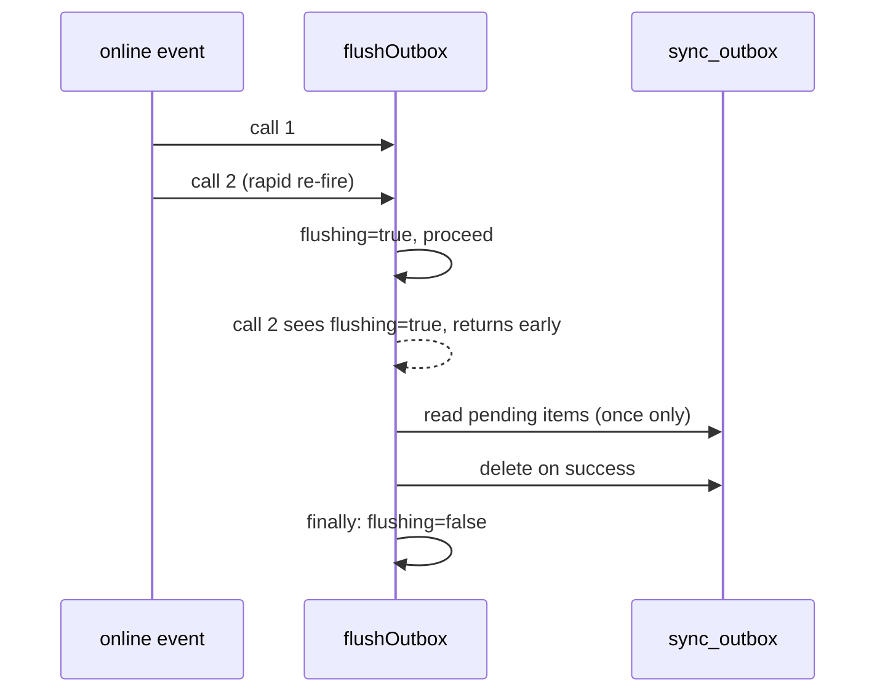

# T2 — Dexie v2 Schema + Sync Concurrency Guard

## Context

Two offline-first infrastructure files need targeted fixes: file:src/lib/db.ts is missing three spec-required Dexie tables, and file:src/lib/sync.ts has no concurrency guard on `flushOutbox`.

**Spec reference:** spec:e4556d74-53bc-432d-b750-3db37d529bab/48044335-1541-401c-9c23-8503e1d648ae — Changes 5, 6.

## Scope

### file:src/lib/db.ts — Add `version(2)` block

Add a `version(2).stores({...})` call after the existing `version(1)` block. The three new tables:

| Table | Index spec | Purpose |
| --- | --- | --- |
| `sync_meta` | `entity` | Tracks last sync cursor per entity type |
| `conflicts` | `++id, entity, record_id` | Stores server vs. local divergences |
| `dashboard_cache` | `farm_id` | Caches dashboard payload per farm |

Add three TypeScript interfaces to the file (before the class definition):

- `SyncMeta` — `{ entity: string; last_synced_at: string; server_version: string | null }`
- `ConflictRecord` — `{ id?: number; entity: string; record_id: string; local_data: unknown; server_data: unknown; created_at: string }`
- `DashboardCache` — `{ farm_id: string; payload: unknown; fetched_at: string }`

Add three `Table` properties to the `LampFarmsDB` class typed to these interfaces.

**Why:** CONVENTIONS §4.6 — the Dexie schema must include these three tables for the offline-first sync architecture.

**Safety:** Dexie handles additive schema migrations automatically on next `db.open()`. Existing v1 data in `farms`, `houses`, `batches`, `activity_log`, `sync_outbox` is fully preserved. The three new tables start empty.

### file:src/lib/sync.ts — Add `flushOutbox` concurrency guard

Add a module-level `let flushing = false` flag.

At the top of `flushOutbox` (before the `pending` query): if `flushing` is `true`, return early.

Set `flushing = true` before the loop. Reset `flushing = false` in a `finally` block wrapping the loop.

**Why:** The `online` event (registered in `setupOnlineListener`) can fire multiple times in quick succession on network flicker. Without a guard, two concurrent `flushOutbox` calls both read the same pending items and attempt to flush them twice, causing duplicate Supabase writes.

## Acceptance Criteria

1. Opening an existing v1 Dexie database succeeds without errors
2. Existing rows in `farms`, `houses`, `batches`, `activity_log`, `sync_outbox` remain readable after the upgrade
3. `db.sync_meta`, `db.conflicts`, `db.dashboard_cache` exist and start empty
4. `db.sync_meta` is indexed on `entity`; `db.conflicts` has `++id, entity, record_id`; `db.dashboard_cache` is indexed on `farm_id`
5. Calling `flushOutbox()` twice in rapid succession results in only one flush execution; the second call returns immediately
6. If the flush loop throws, `flushing` is reset to `false` so subsequent calls can proceed