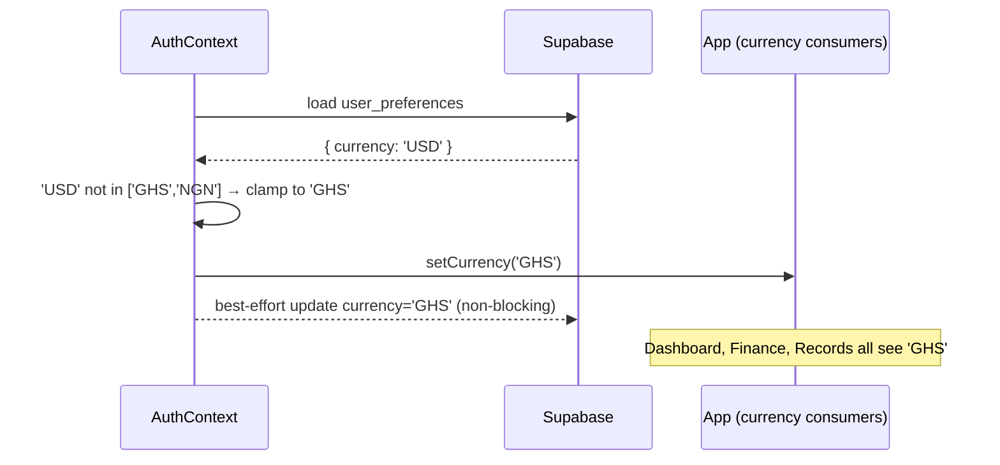

# T3 — Currency Narrowing: SettingsPage, FarmSetup, AuthContext normalization

## Context

Three files allow or propagate non-canonical currency values. The fix has two parts: narrow the pickers to GHS/NGN only, and enforce normalization at the auth/session boundary so invalid historic stored values never leak into the rest of the app.

**Spec reference:** spec:e4556d74-53bc-432d-b750-3db37d529bab/48044335-1541-401c-9c23-8503e1d648ae — Changes 7, 8.

## Scope

### file:src/pages/SettingsPage.tsx — Narrow `CURRENCIES` array

Lines 32–41: replace the 8-entry `CURRENCIES` array with exactly two entries:

- `{ value: 'GHS', label: 'GHS', name: 'Ghana Cedi', symbol: '₵' }`
- `{ value: 'NGN', label: 'NGN', name: 'Nigerian Naira', symbol: '₦' }`

Remove: USD, KES, GBP, EUR, XOF, ZAR.

After a successful `savePreferences()` call, trigger `recheckFarm()` (already available via `useAuth()`) so the current session currency refreshes immediately without requiring a page reload.

**What does NOT change:** password change dialog, all other settings functionality.

### file:src/pages/FarmSetup.tsx — Narrow currency picker

Lines 267–273: the `<SelectContent>` for currency currently has 4 items (GHS, USD, NGN, KES). Remove USD and KES. Keep only GHS and NGN.

**Why:** FarmSetup is the onboarding flow where a user's currency preference is first written to Supabase. Allowing USD/KES here creates the non-canonical stored values that AuthContext then has to defensively handle.

### file:src/contexts/AuthContext.tsx — Normalize currency at session boundary

In `checkFarmSetup()`, after loading `user_preferences` (line 51–54), add a normalization step:

- Define `VALID_CURRENCIES = ['GHS', 'NGN']`
- If `prefs.currency` is not in `VALID_CURRENCIES`, clamp it to `'GHS'` before calling `setCurrency`
- If clamping occurred, perform a best-effort Supabase `update` on `user_preferences` to persist `currency: 'GHS'` back to the DB
- The correction write must **not** block auth/session hydration — use a fire-and-forget pattern (no `await` on the correction, or wrap in a non-blocking async call)
- If the correction write fails, the session still proceeds with local `'GHS'`

## Acceptance Criteria

1. `SettingsPage.tsx` currency picker shows exactly GHS and NGN — no other options
2. After saving preferences in Settings, `useAuth().currency` reflects the new value in the same session without a reload
3. `FarmSetup.tsx` currency picker shows exactly GHS and NGN — no other options
4. A user with `currency: 'USD'` stored in Supabase sees `GHS` across Dashboard, Finance, and Records immediately after login
5. The currency normalization in `AuthContext` does not delay or block the auth/session hydration flow
6. After normalization, the corrected `'GHS'` value is written back to `user_preferences` in Supabase (best-effort — app does not fail if this write fails)