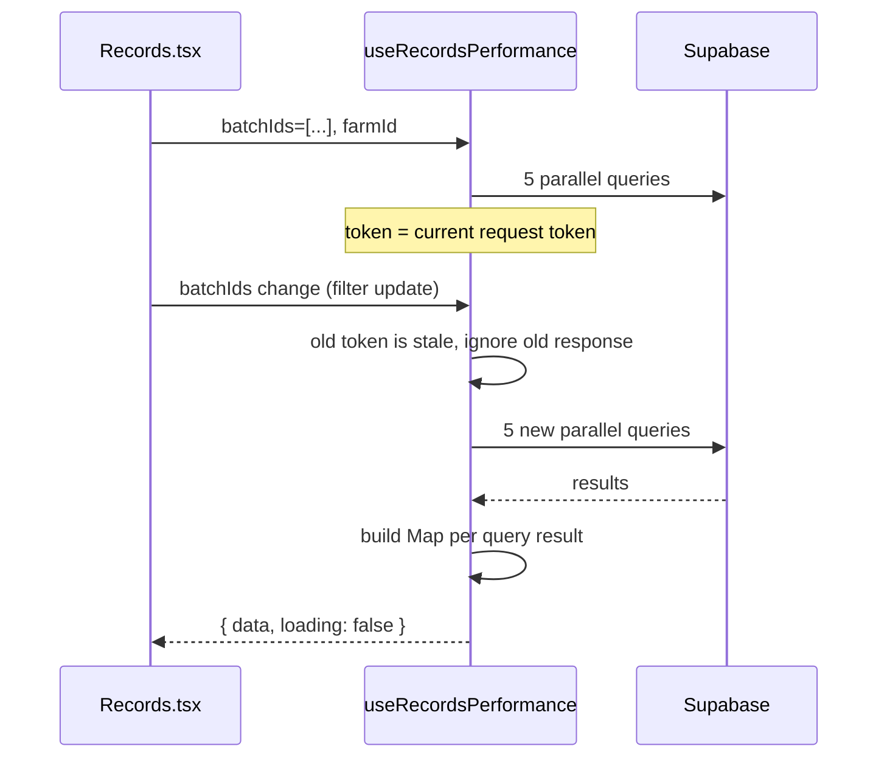

# T4 — Records Hook Extraction + O(1) Performance Map

## Context

file:src/pages/Records.tsx (321 lines) contains an inline `loadPerf` async function (lines 57–100) that fires 5 parallel Supabase queries then runs O(n) `.filter()` per batch in JS. This logic belongs in a dedicated hook. The page component should only consume the hook's output.

**Spec reference:** spec:e4556d74-53bc-432d-b750-3db37d529bab/48044335-1541-401c-9c23-8503e1d648ae — Change 9.

**Depends on:** T1 (correct data), T2 (correct Dexie schema), T3 (correct session currency).

## Scope

### New file: file:src/hooks/useRecordsPerformance.ts

Extract the performance loading logic from `Records.tsx` into this hook. The hook:

- Accepts `batchIds: string[]` and `farmId: string`
- Returns `{ data: Record<string, BatchPerformance>, loading: boolean }`
- Fires the same 5 parallel Supabase queries (`mortality_records`, `feed_schedules`, `egg_records`, `expenses`, `revenue`)
- Replaces the per-batch `.filter(m => m.batch_id === b.id)` loop with a `Map` pre-built from each query result, keyed by `batch_id` — O(1) lookup per batch instead of O(n) per batch
- **Empty-state reset:** when `batchIds.length === 0`, immediately sets `data = {}` and `loading = false` — stale performance data cannot linger when filters produce no results
- **Stale-response guard:** uses a local `cancelled` flag (or `useRef` token) so that if `batchIds` changes while a fetch is in flight, the older response is ignored and does not overwrite the newer state

### file:src/pages/Records.tsx — Slim the page component

- Remove the `loadPerf` `useEffect` (lines 57–100)
- Remove the `performanceData` and `perfLoading` `useState` declarations
- Add: `const { data: performanceData, loading: perfLoading } = useRecordsPerformance(batchIds, farmId)`
- Derive `batchIds` from the existing `batches` state: `const batchIds = useMemo(() => batches.map(b => b.id), [batches])`
- The `mask()` function (line 102) stays — it reads from Zustand `costPrivacyEnabled` which is correct
- All render JSX stays unchanged — the hook is a drop-in replacement for the removed state + effect

**Target:** page component under 200 lines after extraction.

## Acceptance Criteria

1. `src/hooks/useRecordsPerformance.ts` exists and exports `useRecordsPerformance`
2. `Records.tsx` is under 200 lines
3. `Records.tsx` contains no `loadPerf` function and no `performanceData` / `perfLoading` `useState` calls
4. Performance data grouping uses a `Map` keyed by `batch_id` — no `.filter(m => m.batch_id === b.id)` loops
5. When `batchIds` is empty, the hook returns `{ data: {}, loading: false }` immediately — no stale data from a previous filter
6. When `batchIds` changes rapidly, only the response from the most recent request is applied to state
7. The rendered output of the Records page is identical to before — same three tabs, same data, same `mask()` behaviour